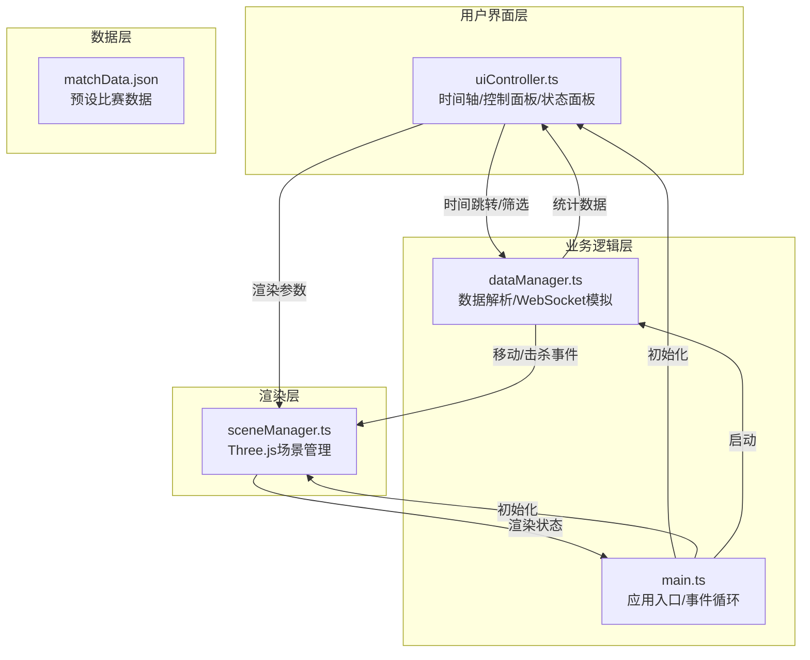

## 1. 架构设计



## 2. 技术选型说明

- **前端框架**：原生 TypeScript + Vite（无需React/Vue，保持轻量级3D渲染性能）
- **3D渲染引擎**：Three.js ^0.160.0（负责3D场景、相机、灯光、模型渲染）
- **构建工具**：Vite ^5.0.0（热更新、路径别名、快速构建）
- **类型系统**：TypeScript ^5.3.0（严格模式，ESNext目标）
- **工具库**：
  - @types/three ^0.160.0（Three.js类型定义）
  - uuid ^9.0.0（生成唯一对象ID）
- **无后端**：纯前端应用，使用JSON预设数据 + WebSocket模拟

## 3. 文件结构与调用关系

```
auto74/
├── package.json              # 项目依赖与脚本
├── vite.config.js            # Vite配置（@别名→src）
├── tsconfig.json             # TypeScript配置（严格模式）
├── index.html                # 入口HTML
└── src/
    ├── main.ts               # [入口] 初始化场景、UI、事件循环
    │                         # 调用：sceneManager.init(), dataManager.init(), uiController.init()
    │                         # 持有：animationLoop
    ├── sceneManager.ts       # [渲染层] Three.js场景管理
    │                         # 暴露：init(), updatePlayerPosition(), addTrailPoint(),
    │                         #       showKillEffect(), updateHeatmap(), setTeamVisibility()
    │                         # 依赖：three, @types/three
    ├── dataManager.ts        # [数据层] 数据解析与推送
    │                         # 暴露：init(), seekToTime(), setTeamFilter(), start(), pause()
    │                         # 回调：onPlayerMove, onKillEvent, onStatsUpdate
    │                         # 依赖：matchData.json, 原生WebSocket模拟
    ├── uiController.ts       # [UI层] 用户交互控制
    │                         # 暴露：init(), updateStats(), updateTimeDisplay()
    │                         # 事件：onTimeChange, onTeamFilterChange, onHeatmapToggle
    │                         # 依赖：原生DOM API
    ├── types/
    │   └── index.ts          # 全局类型定义
    └── data/
        └── matchData.json    # 预设比赛数据（3分钟，10名队员，击杀事件）
```

**数据流向**：
```
matchData.json → dataManager.ts (解析/时间轴控制) 
  → 移动事件 → sceneManager.ts (更新位置/轨迹)
  → 击杀事件 → sceneManager.ts (冲击波特效) + uiController.ts (更新K/D计数)
  → 时间事件 → uiController.ts (更新进度条)
uiController.ts (用户交互) → dataManager.ts (时间跳转/筛选) → sceneManager.ts (重渲染)
```

## 4. 核心数据模型

### 4.1 类型定义

```typescript
// src/types/index.ts

export interface PlayerPosition {
  playerId: string;
  teamId: 'red' | 'blue';
  timestamp: number;
  x: number;
  y: number;
  z: 0;
  eventType: 'moving' | 'kill';
}

export interface KillEvent extends PlayerPosition {
  eventType: 'kill';
  victimId: string;
  victimTeamId: 'red' | 'blue';
}

export interface MatchData {
  matchId: string;
  gameType: 'CS:GO' | 'MOBA';
  duration: number;
  players: PlayerInfo[];
  events: (PlayerPosition | KillEvent)[];
}

export interface PlayerInfo {
  id: string;
  teamId: 'red' | 'blue';
  name: string;
  spawnPoint: { x: number; y: number };
}

export interface TeamStats {
  kills: number;
  deaths: number;
}

export interface RenderConfig {
  showRedTeam: boolean;
  showBlueTeam: boolean;
  heatmapEnabled: boolean;
  currentTime: number;
  isPlaying: boolean;
}
```

### 4.2 数据生成规则
- 总时长：180秒（3分钟）
- 采样频率：每0.5秒一条移动记录
- 每队5名队员，共10人
- 击杀事件：随机分布，总计15-20次
- 坐标范围：x ∈ [-20, 20], y ∈ [-20, 20]
- 复活点：红队(-18, -18)，蓝队(18, 18)

## 5. 关键技术实现

### 5.1 Three.js 场景管理
```typescript
// 场景初始化
const scene = new THREE.Scene();
scene.background = new THREE.Color(0x0a0a14);

// 相机设置
const camera = new THREE.PerspectiveCamera(60, aspect, 0.1, 1000);
camera.position.set(0, 15, 15);
camera.lookAt(0, 0, 0);

// 控制器限制
const controls = new OrbitControls(camera, renderer.domElement);
controls.minPolarAngle = Math.PI / 6;  // -30°
controls.maxPolarAngle = Math.PI / 3;  // 60°
controls.minDistance = 7.5;   // 0.5倍
controls.maxDistance = 30;    // 2倍
controls.enableDamping = true;
```

### 5.2 WebSocket 数据模拟
```typescript
// 使用原生 WebSocket API 模拟实时推送
class MockWebSocket {
  constructor(url: string) {
    // 模拟连接建立
    setTimeout(() => {
      this.onopen?.({ type: 'open' } as Event);
      this.startDataStream();
    }, 100);
  }
  
  private startDataStream() {
    // 按时间轴推送数据，支持seek操作
    this.playbackInterval = setInterval(() => {
      const currentEvents = this.getEventsAtTime(this.currentTime);
      currentEvents.forEach(event => {
        this.onmessage?.({ data: JSON.stringify(event) } as MessageEvent);
      });
      this.currentTime += 0.05; // 20fps 推送
    }, 50);
  }
}
```

### 5.3 性能优化策略
1. **轨迹线段限制**：每队最多200条，超出时移除最早的线段
2. **热力图标记限制**：最多50个，超出时FIFO淘汰
3. **对象池复用**：冲击波和热力图标记使用对象池，避免频繁GC
4. **帧率监控**：使用performance.now()监控，低于45FPS时降低渲染精度
5. **可见性剔除**：队伍筛选时直接隐藏对象而非销毁

### 5.4 动画系统
- **队员球体闪烁**：使用sin函数控制emissiveIntensity，频率2Hz
- **击杀冲击波**：RingGeometry + 缩放动画 + 透明度渐变，1.5秒周期
- **数字弹性动画**：CSS keyframes + transform: scale，0.3秒弹性曲线
- **热力图渐隐**：opacity从0.6线性过渡到0，5秒周期
