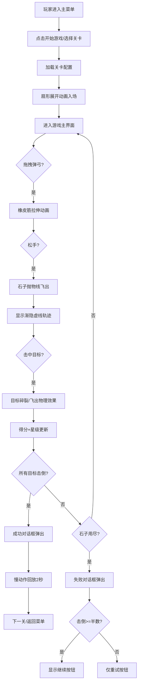

## 1. 产品概述

一款基于物理引擎的弹弓百步穿杨闯关游戏，玩家通过拖拽弹弓瞄准并击倒各种目标（木桶、陶罐、苹果等）。每关难度逐步提升，从静止目标到移动目标，再到有遮挡的目标，最终挑战Boss关卡。

- 核心玩法：拖拽弹弓石子瞄准，松手后物理抛物线飞行
- 目标用户：休闲游戏玩家，喜欢物理益智类游戏的用户
- 价值：提供富有挑战性和策略性的物理弹射体验，配合手绘蜡笔风格带来独特视觉享受

## 2. 核心功能

### 2.1 功能模块

1. **主菜单页面**：游戏标题、开始游戏、关卡选择、设置选项
2. **游戏主界面**：Canvas游戏画布、HUD信息面板（关卡编号、得分、石子数量）、暂停按钮
3. **关卡系统**：8个循序渐进的关卡配置，包含目标、障碍物、Boss关
4. **物理引擎系统**：Matter.js驱动的碰撞检测、重力模拟、碎片效果
5. **拖拽交互系统**：弹弓橡皮筋拖拽、弹性动画、石子轨迹预测
6. **UI弹窗系统**：成功/失败对话框、暂停遮罩、慢动作回放
7. **得分与星级系统**：目标得分累计、星级评价、关卡完成记录

### 2.2 页面详情

| 页面名称 | 模块名称 | 功能描述 |
|---------|---------|---------|
| 主菜单 | 标题区域 | 游戏logo和标题，手绘蜡笔风格动画 |
| 主菜单 | 导航按钮 | 开始游戏、关卡选择、设置，悬停上浮效果 |
| 关卡选择 | 关卡网格 | 8个关卡缩略图，显示通关星级，点击进入 |
| 游戏主界面 | Canvas游戏区 | 弹弓、目标、障碍物、石子轨迹、物理效果渲染 |
| 游戏主界面 | HUD面板 | 顶部关卡编号与得分、左侧石子数、左上角暂停按钮 |
| 暂停遮罩 | 暂停菜单 | Continue和Main Menu按钮，不同入场动画 |
| 成功对话框 | 结果展示 | 击倒数量、耗时、总得分滚动动画、金色粒子背景 |
| 失败对话框 | 重试选择 | 重试按钮（旋转缩放动画）、继续按钮（达成半数击倒条件） |
| 回放覆层 | 慢动作回放 | 2秒侧面视角慢动作，缓动曲线摄像机旋转 |

## 3. 核心流程

## 4. 用户界面设计

### 4.1 设计风格
- **主题风格**：手绘蜡笔风格，扁平低多边形
- **主色调**：米白(#F5F0E1)、棕色(#8B5A2B)、草绿(#7CB342)、淡蓝(#81D4FA)
- **强调色**：金色(#FFD54F)用于星级和得分发光
- **按钮风格**：圆角矩形，轻微阴影，悬停上移2px加深阴影
- **字体**：圆润卡通风格字体，数字带金色发光边
- **布局**：左侧弹弓区、右侧目标区、底部草地、顶部HUD
- **图标**：手绘风格简洁图标，配合蜡笔纹理

### 4.2 页面设计概览

| 页面名称 | 模块名称 | UI元素 |
|---------|---------|---------|
| 游戏主界面 | Canvas区域 | 浅米色画纸纹理背景、木质弹弓支架（细纹+木节）、Y形叉棕色橡皮筋、目标物体（木桶铁箍、陶罐釉面高光、苹果高光球体）、金色星级、草绿地面线+草丛 |
| 游戏主界面 | HUD | 顶部关卡编号+金色发光得分数字、左侧圆形石子图标+数量、圆形暂停按钮 |
| 弹窗 | 对话框 | 中心缩放入场、背景模糊变暗、数值滚动动画、金色粒子飘落 |
| 主菜单/关卡选择 | 页面 | Framer Motion淡入淡出、关卡网格缩略图+星级 |

### 4.3 响应式设计
- Desktop-first设计，优先适配1920x1080
- 基础分辨率1024x768，场景元素按比例缩放
- 1920x1080下场景元素等比放大50%
- 触摸设备支持手指拖拽弹弓交互
- 使用Canvas缩放和CSS媒体查询双重适配

### 4.4 动画与特效
- 橡皮筋拖拽：实时弹性拉伸变形
- 石子轨迹：渐隐白色虚线+等距小圆点
- 星级：击中后空心变实心+脉冲放大
- 草丛：随风微微摆动
- 关卡切换：扇形展开从中心向外扩散
- 按钮：悬停上浮2px+阴影加深
- 对话框：缩放入场+背景模糊
- 数值：从0递增滚动每秒一次
- 暂停按钮：Continue中央弹入弹性动画，Main Menu底部滑入
- 回放：缓动曲线摄像机侧面旋转慢动作2秒
