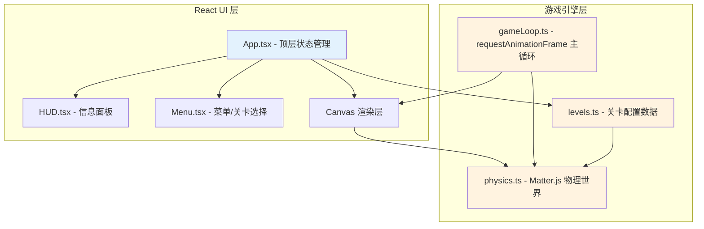

## 1. 架构设计



## 2. 技术栈说明

- **前端框架**：React 18 + TypeScript
- **构建工具**：Vite 5
- **物理引擎**：matter-js（2D刚体物理模拟）
- **UI动画**：framer-motion（React组件过渡动画）
- **唯一ID**：uuid
- **渲染方式**：HTML5 Canvas（游戏场景）+ React DOM（UI层）
- **状态管理**：React useState/useRef（轻量级，无需全局状态库）

## 3. 目录结构

```
src/
├── engine/              # 游戏引擎模块
│   ├── physics.ts       # Matter.js引擎初始化、物理体管理、碰撞回调
│   ├── gameLoop.ts      # requestAnimationFrame主循环、帧间隔计算
│   └── levels.ts        # 8个关卡配置数据、关卡获取函数
├── ui/                  # UI控制模块
│   ├── App.tsx          # 顶层组件、游戏状态机、Canvas嵌入
│   ├── hud.tsx          # HUD信息面板组件
│   └── menu.tsx         # 主菜单、关卡选择、设置页面
├── main.ts              # React入口文件
└── index.css            # 全局样式
```

## 4. 核心模块定义

### 4.1 physics.ts - 物理引擎模块

```typescript
// 类型定义
interface TargetBody {
  id: string;
  type: 'barrel' | 'pot' | 'apple' | 'boss_window';
  body: Matter.Body;
  hp: number;
  points: number;
  destroyed: boolean;
  moving?: { speed: number; range: number; startX: number };
}

interface ObstacleBody {
  id: string;
  type: 'wood' | 'stone';
  body: Matter.Body;
}

interface SlingshotState {
  anchorX: number;
  anchorY: number;
  restLength: number;
  isDragging: boolean;
  dragX: number;
  dragY: number;
}

// 导出接口
export function initPhysics(canvasWidth: number, canvasHeight: number): void;
export function createLevel(levelConfig: LevelConfig): void;
export function updateSlingshotDrag(x: number, y: number): void;
export function releaseStone(): { vx: number; vy: number };
export function resetSlingshot(): void;
export function addCollisionCallback(onTargetHit: (target: TargetBody) => void): void;
export function updatePhysics(deltaTime: number): void;
export function getEngine(): Matter.Engine;
export function getTargets(): TargetBody[];
export function getActiveTrail(): { x: number; y: number; alpha: number }[];
```

### 4.2 gameLoop.ts - 游戏主循环

```typescript
interface GameLoopState {
  running: boolean;
  paused: boolean;
  lastTime: number;
  deltaTime: number;
}

export function startGameLoop(
  onUpdate: (deltaTime: number) => void,
  onRender: () => void
): void;
export function pauseGameLoop(): void;
export function resumeGameLoop(): void;
export function stopGameLoop(): void;
export function isPaused(): boolean;
```

### 4.3 levels.ts - 关卡配置

```typescript
export interface TargetConfig {
  type: 'barrel' | 'pot' | 'apple';
  x: number;
  y: number;
  points: number;
  moving?: { speed: number; range: number };
}

export interface ObstacleConfig {
  type: 'wood' | 'stone';
  x: number;
  y: number;
  width: number;
  height: number;
}

export interface LevelConfig {
  id: number;
  name: string;
  stones: number;
  targets: TargetConfig[];
  obstacles: ObstacleConfig[];
  isBoss?: boolean;
  bossHp?: number;
}

export function getLevel(index: number): LevelConfig;
export function getLevelCount(): number;
```

### 4.4 App.tsx - 顶层组件状态

```typescript
type GameState = 'menu' | 'levelSelect' | 'playing' | 'paused' | 'success' | 'failure' | 'replay';

interface GameStats {
  currentLevel: number;
  score: number;
  totalScore: number;
  stonesLeft: number;
  targetsDestroyed: number;
  totalTargets: number;
  startTime: number;
  elapsedTime: number;
}
```

## 5. 性能优化要求

- 主循环帧率：≥ 55 FPS（requestAnimationFrame）
- 物理更新频率：≥ 30 Hz（Matter.js Engine.update）
- 轨迹点：每帧更新不超过20个，使用数组滑动窗口
- 关卡切换动画：≤ 1.2秒，CSS transform/GPU加速
- Canvas渲染：使用脏矩形区域更新，避免全量重绘

## 6. 关卡设计概要

| 关卡 | 目标数 | 石子数 | 特点 |
|-----|--------|--------|------|
| 1 | 3 | 5 | 全部静止木桶，基础瞄准 |
| 2 | 4 | 6 | 混合木桶和陶罐 |
| 3 | 4 | 5 | 1个水平移动苹果 |
| 4 | 5 | 6 | 2个移动目标，不同速度 |
| 5 | 5 | 5 | 远距离高精度目标 |
| 6 | 5 | 6 | 木板遮挡目标 |
| 7 | 6 | 7 | 石块+木板双层遮挡 |
| 8 | 1 Boss | 10 | 旋转木制堡垒，4个窗口小目标 |
