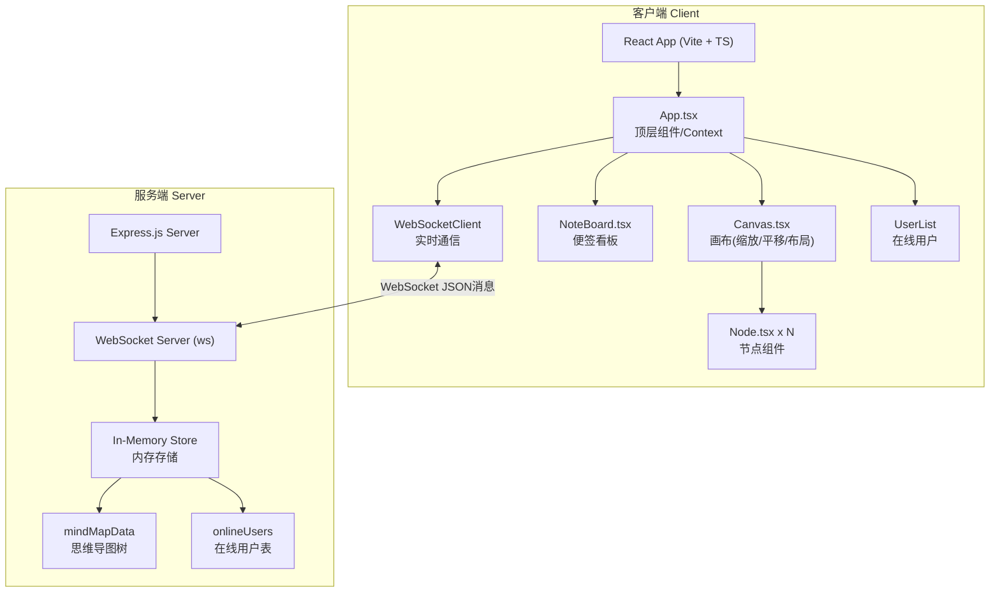
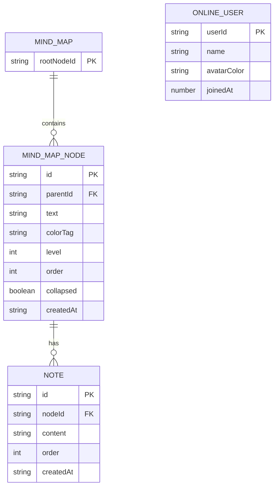

## 1. 架构设计



## 2. 技术栈说明

- **前端框架**：React@18 + TypeScript@5 + Vite@5
- **构建工具**：Vite + @vitejs/plugin-react，路径别名 @ → src
- **状态管理**：React Context + useState/useReducer，WebSocket 驱动更新
- **实时通信**：ws@8 (WebSocket 客户端与服务端)
- **后端服务**：Express@4 + cors@2，同时提供静态资源服务与 WebSocket 升级
- **唯一标识**：uuid@9 生成节点/便签 ID
- **样式方案**：内联 CSS + CSS Modules，动画使用 CSS transition/keyframes
- **启动脚本**：`npm run dev` 同时启动前后端（Vite 3000端口，Express+WS 3001端口）

## 3. 文件结构与职责

```
auto77/
├── package.json                 # 项目依赖与脚本
├── vite.config.js               # Vite构建配置(@别名)
├── tsconfig.json                # TS严格模式配置
├── index.html                   # 入口HTML
├── server/                      # ---------- 后端 ----------
│   └── index.ts                 # Express+WS服务入口，内存存储，消息广播
├── src/                         # ---------- 前端 ----------
│   ├── main.tsx                 # 应用入口，创建React根，挂载App
│   ├── App.tsx                  # 顶层组件：WS连接、Context、状态管理
│   ├── context/
│   │   └── MindMapContext.tsx   # MindMapContext，下发数据与操作方法
│   ├── components/
│   │   ├── Canvas.tsx           # 画布：布局、缩放、平移、渲染节点树
│   │   ├── Node.tsx             # 单个节点：编辑、拖拽、菜单、动画
│   │   ├── NoteBoard.tsx        # 便签看板：列表、增删改、拖拽、滑动删除
│   │   ├── ContextMenu.tsx      # 右键菜单组件
│   │   └── UserAvatars.tsx      # 在线用户头像列表
│   ├── hooks/
│   │   ├── useWebSocket.ts      # WebSocket连接与消息收发Hook
│   │   └── useDragAndDrop.ts    # 通用拖拽逻辑Hook
│   ├── types/
│   │   └── index.ts             # 共享类型定义(节点/便签/WS消息)
│   └── utils/
│       ├── layout.ts            # 树形布局算法(计算节点坐标)
│       └── colors.ts            # 预设颜色与层级渐变色生成
```

### 调用关系与数据流向

1. **启动流**：`main.tsx` → 渲染 `<App />` → App 读取 URL userId → 调用 `useWebSocket` 建立连接 → 收到 `INIT` 消息 → 注入 Context
2. **用户操作 → 同步流**：`Node/NoteBoard` 触发操作 → 调用 Context 提供的 action → 本地更新状态 → `useWebSocket.send()` 广播 → 其他客户端收到 → 更新 Context → 子组件重渲染
3. **布局渲染流**：Context mindMapData → `Canvas` 调用 `layout.ts` 计算每个节点的 x/y → 遍历渲染 `<Node>` 组件（递归）
4. **便签数据流**：选中节点ID → `NoteBoard` 从 Context 过滤该节点的 notes → 渲染便签卡片

## 4. WebSocket 消息协议

### 消息类型定义

```typescript
// 客户端 -> 服务端
type ClientMessage =
  | { type: 'JOIN'; userId: string; userName: string }
  | { type: 'UPDATE_NODE'; nodeId: string; patch: Partial<MindMapNode> }
  | { type: 'ADD_NODE'; parentId: string; newNode: MindMapNode }
  | { type: 'DELETE_NODE'; nodeId: string }
  | { type: 'MOVE_NODE'; nodeId: string; newParentId: string; index: number }
  | { type: 'ADD_NOTE'; nodeId: string; note: Note }
  | { type: 'UPDATE_NOTE'; nodeId: string; noteId: string; content: string }
  | { type: 'DELETE_NOTE'; nodeId: string; noteId: string }
  | { type: 'REORDER_NOTES'; nodeId: string; noteIds: string[] };

// 服务端 -> 客户端
type ServerMessage =
  | { type: 'INIT'; data: MindMapData; users: OnlineUser[] }
  | { type: 'USER_JOIN'; user: OnlineUser }
  | { type: 'USER_LEAVE'; userId: string }
  | ClientMessage; // 广播转发
```

## 5. 服务端架构


**服务端文件 `server/index.ts` 职责**：
- Express 提供静态文件服务（dist/）与 CORS
- 在同一 HTTP server 上升级 ws WebSocket
- 维护 `mindMap: MindMapData` 与 `users: Map<ws, OnlineUser>` 两个内存对象
- 接收客户端消息 → 校验 → 更新内存 → 广播给所有连接
- 首次连接发送 INIT 全量快照
- 连接断开时广播 USER_LEAVE

## 6. 数据模型

### 6.1 ER 模型



### 6.2 TypeScript 类型定义

```typescript
interface MindMapNode {
  id: string;
  parentId: string | null;
  text: string;
  colorTag: string;      // 预设颜色key或hex
  level: number;         // 根节点为0
  order: number;         // 同级排序
  collapsed: boolean;    // 是否折叠子节点
  childrenIds: string[]; // 子节点id列表
}

interface Note {
  id: string;
  nodeId: string;
  content: string;
  order: number;
  createdAt: number;
}

interface MindMapData {
  rootId: string;
  nodes: Record<string, MindMapNode>;
  notes: Record<string, Note[]>; // nodeId -> notes[]
}

interface OnlineUser {
  userId: string;
  name: string;
  avatarColor: string;
}
```

### 6.3 初始数据（服务端启动时生成）

```json
{
  "rootId": "root-001",
  "nodes": {
    "root-001": {
      "id": "root-001",
      "parentId": null,
      "text": "中心主题",
      "colorTag": "#1e3a5f",
      "level": 0,
      "order": 0,
      "collapsed": false,
      "childrenIds": []
    }
  },
  "notes": {}
}
```
