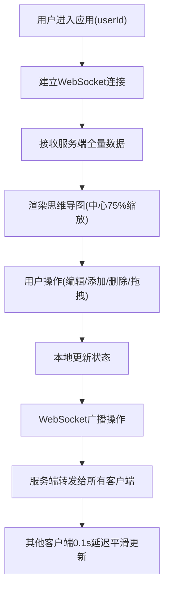

## 1. 产品概述

团队协作思维导图与便签看板应用，面向初创团队的在线协作白板工具，解决多人实时协作绘制思维导图、管理创意便签时的同步与版本管理问题。通过 WebSocket 实现毫秒级实时同步，支持多人同时编辑节点内容、拖拽排序、添加便签注释。

- 核心目标：提供流畅、低延迟的多人实时协作体验
- 目标用户：产品团队、设计团队、远程协作小组
- 核心价值：可视化思维梳理 + 实时协作 + 便签化创意管理

## 2. 核心功能

### 2.1 用户角色

| 角色 | 注册方式 | 核心权限 |
|------|----------|----------|
| 协作用户 | 通过 URL 参数 userId 模拟 | 编辑思维导图节点、添加/删除节点、管理便签 |

### 2.2 功能模块

1. **思维导图画布**：树形节点布局、缩放平移、拖拽排序、右键菜单
2. **思维导图节点**：文本编辑、颜色标签、展开/折叠动画、父子节点管理
3. **实时协作同步**：WebSocket 双向通信、在线用户展示、操作广播
4. **便签看板**：便签列表、新增/编辑/删除、拖拽排序、滑动删除

### 2.3 页面详情

| 页面名称 | 模块名称 | 功能描述 |
|----------|----------|----------|
| 主应用页 | 画布区域 | 75% 宽度，展示思维导图树形结构，支持滚轮缩放(0.5x-2.0x)、拖拽平移、弹性回弹 |
| 主应用页 | 节点组件 | 圆角白色卡片、层级渐变边框、双击编辑、右键菜单(添加子节点/删除/改色)、拖拽排序、展开折叠动画 |
| 主应用页 | 便签看板 | 25% 宽度右侧边栏，淡蓝色卡纸样式便签、点击展开编辑、拖拽排序、左滑删除 |
| 主应用页 | 在线用户区 | 左下角圆形头像缩略图列表，随机背景色 |
| 主应用页 | 右键上下文菜单 | 添加子节点、删除节点、8色标签选择器 |
| 主应用页 | 响应式适配 | <768px 时便签看板折叠为底部抽屉 |

## 3. 核心流程

### 3.1 用户进入应用流程

用户打开 URL（含 userId 参数）→ 建立 WebSocket 连接 → 接收服务端当前思维导图状态 → 画布以根节点为中心、75% 缩放比渲染（淡入动画）→ 进入可操作状态

### 3.2 节点编辑协作流程

用户 A 双击节点进入编辑 → Enter 保存 → 本地更新节点 → WebSocket 广播 UPDATE_NODE → 用户 B/C 收到消息 → 0.1s 延迟平滑更新画布

### 3.3 便签管理流程

点击选中节点 → 右侧显示该节点便签列表 → 新增/编辑/删除/拖拽 → WebSocket 同步 → 所有协作者实时看到更新

### 3.4 协作流程图

## 4. 用户界面设计

### 4.1 设计风格

- **主色调**：深蓝 #1e3a5f（根节点边框）、蓝色 #4a90d9（选中高亮）、浅灰渐变背景 #f0f0f5 → #e8e8f0
- **辅助色**：8种预设节点标签色（红/橙/黄/绿/青/蓝/紫/粉）
- **节点卡片**：白色 #ffffff 背景，8px 圆角，1px 浅灰 #d0d0d0 边框
- **便签卡片**：淡蓝色 #e6f0fa 背景，6px 圆角，阴影 0 2px 4px rgba(0,0,0,0.1)
- **字体**：现代无衬线字体，支持中英文混排
- **动画曲线**：cubic-bezier(0.4, 0, 0.2, 1)，时长 0.2s-0.4s

### 4.2 页面设计概览

| 页面名称 | 模块名称 | UI元素 |
|----------|----------|--------|
| 主应用页 | 画布区域 | 浅灰渐变背景、树形布局连接线、节点卡片(层级渐变色边框)、缩放比例指示 |
| 主应用页 | 节点交互 | 双击蓝色高亮边框(2px)、输入框自动选中文本、Enter保存弹性缩放反馈 |
| 主应用页 | 右键菜单 | 浮层面板、菜单项hover高亮、颜色圆点选择器 |
| 主应用页 | 便签看板 | 垂直分割线、淡蓝色卡纸便签、展开高度动画(0.2s)、左滑红色删除按钮 |
| 主应用页 | 在线用户区 | 左下角堆叠圆形头像、首字母文字、随机背景色 |
| 主应用页 | 拖拽状态 | 节点透明度0.7跟随鼠标、其他节点0.3s ease位移过渡、便签阴影加深 |
| 主应用页 | 响应式 | <768px 底部抽屉式便签看板、浮动展开按钮 |

### 4.3 响应式设计

- 桌面端（>768px）：左侧画布75% + 右侧便签25%，垂直分割线
- 移动端（≤768px）：画布占满全宽，便签折叠为底部抽屉，浮动按钮展开
- 触摸优化：双击编辑、长按触发菜单、拖拽时增大热区

### 4.4 性能与约束

- WebSocket 端到端延迟 ≤ 200ms
- 100节点以内保持 60fps
- 超过100节点最低帧率 ≥ 30fps
- 内存存储，服务端重启数据重置
