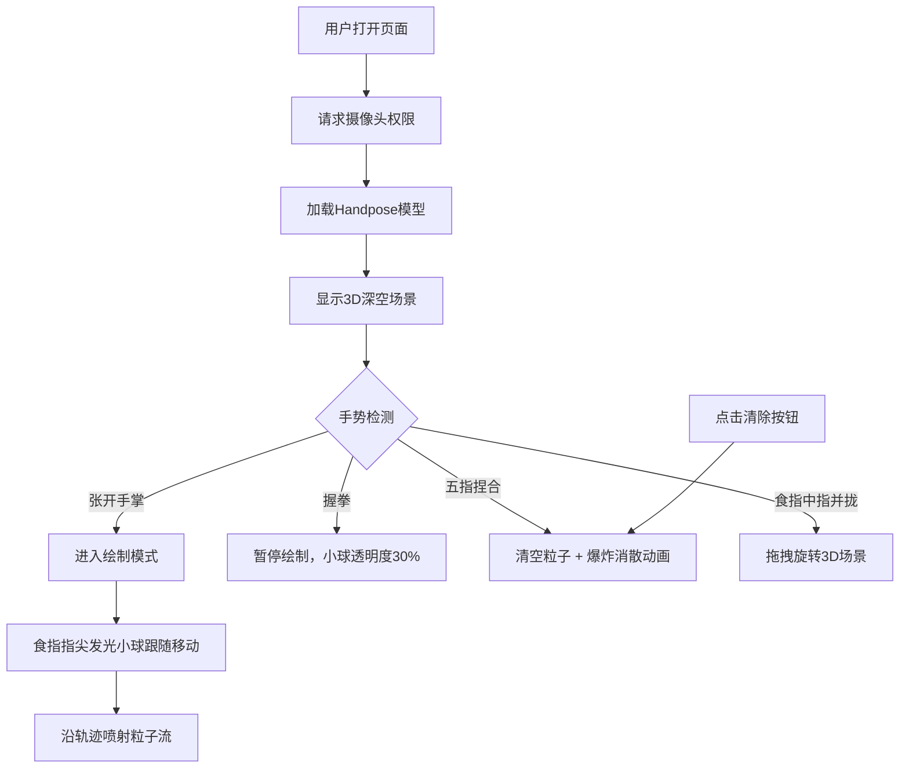

## 1. 产品概述

基于手势识别的3D艺术沙盘应用，用户通过摄像头捕获手部动作，在三维空间中以粒子喷射、拖拽和旋转的方式自由绘制光影线条和彩色粒子轨迹，如同在数字沙盘中创作动态雕塑。

- 主要用途：艺术创作、沉浸式互动体验、数字绘画
- 目标用户：艺术家、设计师、互动艺术爱好者、普通用户
- 市场价值：将手势交互与3D粒子艺术结合，提供新颖的数字创作体验

## 2. 核心功能

### 2.1 功能模块

1. **3D深空场景模块**：全屏星空粒子背景、缓慢旋转、深蓝到紫色渐变
2. **手势识别模块**：摄像头视频捕获、Handpose模型手部关键点检测、手势识别（张开/握拳/捏合/拖拽）
3. **粒子绘制系统**：粒子喷射、渐隐粒子流、流线连接、颜色渐变、粒子回收机制
4. **控制面板模块**：颜色选择器、笔刷大小滑块、清除画布按钮、折叠动画
5. **场景交互模块**：手势旋转3D场景、粒子爆炸消散动画

### 2.2 页面详情

| 页面名称 | 模块名称 | 功能描述 |
|-----------|-------------|---------------------|
| 主页面 | 3D深空场景 | 全屏星空背景粒子层，深蓝到紫色渐变，缓慢旋转 |
| 主页面 | 控制面板 | 左侧半透明毛玻璃面板，12种预设色块+自定义吸色器，笔刷大小滑块（1-20px）带实时预览圆环，清除画布按钮，右上角折叠箭头 |
| 主页面 | 手势交互区域 | 张开手绘制粒子轨迹，握拳暂停绘制，捏合手势清空并爆炸，食指中指并拢拖拽旋转场景 |
| 主页面 | 光标指示器 | 食指指尖位置的发光小球，半径同步笔刷大小，颜色随选中色变化，握拳时透明度降至30% |

## 3. 核心流程

用户打开页面 → 请求摄像头权限 → 加载Handpose模型 → 显示3D深空场景 → 用户张开手掌对准摄像头 → 系统检测5根手指进入绘制模式 → 食指指尖位置生成发光小球 → 手部移动时沿轨迹喷射渐隐粒子流 → 用户握拳暂停绘制 → 用户五指捏合清空所有粒子并触发爆炸动画 → 用户使用食指和中指并拢拖拽旋转3D场景 → 点击清除按钮清空画布

## 4. 用户界面设计

### 4.1 设计风格

- **主色调**：深空蓝(#0a0a2e) → 暗紫色(#1a0a3e) 渐变背景
- **霓虹色系**：霓虹蓝(#00d4ff)、霓虹紫(#a855f7)、霓虹粉(#ff00ea)
- **按钮样式**：圆角12px，悬停放大1.1倍 + 发光阴影(box-shadow: 0 0 20px rgba(0, 212, 255, 0.6))
- **字体**：现代科技感无衬线字体，使用Orbitron作为标题字体，系统字体作为正文
- **布局风格**：全屏沉浸式，左侧浮动控制面板，毛玻璃效果(backdrop-filter: blur(10px))
- **视觉特效**：面板边缘霓虹光晕，粒子发光效果，按钮悬停动效

### 4.2 页面设计概览

| 页面名称 | 模块名称 | UI元素 |
|-----------|-------------|-------------|
| 主页面 | 3D场景 | 全屏canvas，星空粒子背景，深蓝紫色渐变，缓慢自转 |
| 主页面 | 控制面板 | 左侧垂直布局，半透明黑色+毛玻璃，霓虹蓝边缘光晕，宽度320px，圆角16px |
| 主页面 | 颜色选择器 | 4×3色块网格（12种预设色），色块大小36px，圆角8px，选中态有发光边框 |
| 主页面 | 自定义吸色器 | 圆形吸色按钮，点击打开系统颜色选择器 |
| 主页面 | 笔刷滑块 | 自定义滑块轨道渐变（霓虹蓝到紫），滑块带实时预览圆环（上方显示） |
| 主页面 | 清除按钮 | 全宽按钮，背景渐变，图标+文字，悬停放大发光 |
| 主页面 | 折叠按钮 | 面板右上角箭头图标，点击0.3秒ease-out动画滑出 |
| 主页面 | 绘制小球 | Three.js MeshBasicMaterial发光材质，AdditiveBlending，半径同步笔刷大小 |
| 主页面 | 粒子流 | 100+圆点组成，2秒生命周期，颜色从实色渐变透明，粒子间半透明细线连接 |

### 4.3 响应式设计

- **桌面端**：左侧控制面板（320px宽），全屏3D场景
- **平板端**：左侧控制面板缩小（280px宽），按钮尺寸保持一致
- **移动端竖屏**：控制面板置于底部（全宽），按钮放大至48px以上确保触控可用，3D场景占据上半屏
- **触控优化**：所有可交互元素最小尺寸48×48px，增加点击热区

### 4.4 3D场景指引

- **环境**：深空主题，深蓝色(#0a0a2e)到暗紫色(#1a0a3e)的径向渐变背景，2000+个随机分布的星星粒子（Points + AdditiveBlending），整体场景以Y轴为中心缓慢旋转（0.05 rad/s）
- **灯光**：无需场景灯光，粒子使用自发光材质（MeshBasicMaterial / PointsMaterial with emissive），利用加法混合产生发光效果
- **相机**：PerspectiveCamera，fov 75，初始位置(0, 0, 5)，看向原点；拖拽旋转通过修改相机theta/phi角度实现球面轨道
- **构图**：相机正前方为绘制空间中心（Z轴范围-3到+3），背景星空粒子分布在半径10-50的球壳上，绘制粒子限制在可视范围内
- **交互动画**：小球位置平滑插值跟随指尖（lerp 0.2），粒子爆炸时每个粒子随机方向velocity并应用阻尼，场景旋转使用四元数球面插值
- **后处理**：使用EffectComposer添加UnrealBloomPass（强度0.8，阈值0.3，半径0.5）产生辉光效果
- **性能预算**：粒子上限5000个（超过时FIFO回收最早粒子），目标帧率30fps+，使用BufferGeometry + 合并绘制减少draw call

## 5. 性能要求

- 绘制过程帧率 ≥ 30fps
- 粒子数量上限：5000个（超出时自动回收最早生成的粒子）
- 手势识别检测频率：与渲染帧率同步，每帧检测一次
- 模型加载时间：首次加载需显示加载进度提示
