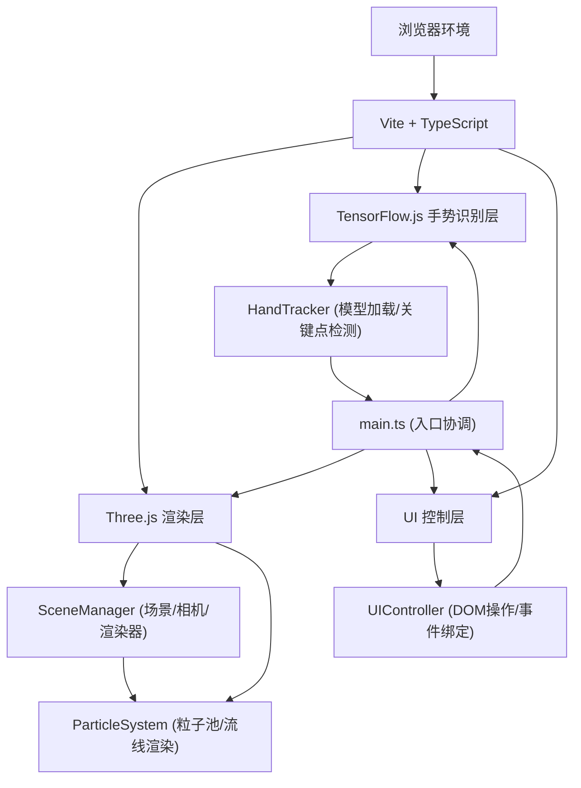

## 1. 架构设计



## 2. 技术说明

- **前端框架**: 原生 TypeScript + Vite（轻量构建工具），不使用React/Vue，因为项目以Three.js渲染为主，UI层仅为简单控制面板
- **3D渲染**: Three.js @latest，包含以下核心模块
  - `THREE.Scene` / `THREE.PerspectiveCamera` / `THREE.WebGLRenderer`
  - `THREE.Points` + `THREE.BufferGeometry` 用于粒子系统
  - `THREE.Line` + `THREE.BufferGeometry` 用于流线连接
  - `THREE.EffectComposer` + `THREE.UnrealBloomPass` 用于辉光后处理
- **手势识别**: 
  - `@tensorflow/tfjs` (TensorFlow.js核心)
  - `@tensorflow-models/handpose` (手部关键点检测模型，基于MediaPipe Hands)
  - `@mediapipe/hands` (Handpose的底层依赖)
- **构建工具**: Vite @latest，配置alias `@` → `src`，开发服务器支持CORS代理
- **类型定义**: `@types/three` 用于Three.js类型支持
- **启动脚本**: `npm run dev` → `vite`

## 3. 项目文件结构

```
auto79/
├── index.html                 # 入口HTML页面（全屏canvas + 权限提示 + 控制面板DOM）
├── package.json               # 项目依赖和脚本
├── tsconfig.json              # TypeScript配置（严格模式，目标ES2020）
├── vite.config.js             # Vite构建配置（alias + 代理）
└── src/
    ├── main.ts                # 应用入口：初始化所有模块，主循环协调
    ├── sceneManager.ts        # Three.js场景、相机、灯光、渲染器管理
    ├── handTracker.ts         # Handpose模型加载、摄像头流、手势检测
    ├── particleSystem.ts      # 粒子池管理、颜色渐变、流线渲染
    └── uiController.ts        # 控制面板DOM操作、事件绑定
```

## 4. 模块接口定义

### 4.1 HandTracker 模块

```typescript
interface HandLandmark {
  x: number;  // 归一化坐标 0-1
  y: number;
  z: number;
}

interface HandData {
  landmarks: HandLandmark[];  // 21个手部关键点
  gesture: 'open' | 'fist' | 'pinch' | 'drag' | 'none';
  indexTip3D: THREE.Vector3;  // 食指指尖3D坐标（映射到绘制空间）
}

// 暴露给外部的回调
type OnHandDetectedCallback = (data: HandData | null) => void;

class HandTracker {
  constructor(videoElement: HTMLVideoElement);
  async init(): Promise<void>;           // 加载模型 + 启动摄像头
  setOnHandDetected(cb: OnHandDetectedCallback): void;
  start(): void;                         // 开始逐帧检测
  stop(): void;                          // 停止检测
}
```

### 4.2 ParticleSystem 模块

```typescript
interface Particle {
  position: THREE.Vector3;
  velocity: THREE.Vector3;  // 用于爆炸动画
  color: THREE.Color;
  alpha: number;
  life: number;             // 剩余生命周期 (秒)
  maxLife: number;          // 最大生命周期 (默认2秒)
  size: number;
  exploding: boolean;
}

interface BrushSettings {
  color: string;   // hex颜色值
  size: number;    // 1-20像素（映射到Three.js单位）
}

class ParticleSystem {
  constructor(scene: THREE.Scene);
  setBrush(settings: BrushSettings): void;
  emit(position: THREE.Vector3): void;          // 在指定位置发射粒子
  update(deltaTime: number): void;              // 每帧更新粒子状态
  clear(withExplosion: boolean): void;          // 清空粒子（可选爆炸动画）
  getCursorMesh(): THREE.Mesh;                  // 获取跟随指尖的光标小球
}
```

### 4.3 SceneManager 模块

```typescript
class SceneManager {
  constructor(canvas: HTMLCanvasElement);
  init(): void;                                 // 初始化场景/相机/渲染器/后处理
  getScene(): THREE.Scene;
  getCamera(): THREE.PerspectiveCamera;
  rotateScene(deltaTheta: number, deltaPhi: number): void;  // 拖拽旋转
  render(): void;                               // 单帧渲染
  resize(): void;                               // 响应窗口大小变化
}
```

### 4.4 UIController 模块

```typescript
interface UICallbacks {
  onColorChange: (color: string) => void;
  onSizeChange: (size: number) => void;
  onClear: () => void;
}

class UIController {
  constructor(panelElement: HTMLElement, callbacks: UICallbacks);
  init(): void;                                 // 绑定事件
  getColor(): string;
  getSize(): number;
  setPanelCollapsed(collapsed: boolean): void;  // 折叠/展开面板
  showLoading(message: string): void;           // 显示加载提示
  hideLoading(): void;
  showPermissionPrompt(): Promise<boolean>;     // 请求摄像头权限
}
```

### 4.5 main.ts 入口协调

```typescript
// 主循环伪代码
const sceneManager = new SceneManager(canvas);
const particleSystem = new ParticleSystem(sceneManager.getScene());
const handTracker = new HandTracker(videoEl);
const uiController = new UIController(panelEl, {
  onColorChange: c => particleSystem.setBrush({ color: c, size: uiController.getSize() }),
  onSizeChange: s => particleSystem.setBrush({ color: uiController.getColor(), size: s }),
  onClear: () => particleSystem.clear(false),
});

let lastGesture = 'none';

handTracker.setOnHandDetected((handData) => {
  if (handData) {
    const cursor = particleSystem.getCursorMesh();
    cursor.position.lerp(handData.indexTip3D, 0.2);
    cursor.visible = true;

    switch (handData.gesture) {
      case 'open':
        cursor.material.opacity = 1.0;
        particleSystem.emit(handData.indexTip3D);
        break;
      case 'fist':
        cursor.material.opacity = 0.3;
        break;
      case 'pinch':
        if (lastGesture !== 'pinch') {
          particleSystem.clear(true);
        }
        break;
      case 'drag':
        // 根据指尖移动增量调用 sceneManager.rotateScene
        break;
    }
    lastGesture = handData.gesture;
  } else {
    particleSystem.getCursorMesh().visible = false;
    lastGesture = 'none';
  }
});

// 渲染循环
function animate() {
  requestAnimationFrame(animate);
  particleSystem.update(deltaTime);
  sceneManager.render();
}
```

## 5. 手势识别算法

### 5.1 关键点索引（MediaPipe Hands 21个landmarks）

```
0: wrist
4: thumb_tip         (拇指指尖)
8: index_finger_tip  (食指指尖)
12: middle_finger_tip (中指指尖)
16: ring_finger_tip   (无名指指尖)
20: pinky_tip         (小指指尖)
3,6: thumb_ip, index_pip_mcp (用于判断拇指捏合)
```

### 5.2 手势判断逻辑

- **张开手 (open)**：index/middle/ring/pinky 四根手指的指尖(y坐标)都在对应PIP关节之上（手竖直方向），且间距足够大
- **握拳 (fist)**：所有四根手指的指尖都靠近手掌中心（与wrist距离 < 阈值）
- **五指捏合 (pinch)**：thumb_tip与其他四根指尖的距离都 < 阈值
- **拖拽 (drag)**：食指和中指指尖距离 < 阈值（并拢），其他手指张开
- **食指指尖3D坐标映射**：将归一化的(x, y)从摄像头画面映射到3D空间的(x: -3~3, y: -2~2, z: 0)，z坐标可根据手的大小(0号到9号点距离)粗略估计深度

## 6. 性能优化策略

1. **粒子对象池**：预分配5000个Particle对象，使用active标志位 + FIFO队列管理，避免频繁GC
2. **BufferGeometry重用**：所有粒子使用单一Points + BufferGeometry，每帧仅更新position/color attribute数组，不创建新Mesh
3. **流线优化**：仅连接最近N个粒子（如20个），每帧重建Line的position数组
4. **材质共享**：所有粒子共享同一份PointsMaterial，使用vertexColors实现不同颜色
5. **降采样检测**：手势识别每2帧检测一次（30fps），渲染保持60fps，平衡识别精度与性能
6. **WebGL优化**：使用`AdditiveBlending` + `depthWrite: false` 减少排序开销
