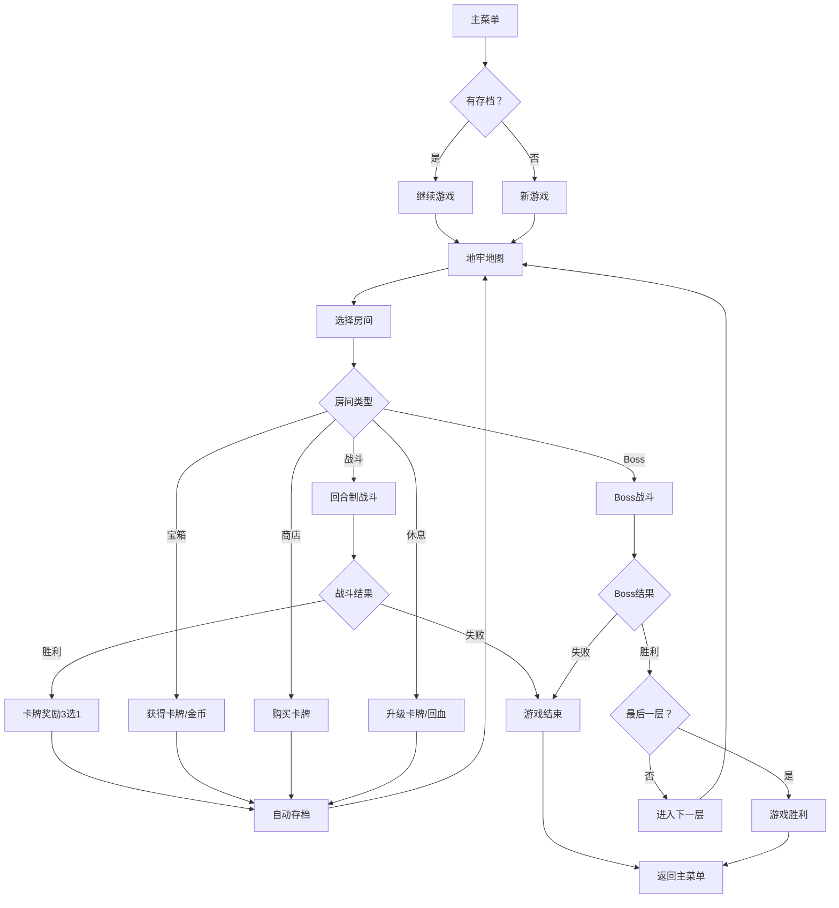

## 1. 产品概述

Roguelike卡牌冒险游戏是一款暗黑奇幻风格的地牢探索卡牌游戏。玩家控制英雄在随机生成的三层地牢中探索、战斗，收集并强化卡牌，最终击败Boss通关。游戏融合了策略卡牌构筑与Roguelike随机元素，每局体验独特。

- 核心玩法：回合制卡牌战斗 + 随机地牢探索 + 牌组构建
- 目标用户：喜欢策略卡牌游戏和Roguelike游戏的玩家
- 产品价值：提供高重玩性的策略卡牌冒险体验，每局游戏都有独特的牌组构建路线

## 2. 核心功能

### 2.1 用户角色
| 角色 | 注册方式 | 核心权限 |
|------|----------|----------|
| 玩家 | 无需注册，本地存档 | 游戏游玩、存档读取、牌组管理 |

### 2.2 功能模块
1. **地牢探索模块**：六边形网格地牢地图，随机房间布局，小地图预览
2. **战斗系统模块**：回合制卡牌战斗，能量管理，敌人AI
3. **牌组管理模块**：卡牌收集、升级、弃牌，卡牌稀有度系统
4. **英雄状态模块**：生命值、能量、护甲、金币管理
5. **存档系统模块**：自动存档、继续游戏、进度重置
6. **商店系统模块**：购买卡牌、升级卡牌
7. **事件系统模块**：随机事件生成，宝箱、休息点、Boss

### 2.3 页面详情
| 页面名称 | 模块名称 | 功能描述 |
|----------|----------|----------|
| 主菜单页面 | 开始游戏 | 新游戏、继续游戏、游戏说明 |
| 地牢地图页面 | 地牢探索 | 六边形房间地图、小地图、英雄状态、房间选择 |
| 战斗页面 | 战斗系统 | 敌人展示、手牌区、能量条、战斗动画、伤害数字 |
| 牌组选择页面 | 卡牌收集 | 3选1卡牌掉落、卡牌详情展示 |
| 商店页面 | 商店系统 | 稀有卡牌购买、金币显示 |
| 休息页面 | 休息系统 | 卡牌升级、生命恢复 |
| 游戏结束页面 | 结算 | 胜利/失败界面、统计数据、重新开始 |

## 3. 核心流程

玩家从主菜单开始，选择新游戏或继续游戏。进入地牢后，在六边形网格地图上选择房间前进。每个房间可能是战斗、宝箱、商店、休息点或Boss。战斗中使用卡牌消耗能量攻击敌人，胜利后获得奖励。通过所有三层地牢击败最终Boss即获胜，生命归零则失败。每完成一个房间自动存档。

## 4. 用户界面设计

### 4.1 设计风格
- **主色调**：深紫色背景 (#1a0a2e)，搭配金色边框 (#d4af37) 和暗红色高亮 (#8b0000)
- **辅助色**：羊皮纸米黄 (#f5e6c8)，能量蓝 (#4169e1)，生命红 (#dc143c)
- **卡牌稀有度**：金色(传说)、紫色(稀有)、蓝色(普通)
- **字体**：标题使用 Cinzel 装饰性字体，正文使用 Crimson Pro 衬线字体
- **视觉风格**：暗黑奇幻、羊皮纸纹理、六边形元素、发光边缘效果
- **动画风格**：CSS transition + transform 实现流畅动画，卡牌缩放、粒子消散、伤害浮动

### 4.2 页面设计概览
| 页面名称 | 模块名称 | UI元素 |
|----------|----------|--------|
| 主菜单页面 | 标题区域 | 游戏标题(金色发光效果)、装饰性边框、暗黑背景 |
| 主菜单页面 | 菜单按钮 | 新游戏、继续游戏、游戏说明按钮(金色边框，悬停发光) |
| 地牢地图页面 | 英雄状态栏 | 左上角圆形头像、生命条(红色)、能量条(蓝色)、金币显示 |
| 地牢地图页面 | 六边形地图 | 中央六边形网格、未探索房间发光边缘、已探索暗淡 |
| 地牢地图页面 | 小地图 | 右上角迷你地图预览、当前位置标记 |
| 战斗页面 | 敌人区域 | 敌人立绘、生命条、受击抖动动画、浮动伤害数字 |
| 战斗页面 | 手牌区 | 底部扇形排列卡牌、可拖拽、选中高亮、入场退场动画 |
| 战斗页面 | 能量显示 | 能量水晶图标、当前/最大能量 |
| 卡牌奖励页面 | 卡牌选择 | 三张卡牌横向排列、悬停放大、点击选择 |
| 商店页面 | 商品列表 | 卡牌商品展示、价格标签、购买按钮 |
| 游戏结束页面 | 结算面板 | 胜利/失败标题、统计数据、重新开始按钮 |

### 4.3 响应式设计
- **桌面端**：完整布局，左侧英雄状态，中央地图/战斗，右侧小地图
- **平板端**：自适应缩放，小地图可折叠
- **手机端**：隐藏小地图，改为手势滑动切换视图，卡牌尺寸适配屏幕宽度
- **触控优化**：按钮最小点击区域44px，支持触控拖拽卡牌

### 4.4 动效设计
- **卡牌入场**：从牌堆飞入，带旋转和缩放动画，stagger延迟
- **卡牌打出**：缩放飞出，粒子消散效果
- **受击动画**：敌人/英雄抖动，红色闪屏
- **伤害数字**：向上浮动，渐隐消失
- **房间探索**：发光边缘渐变为暗淡，平滑过渡
- **生命条低血量**：生命值<30%时红色闪烁
- **页面切换**：淡入淡出过渡，时长300ms
