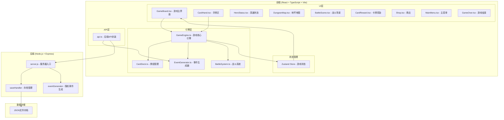
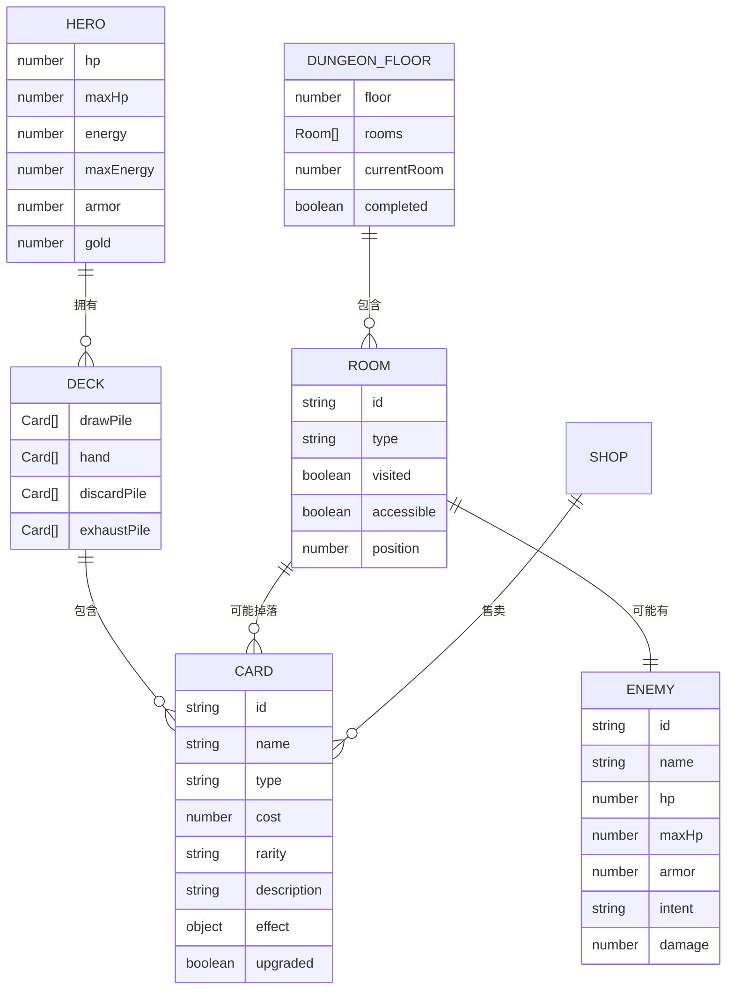

## 1. 架构设计



## 2. 技术描述

- **前端框架**：React@18 + TypeScript
- **构建工具**：Vite@5
- **状态管理**：Zustand@4
- **样式方案**：CSS Modules + CSS Variables
- **后端框架**：Express@4
- **跨域处理**：CORS
- **HTTP客户端**：Fetch API
- **动画方案**：CSS transition + transform + requestAnimationFrame

## 3. 文件结构

```
auto8/
├── index.html                 # 入口HTML
├── package.json               # 项目依赖
├── vite.config.js             # Vite配置
├── tsconfig.json              # TypeScript配置
├── server.js                  # 后端入口
├── .trae/documents/           # 项目文档
├── src/
│   ├── App.tsx                # 主应用组件
│   ├── main.tsx               # 入口文件
│   ├── vite-env.d.ts          # Vite类型声明
│   ├── types/                 # 类型定义
│   │   └── game.ts            # 游戏类型定义
│   ├── engine/                # 游戏引擎模块
│   │   ├── GameEngine.ts      # 游戏核心引擎
│   │   ├── CardDeck.ts        # 牌组管理
│   │   ├── EventGenerator.ts  # 事件生成器
│   │   └── BattleSystem.ts    # 战斗系统
│   ├── ui/                    # UI组件模块
│   │   ├── GameBoard.tsx      # 游戏主界面
│   │   ├── CardHand.tsx       # 手牌区
│   │   ├── HeroStatus.tsx     # 英雄状态
│   │   ├── DungeonMap.tsx     # 地牢地图
│   │   ├── BattleScene.tsx    # 战斗场景
│   │   ├── CardReward.tsx     # 卡牌奖励
│   │   ├── Shop.tsx           # 商店
│   │   ├── RestSite.tsx       # 休息点
│   │   ├── MainMenu.tsx       # 主菜单
│   │   ├── GameOver.tsx       # 游戏结束
│   │   └── MiniMap.tsx        # 小地图
│   ├── data/                  # 游戏数据
│   │   ├── cards.ts           # 卡牌数据
│   │   ├── enemies.ts         # 敌人数据
│   │   └── events.ts          # 事件数据
│   ├── store/                 # 状态管理
│   │   └── useGameStore.ts    # Zustand store
│   ├── utils/                 # 工具函数
│   │   └── api.ts             # API封装
│   └── styles/                # 样式文件
│       ├── variables.css      # CSS变量
│       └── animations.css     # 动画关键帧
└── saves/                     # 存档文件目录
```

## 4. 路由定义

| 路由/页面状态 | 用途 |
|---------------|------|
| menu | 主菜单页面 |
| map | 地牢地图页面 |
| battle | 战斗页面 |
| reward | 卡牌奖励选择页面 |
| shop | 商店页面 |
| rest | 休息点页面 |
| gameover | 游戏结束页面 |

## 5. API 定义

### 5.1 存档相关

**POST /api/save**
- 描述：保存游戏进度
- 请求体：
  ```typescript
  interface SaveRequest {
    saveId: string;
    data: {
      floor: number;
      roomIndex: number;
      hero: {
        hp: number;
        maxHp: number;
        energy: number;
        maxEnergy: number;
        armor: number;
        gold: number;
      };
      deck: Card[];
      dungeon: DungeonFloor;
      currentRoom: number;
    };
  }
  ```
- 响应：
  ```typescript
  interface SaveResponse {
    success: boolean;
    message: string;
    timestamp: number;
  }
  ```

**GET /api/save/:saveId**
- 描述：读取游戏存档
- 响应：
  ```typescript
  interface LoadResponse {
    success: boolean;
    data?: SaveRequest['data'];
    message: string;
  }
  ```

**DELETE /api/save/:saveId**
- 描述：删除存档
- 响应：
  ```typescript
  { success: boolean; message: string; }
  ```

### 5.2 随机事件相关

**GET /api/events?floor=1&seed=abc**
- 描述：生成随机事件种子
- 参数：
  - floor: 层数 (1-3)
  - seed: 随机种子（可选）
- 响应：
  ```typescript
  interface EventsResponse {
    seed: string;
    events: RoomEvent[];
    bossEnemy: EnemyData;
  }
  ```

## 6. 数据模型

### 6.1 实体关系图



### 6.2 核心类型定义

```typescript
// 卡牌类型
type CardType = 'attack' | 'skill' | 'power';
type CardRarity = 'common' | 'rare' | 'legendary';

interface Card {
  id: string;
  name: string;
  type: CardType;
  cost: number;
  rarity: CardRarity;
  description: string;
  effect: CardEffect;
  upgraded: boolean;
  upgradedName?: string;
  upgradedDescription?: string;
}

interface CardEffect {
  damage?: number;
  block?: number;
  heal?: number;
  draw?: number;
  energy?: number;
  strength?: number;
  vulnerable?: number;
  weak?: number;
}

// 英雄状态
interface Hero {
  hp: number;
  maxHp: number;
  energy: number;
  maxEnergy: number;
  armor: number;
  gold: number;
  strength: number;
  vulnerable: number;
  weak: number;
}

// 敌人
interface Enemy {
  id: string;
  name: string;
  hp: number;
  maxHp: number;
  armor: number;
  intent: EnemyIntent;
  baseDamage: number;
  strength: number;
  vulnerable: number;
  weak: number;
}

type EnemyIntent = 'attack' | 'defend' | 'buff' | 'debuff';

// 房间
type RoomType = 'battle' | 'elite' | 'boss' | 'treasure' | 'shop' | 'rest' | 'event';

interface Room {
  id: string;
  type: RoomType;
  visited: boolean;
  accessible: boolean;
  position: { row: number; col: number };
  connections: string[];
}

// 地牢层
interface DungeonFloor {
  floor: number;
  rooms: Room[];
  currentRoomId: string | null;
  bossDefeated: boolean;
}

// 战斗状态
interface BattleState {
  turn: number;
  phase: 'player' | 'enemy' | 'ended';
  enemies: Enemy[];
  selectedCardIndex: number | null;
  combatLog: string[];
}

// 游戏存档
interface GameSave {
  hero: Hero;
  deck: Card[];
  floors: DungeonFloor[];
  currentFloor: number;
  gold: number;
  timestamp: number;
}
```

## 7. 数据流

### 7.1 游戏主循环数据流

```
用户操作 → UI组件 → GameEngine方法调用 → 状态更新 → Zustand Store → 组件重新渲染
     ↑                                                          ↓
     └──────────────────── 事件回调/动画完成 ────────────────────┘
```

### 7.2 战斗数据流

1. 进入战斗：GameEngine.startBattle() → 初始化敌人 → 洗牌 → 抽初始手牌 → 渲染战斗场景
2. 玩家回合：GameEngine.startPlayerTurn() → 回复能量 → 抽牌 → 玩家打出卡牌
3. 打出卡牌：GameEngine.playCard(index) → 消耗能量 → 执行卡牌效果 → 更新状态 → 弃牌
4. 结束回合：GameEngine.endTurn() → 敌人行动阶段 → 每个敌人执行AI → 更新状态
5. 战斗结束：检测胜负 → 胜利则进入奖励 → 失败则游戏结束

### 7.3 存档数据流

1. 房间完成 → GameEngine.triggerAutoSave() → 调用api.saveGame()
2. 发送POST /api/save → 后端写入JSON文件 → 返回成功
3. 加载游戏 → api.loadSave() → GET /api/save/:id → 后端读取文件 → GameEngine.loadSave()

## 8. 性能优化策略

- 使用 `requestAnimationFrame` 保证动画60fps
- 卡牌组件使用 `React.memo` 避免不必要的重渲染
- 大型列表使用虚拟滚动（如卡牌收藏）
- CSS动画使用 `transform` 和 `opacity` 触发GPU加速
- 存档请求超时3秒自动重试，最多3次
- 房间切换动画控制在500ms以内
- 战斗场景帧率不低于45fps
- 使用 `useCallback` 和 `useMemo` 优化性能
