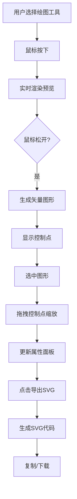

## 1. 产品概述

在线手绘SVG白板工具，解决设计师和开发者在快速构思界面原型时，无法便捷地将手绘草图转换为可复用矢量图形的痛点。用户可通过鼠标或触控笔自由绘制线条、矩形、圆形和箭头，实时预览并一键导出为SVG代码。

- **目标用户**：UI/UX设计师、前端开发者、产品经理
- **核心价值**：快速将手绘想法转化为可复用的矢量图形，提升原型设计效率
- **市场定位**：轻量级、零学习成本的在线绘图工具

## 2. 核心功能

### 2.1 用户角色

| 角色 | 注册方式 | 核心权限 |
|------|----------|----------|
| 普通用户 | 无需注册，直接使用 | 绘制图形、调整图形、撤销重做、导出SVG |

### 2.2 功能模块

1. **绘图引擎模块**：支持画笔、矩形、圆形、箭头四种图形的自由绘制，实时跟随鼠标显示，松手后转换为矢量路径
2. **图形编辑模块**：支持选中图形、拖拽缩放（四角控制点）、弹性动画反馈
3. **工具栏模块**：画笔、矩形、圆形、箭头、选择五种模式切换
4. **属性面板模块**：显示选中图形的宽度、高度、旋转角度
5. **颜色预设模块**：8种预设颜色快速切换
6. **SVG导出模块**：生成SVG代码、复制到剪贴板、下载为.svg文件
7. **撤销重做模块**：支持Ctrl+Z撤销、Ctrl+Y重做，50步操作历史

### 2.3 页面详情

| 页面名称 | 模块名称 | 功能描述 |
|-----------|-------------|---------------------|
| 主画布页 | 顶部导航栏 | SVG导出按钮、品牌标识 |
| 主画布页 | 左侧工具栏 | 绘图模式切换（画笔/矩形/圆形/箭头/选择） |
| 主画布页 | 中央绘图区 | 5x5px网格背景，支持自由绘制和图形编辑 |
| 主画布页 | 底部颜色条 | 8种颜色预设，点击切换绘图颜色 |
| 主画布页 | 右侧属性面板 | 显示选中图形的宽高、旋转角度 |
| 主画布页 | 导出模态框 | 显示SVG代码，提供复制和下载功能 |

## 3. 核心流程

### 3.1 绘图流程
用户选择绘图工具 → 鼠标按下开始绘制 → 实时预览绘制轨迹 → 鼠标松开完成绘制 → 图形显示四角控制点

### 3.2 图形编辑流程
用户点击选择工具 → 点击选中图形 → 显示控制点和属性面板 → 拖拽控制点调整大小 → 实时更新图形和属性数值

### 3.3 SVG导出流程
点击导出按钮 → 生成SVG代码 → 模态框从顶部滑入 → 点击复制/下载按钮 → 完成操作后关闭模态框

### 3.4 Mermaid流程图

## 4. 用户界面设计

### 4.1 设计风格
- **设计语言**：极简毛玻璃风格
- **主色调**：#2563eb（深蓝）
- **辅助色**：#7c3aed（紫色）
- **警告色**：#f59e0b（橙色）
- **主背景**：从左上到右下渐变，#f0f4ff 到 #e8ecf1
- **绘图区背景**：纯白#ffffff，5x5px浅灰#e5e7eb网格线
- **毛玻璃效果**：半透明白色rgba(255,255,255,0.7) + backdrop-filter: blur(8px)
- **圆角**：12px
- **按钮效果**：点击时scale(0.95)，0.1秒过渡
- **图标风格**：1.5px线性图标，无钝角或实心填充

### 4.2 动画设计
- **工具切换**：0.2秒淡入色块过渡
- **颜色选中**：外侧白色描边 + 放大1.1倍弹性动画
- **控制点闪烁**：每0.8秒透明度在0.6~1.0之间循环
- **模态框**：0.25秒缓动动画，从顶部滑入
- **撤销重做**：0.15秒淡入淡出动画
- **缩放动画**：0.1秒缓出弹性效果

### 4.2 页面设计概览

| 页面名称 | 模块名称 | UI元素 |
|-----------|-------------|-------------|
| 主画布页 | 顶部导航栏 | 品牌Logo、SVG导出按钮（下载箭头图标）、1px柔和阴影 |
| 主画布页 | 左侧工具栏 | 5个扁平图标按钮（画笔、矩形、圆形、箭头、选择），垂直排列，毛玻璃背景 |
| 主画布页 | 中央绘图区 | 80%宽度居中，白色背景，网格线，1px柔和阴影rgba(0,0,0,0.08) |
| 主画布页 | 底部颜色条 | 8个圆形色块（黑、红、蓝、绿、紫、橙、青、粉），水平排列 |
| 主画布页 | 右侧属性面板 | 毛玻璃背景，显示宽高、旋转角度数值（精确到小数点后一位） |
| 主画布页 | 导出模态框 | 半透明遮罩，代码区域灰色背景，等宽字体，行号显示，复制/下载按钮 |

### 4.3 响应式设计

- **桌面端（>=1024px）**：完整布局，左侧工具栏 + 中央绘图区 + 右侧属性面板
- **平板端（768-1023px）**：属性面板收缩为右侧抽屉式，点击图标展开
- **手机端（<768px）**：工具栏变为底部横排可滚动条，属性面板以向上弹出的半屏卡片形式出现

### 4.4 字体选择
- **显示字体**：Inter 或系统无衬线字体
- **代码字体**：JetBrains Mono 或 Menlo 等宽字体
- **字号层级**：标题16px，正文14px，属性值13px，代码12px

## 5. 性能指标

- **绘图延迟**：<16ms（每帧渲染一次）
- **撤销/重做响应**：<50ms
- **SVG代码生成**：<100ms（100条路径以内）
- **撤销栈深度**：50步
