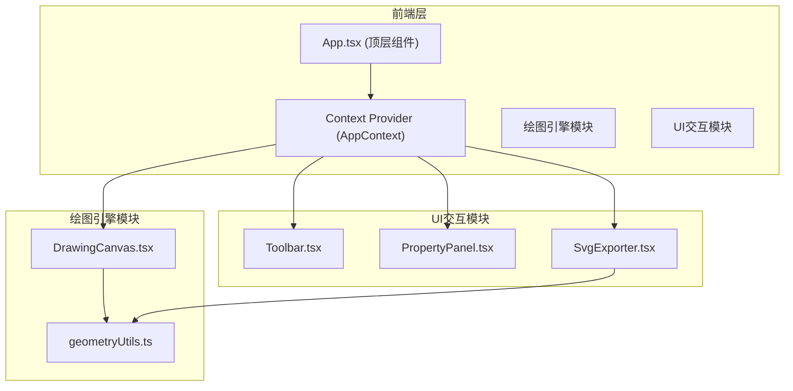

## 1. 架构设计



## 2. 技术栈描述

- **前端框架**：React@18 + TypeScript
- **构建工具**：Vite@5
- **状态管理**：React Context + useReducer
- **样式方案**：原生CSS + CSS变量 + 响应式媒体查询
- **图标方案**：内联SVG图标（1.5px线性风格）
- **唯一ID**：uuid库

### 2.1 核心依赖

```json
{
  "react": "^18.2.0",
  "react-dom": "^18.2.0",
  "typescript": "^5.3.0",
  "vite": "^5.0.0",
  "@vitejs/plugin-react": "^4.2.0",
  "uuid": "^9.0.0",
  "@types/uuid": "^9.0.0"
}
```

## 3. 数据模型

### 3.1 图形类型定义

```typescript
type ToolMode = 'brush' | 'rectangle' | 'circle' | 'arrow' | 'select';

interface Point {
  x: number;
  y: number;
}

interface BaseShape {
  id: string;
  type: ToolMode;
  color: string;
  strokeWidth: number;
  rotation: number;
  x: number;
  y: number;
  width: number;
  height: number;
}

interface BrushShape extends BaseShape {
  type: 'brush';
  points: Point[];
  path: string;
}

interface RectangleShape extends BaseShape {
  type: 'rectangle';
}

interface CircleShape extends BaseShape {
  type: 'circle';
}

interface ArrowShape extends BaseShape {
  type: 'arrow';
  startPoint: Point;
  endPoint: Point;
}

type Shape = BrushShape | RectangleShape | CircleShape | ArrowShape;

interface AppState {
  shapes: Shape[];
  currentMode: ToolMode;
  selectedId: string | null;
  currentColor: string;
  strokeWidth: number;
  undoStack: Shape[][];
  redoStack: Shape[][];
  isDrawing: boolean;
}
```

### 3.2 几何工具函数

| 函数名 | 参数 | 返回值 | 功能描述 |
|--------|------|--------|----------|
| `generateRectPath` | x, y, width, height | string | 生成矩形SVG路径 |
| `generateCirclePath` | cx, cy, radius | string | 生成圆形SVG路径 |
| `generateArrowPath` | startPoint, endPoint | string | 生成箭头SVG路径 |
| `calculateBoundingBox` | points: Point[] | { x, y, width, height } | 计算点集的边界盒 |
| `shapeToSvgString` | shape: Shape | string | 将图形转换为SVG元素字符串 |

## 4. 模块职责划分

### 4.1 绘图引擎模块 (drawing-engine)

| 文件 | 职责 | 对外暴露 |
|------|------|----------|
| `DrawingCanvas.tsx` | 处理鼠标事件、实时绘制、图形渲染、拖拽缩放 | `handleMouseDown`, `handleMouseMove`, `handleMouseUp`, 图形列表状态 |
| `geometryUtils.ts` | 几何计算、路径生成、边界盒计算、SVG字符串生成 | 纯函数集合 |

### 4.2 UI交互模块 (ui-panel)

| 文件 | 职责 | 数据来源 |
|------|------|----------|
| `Toolbar.tsx` | 渲染工具选择栏、切换绘图模式 | Context 读取 currentMode，dispatch 切换模式 |
| `PropertyPanel.tsx` | 渲染属性面板、显示宽高/旋转角度 | Context 读取 selectedId 和 shapes |
| `SvgExporter.tsx` | 渲染导出按钮和模态框、生成SVG代码、复制下载 | Context 读取 shapes，调用 geometryUtils |

### 4.3 全局上下文 (context)

| 文件 | 职责 | 提供内容 |
|------|------|----------|
| `AppContext.tsx` | 存储全局状态、提供dispatch、管理撤销栈 | `shapes`, `currentMode`, `selectedId`, `currentColor`, `strokeWidth`, `dispatch` |

## 5. 核心交互流程

### 5.1 绘制流程
1. 鼠标按下 → `handleMouseDown` → 创建临时图形
2. 鼠标移动 → `handleMouseMove` → 更新临时图形坐标 → requestAnimationFrame 重绘
3. 鼠标松开 → `handleMouseUp` → 保存图形到 shapes → push 到 undoStack → 清空 redoStack

### 5.2 撤销/重做流程
1. Ctrl+Z → dispatch(UNDO) → 当前 shapes push 到 redoStack → undoStack 弹出作为新 shapes
2. Ctrl+Y → dispatch(REDO) → 当前 shapes push 到 undoStack → redoStack 弹出作为新 shapes

### 5.3 SVG导出流程
1. 点击导出按钮 → 遍历 shapes → 调用 `shapeToSvgString` 生成每个图形的SVG
2. 拼接完整SVG文档（包含width/height/viewBox）→ 显示在模态框中
3. 复制：navigator.clipboard.writeText(code)
4. 下载：创建Blob → 创建URL → 创建a标签触发下载

## 6. 性能优化策略

### 6.1 绘图性能
- 使用 `requestAnimationFrame` 确保60fps渲染
- 只重绘当前正在绘制的图形，而非全部重绘
- 使用 SVG path 元素而非大量独立 line 元素

### 6.2 状态更新
- 使用 useReducer 进行批量状态更新
- 撤销栈限制在50步，防止内存溢出
- 选中图形时使用缓存的边界盒，避免重复计算

### 6.3 响应式渲染
- 使用 CSS 媒体查询处理不同屏幕尺寸
- 移动端使用 transform 优化滚动性能
- 避免在 resize 事件中进行重计算，使用防抖

## 7. 目录结构

```
auto80/
├── package.json
├── vite.config.js
├── tsconfig.json
├── index.html
├── src/
│   ├── App.tsx
│   ├── main.tsx
│   ├── index.css
│   ├── context/
│   │   └── AppContext.tsx
│   └── modules/
│       ├── drawing-engine/
│       │   ├── DrawingCanvas.tsx
│       │   └── geometryUtils.ts
│       └── ui-panel/
│           ├── Toolbar.tsx
│           ├── PropertyPanel.tsx
│           └── SvgExporter.tsx
```

## 8. Action Types (useReducer)

| Action Type | Payload | 说明 |
|-------------|---------|------|
| `SET_MODE` | `mode: ToolMode` | 切换绘图模式 |
| `SET_COLOR` | `color: string` | 设置绘图颜色 |
| `ADD_SHAPE` | `shape: Shape` | 添加新图形 |
| `UPDATE_SHAPE` | `id: string, updates: Partial<Shape>` | 更新图形属性 |
| `DELETE_SHAPE` | `id: string` | 删除图形 |
| `SELECT_SHAPE` | `id: string \| null` | 选中/取消选中 |
| `UNDO` | - | 撤销 |
| `REDO` | - | 重做 |
| `CLEAR_ALL` | - | 清空所有图形 |
