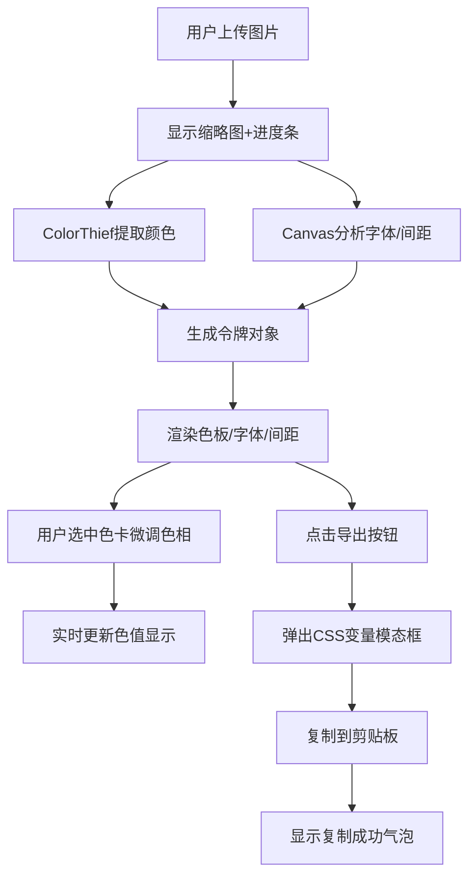

## 1. 产品概述

设计令牌提取与主题预览应用是一款面向设计师和前端开发者的协作工具，用于将设计稿截图自动转换为统一的设计令牌（Design Tokens）。用户上传设计稿截图后，系统自动提取主色、辅助色、字体和间距等参数，生成可直接引用的CSS变量主题文件，解决手动提取效率低、易出错的问题。

- **目标用户**：UI设计师、前端开发工程师、设计系统维护人员
- **产品价值**：提升设计到开发的协作效率，确保设计规范一致性，减少沟通成本

## 2. 核心功能

### 2.1 用户角色
| 角色 | 注册方式 | 核心权限 |
|------|---------|---------|
| 普通用户 | 无需注册，直接使用 | 上传图片、提取令牌、预览主题、导出CSS变量 |

### 2.2 功能模块
1. **图片上传模块**：拖拽/点击上传、上传反馈、缩略图展示、提取进度条
2. **颜色提取模块**：主色提取（>15%占比，最多6种）、辅助色提取（5%-15%占比，最多4种）、HSL排序
3. **色板展示模块**：主色/辅助色卡片、放大选中态、渐变色相环、色相微调滑块
4. **字体与间距模块**：常用字体大小提取（最多3个）、间距值提取（最多5个）、阶梯条形图展示、tooltip悬停提示
5. **主题导出模块**：CSS变量生成、模态框预览、一键复制到剪贴板、复制成功反馈

### 2.3 页面详情
| 页面名称 | 模块名称 | 功能描述 |
|---------|---------|----------|
| 主应用页面 | 上传区域 | 虚线边框方框，中心文字提示，拖拽高亮反馈，上传成功绿色闪烁 |
| 主应用页面 | 缩略图与进度 | 300px宽缩略图，1.5秒平滑进度条，主色渐变填充 |
| 主应用页面 | 主色板区域 | 6张1:1等宽卡片，深色背景+发光边框，左上角十六进制色码，中心扩散淡入动画 |
| 主应用页面 | 辅助色板区域 | 4张60%尺寸卡片，中心扩散淡入动画 |
| 主应用页面 | 色相环预览 | 选中颜色后底部展示，圆形渐变色带，滑块拖拽微调，实时更新色值 |
| 主应用页面 | 字体标签区 | 垂直堆叠标签，显示字体大小和"Aa"示例文字 |
| 主应用页面 | 间距标尺区 | 水平阶梯条形图，主色透明渐变填充，悬停显示tooltip |
| 主应用页面 | 导出模态框 | 半透明模糊背景，底部滑入动画，等宽字体CSS文本，复制按钮+成功气泡 |

## 3. 核心流程

用户点击或拖拽上传设计稿图片 → 系统显示缩略图并启动提取进度条 → ColorThief提取主色和辅助色 → Canvas分析提取字体大小和间距值 → 令牌对象传递到预览模块 → 色板、字体、间距实时渲染展示 → 用户点击色卡选中可微调色相 → 点击导出按钮弹出CSS变量模态框 → 一键复制到剪贴板

## 4. 用户界面设计

### 4.1 设计风格
- **整体主题**：深色科技风，背景色 `#1a1a2e`，卡片边缘微弱发光边框
- **主色调**：由提取的图片主色动态决定，提取失败时默认 `#667eea`
- **按钮风格**：圆角胶囊按钮，发光阴影，hover时轻微放大+亮度提升
- **字体**：展示字体使用独特衬线或现代无衬线字体，避免使用Inter/Arial等通用字体
- **布局风格**：桌面端左右两栏布局（<768px自动切换为上下布局），卡片式模块，大量留白
- **动效风格**：统一0.3秒ease-out过渡，卡片中心扩散淡入，模态框底部滑入，弹性缩放动画

### 4.2 页面设计概述
| 页面名称 | 模块名称 | UI元素 |
|---------|---------|--------|
| 主应用页面 | 顶部导航区 | 标题文字+导出按钮固定右上角，微妙的顶部发光分割线 |
| 主应用页面 | 左侧上传与信息区 | 上传区域占据上部，缩略图+进度条下方，字体标签区底部 |
| 主应用页面 | 右侧预览区 | 主色板两行流动布局，辅助色板下方，间距标尺底部，色相环固定底部 |
| 主应用页面 | 色卡组件 | 1:1等宽，左上角色码标签，选中时金色细边框+弹性缩放，发光box-shadow |
| 主应用页面 | 间距条块 | 阶梯式从短到长，主色透明渐变，悬停上方显示深色半透明tooltip带箭头 |
| 主应用页面 | 色相环组件 | 圆形渐变带，滑块可拖拽，背景有微妙径向光晕 |
| 主应用页面 | 导出模态框 | backdrop-filter模糊，底部滑入，代码区带行号感，复制按钮绿色主题 |

### 4.3 响应式设计
- **桌面端**（>768px）：左右两栏布局，左侧上传+字体信息，右侧色板+间距预览，色板每行显示4-6个
- **移动端**（<768px）：上下堆叠布局，上传区域全宽条状，色板每行显示3个，间距标尺改为垂直排列
- **触摸优化**：色卡最小触摸区域44x44px，滑块拖拽区域扩大，tooltip改为点击触发

## 5. 性能约束
- 图片提取处理时间：1MB以内PNG/JPG ≤ 2秒
- 色相滑块拖动响应延迟：< 100ms
- 导出模态框弹窗动画：≤ 0.3秒
- 所有交互动画统一帧率：60fps，使用CSS transform/opacity硬件加速
