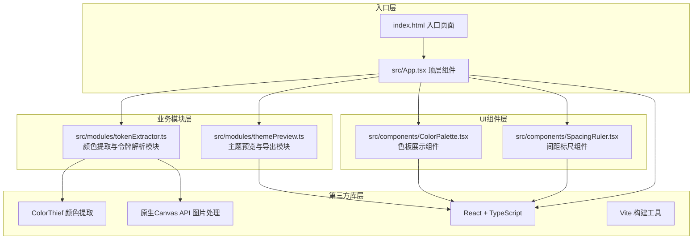

## 1. 架构设计

本项目为纯前端React单页应用，采用分层模块化架构，按职责分离核心逻辑与UI展示。数据流采用单向流动模式，从顶层App组件向下传递到各子模块和组件。



**数据流向说明**：
1. 用户上传事件 → `App.tsx` 接收文件 → 创建Image对象和Canvas
2. `App.tsx` → 调用 `tokenExtractor.extractTokens(imageData)` → 返回令牌对象
3. `App.tsx` → 将令牌对象传入 `ColorPalette` 和 `SpacingRuler` 展示
4. 用户选中色卡/微调色相 → `App.tsx` 更新本地状态 → 重新渲染组件
5. 用户点击导出 → 调用 `themePreview.generateCSSVariables(tokens)` → 生成CSS文本

## 2. 技术描述

- **前端框架**：React@18 + TypeScript（严格模式 strict: true）
- **构建工具**：Vite@5 + @vitejs/plugin-react
- **颜色提取库**：colorthief@latest
- **图片处理**：原生 HTML5 Canvas API（离屏Canvas）
- **状态管理**：React useState/useRef（组件内部状态，无需全局状态库）
- **样式方案**：原生 CSS + CSS Modules（内联样式处理动态值）
- **包管理工具**：npm
- **初始化方式**：`npm init vite-init@latest . --template react-ts --force`

**不引入的技术**：
- 不使用路由（单页应用，无页面跳转）
- 不使用全局状态管理（状态集中在App.tsx）
- 不使用Tailwind CSS（用户未要求，使用原生CSS实现精确动画控制）
- 不引入后端服务（纯前端，所有处理在浏览器端完成）

## 3. 项目文件结构

```
d:\Pro\tasks\auto82/
├── package.json                 # 项目依赖配置
├── vite.config.js              # Vite构建配置
├── tsconfig.json               # TypeScript配置（严格模式）
├── index.html                  # 入口HTML页面
└── src/
    ├── App.tsx                 # 顶层组件（流程编排）
    ├── main.tsx                # React渲染入口
    ├── index.css               # 全局样式
    ├── modules/
    │   ├── tokenExtractor.ts   # 颜色提取与令牌解析
    │   └── themePreview.ts     # CSS变量生成与导出逻辑
    └── components/
        ├── ColorPalette.tsx    # 色板展示组件（含色相环）
        └── SpacingRuler.tsx    # 间距标尺组件
```

**文件间调用关系**：
- `App.tsx` → `import { extractDesignTokens, DesignTokens } from './modules/tokenExtractor'`
- `App.tsx` → `import { generateCSSVariables, copyToClipboard } from './modules/themePreview'`
- `App.tsx` → `import ColorPalette from './components/ColorPalette'`
- `App.tsx` → `import SpacingRuler from './components/SpacingRuler'`
- `tokenExtractor.ts` → 内部使用 `import ColorThief from 'colorthief'`

## 4. 核心数据类型定义

```typescript
// src/modules/tokenExtractor.ts 中定义

interface HSL {
  h: number;     // 色相 0-360
  s: number;     // 饱和度 0-100
  l: number;     // 亮度 0-100
}

interface ColorToken {
  hex: string;   // 十六进制色值 #RRGGBB
  rgb: [number, number, number];  // RGB值
  hsl: HSL;      // HSL值
  ratio: number; // 颜色占比 0-1
}

interface FontToken {
  size: number;       // 字体大小px
  sampleText: 'Aa';   // 示例文字
}

interface SpacingToken {
  value: number;      // 间距值px
  label: string;      // 标签如 'spacing-1'
}

interface DesignTokens {
  primaryColors: ColorToken[];   // 主色数组，最多6个（>15%占比）
  secondaryColors: ColorToken[]; // 辅助色数组，最多4个（5%-15%占比）
  fonts: FontToken[];            // 字体数组，最多3个
  spacings: SpacingToken[];      // 间距数组，最多5个
  thumbnailUrl: string;          // 缩略图DataURL
}
```

## 5. 模块职责与API设计

### 5.1 tokenExtractor.ts - 令牌提取模块

| 导出函数 | 输入参数 | 返回值 | 功能描述 |
|---------|---------|--------|---------|
| `extractDesignTokens` | `imageData: ImageData`, `thumbnailUrl: string` | `Promise<DesignTokens>` | 主入口函数，编排颜色/字体/间距提取流程 |
| `extractColors` | `imageData: ImageData` | `{ primary: ColorToken[], secondary: ColorToken[] }` | 调用ColorThief提取调色板，按占比分主色/辅助色，按HSL色相排序 |
| `extractFontsAndSpacings` | `imageData: ImageData` | `{ fonts: FontToken[], spacings: SpacingToken[] }` | Canvas像素分析，基于边缘检测和空白区域估算字体/间距 |
| `rgbToHex` | `rgb: [number, number, number]` | `string` | RGB转十六进制色值工具函数 |
| `rgbToHsl` | `rgb: [number, number, number]` | `HSL` | RGB转HSL工具函数 |
| `sortByHue` | `colors: ColorToken[]` | `ColorToken[]` | 按HSL色相值升序排序 |

### 5.2 themePreview.ts - 主题导出模块

| 导出函数 | 输入参数 | 返回值 | 功能描述 |
|---------|---------|--------|---------|
| `generateCSSVariables` | `tokens: DesignTokens` | `string` | 生成完整CSS变量文本，格式如 `--primary-1: #xxxxxx;` |
| `copyToClipboard` | `text: string` | `Promise<boolean>` | 调用Clipboard API复制文本，返回是否成功 |

### 5.3 ColorPalette.tsx - 色板组件

| Props名称 | 类型 | 用途 |
|----------|------|------|
| `primaryColors` | `ColorToken[]` | 主色数组 |
| `secondaryColors` | `ColorToken[]` | 辅助色数组 |
| `selectedIndex` | `number \| null` | 当前选中主色索引 |
| `onColorSelect` | `(index: number) => void` | 选中主色回调 |
| `onColorAdjust` | `(index: number, newHex: string) => void` | 色相微调回调 |

### 5.4 SpacingRuler.tsx - 间距标尺组件

| Props名称 | 类型 | 用途 |
|----------|------|------|
| `spacings` | `SpacingToken[]` | 间距数组 |
| `accentColor` | `string` | 主色（用于条块渐变填充） |
| `vertical` | `boolean` | 是否垂直排列（移动端） |

## 6. 性能优化方案

1. **颜色提取优化**：
   - 将图片缩小至最大尺寸 400x400px 再分析，减少像素处理量
   - 使用离屏 Canvas（OffscreenCanvas）异步处理，避免阻塞主线程

2. **动画性能**：
   - 所有过渡动画仅使用 `transform` 和 `opacity` 属性，触发GPU合成
   - 色相滑块使用 `requestAnimationFrame` 节流更新，确保<100ms响应
   - 大量元素动画使用 `animation-delay` 错峰渲染，避免帧率尖峰

3. **内存管理**：
   - 图片处理完成后及时调用 `URL.revokeObjectURL()` 释放内存
   - Canvas 用完后清除上下文并置空引用

4. **响应式策略**：
   - 使用 CSS `@media (max-width: 768px)` 媒体查询切换布局
   - 避免在JS中监听 resize 事件，纯CSS控制布局切换
