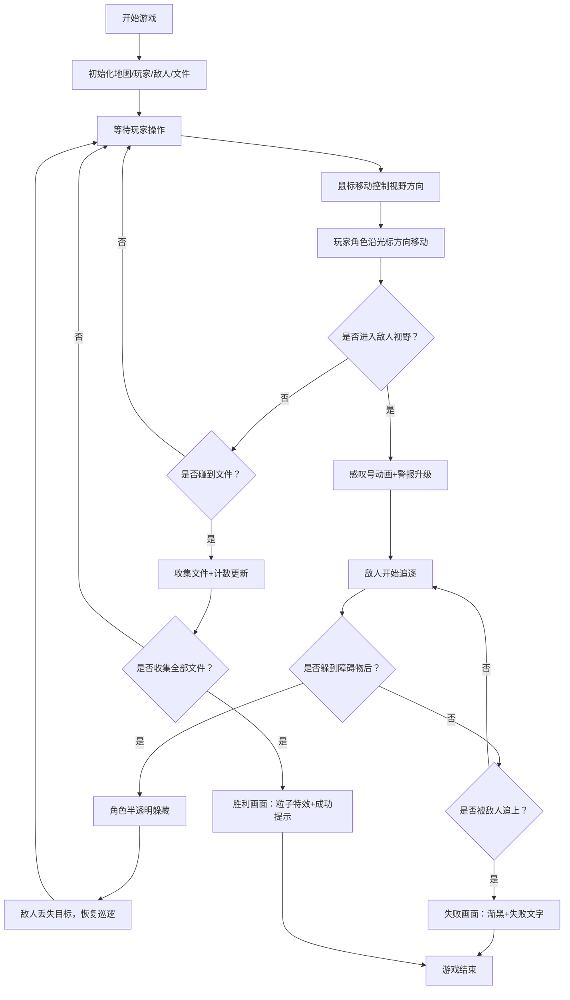

## 1. 产品概述
基于视线追踪的2D潜入式潜行游戏，玩家通过鼠标控制特工在仓库地图中躲避敌人巡逻，收集机密文件。通过独特的视线控制机制提供紧张刺激的游戏体验。
- 目标用户：休闲游戏爱好者、喜欢潜行策略类游戏的玩家
- 产品价值：提供创新的视线驱动玩法，紧张刺激的躲避追逐体验

## 2. 核心特性

### 2.1 功能模块
1. **游戏主场景**：俯视视角2D仓库地图，包含地砖、墙壁、障碍物
2. **玩家控制系统**：鼠标控制视野方向，角色自动沿光标方向移动
3. **敌人AI系统**：固定路线巡逻、视野检测、追逐行为
4. **躲藏机制**：躲避到障碍物后方，角色半透明化
5. **收集系统**：收集散布在地图中的5份机密文件
6. **警报系统**：三档警报等级（安全/警戒/追捕）
7. **胜负判定**：收集全部文件胜利，被敌人抓住失败
8. **粒子特效**：胜利彩色粒子、失败屏幕变暗

### 2.2 详细功能
| 模块 | 子功能 | 功能描述 |
|------|--------|----------|
| 地图渲染 | 地砖纹理 | 深浅交错的灰色地砖（#4a4a4a） |
| | 墙壁纹理 | 深灰色砖墙（#1a1a1a） |
| | 障碍物 | 木箱（浅棕色）、铁桶（暗红色）散布场景 |
| 玩家角色 | 外观 | 黑色圆形 |
| | 视野锥 | 半透明白色扇形，角度90度，距离200像素 |
| | 移动控制 | 鼠标控制方向，自动缓慢前进 |
| | 躲藏状态 | 半透明+浅蓝色轮廓线 |
| 敌人角色 | 外观 | 红色圆形 |
| | 视野锥 | 半透明橙色扇形，角度60度，距离150像素 |
| | 巡逻路径 | 初始化时随机生成固定路线，来回巡逻 |
| | 发现效果 | 头上感叹号缩放动画（0.3秒） |
| | 追逐行为 | 发现后以1.5倍玩家速度追逐 |
| | 视野遮挡 | 视野锥碰到障碍物时被遮挡 |
| 机密文件 | 外观 | 折叠的白色纸片图标 |
| | 放置位置 | 分散在地图5个角落 |
| | 收集效果 | 平滑过渡动画（0.2-0.5秒） |
| UI系统 | 文件计数 | 右上角显示已获取/总数 |
| | 警报等级 | 三档显示，文字变色+闪烁动画 |
| | 胜利画面 | 彩色粒子特效2秒+成功提示 |
| | 失败画面 | 屏幕变暗至全黑+失败文字淡入 |

## 3. 核心流程
玩家进入游戏后，鼠标控制特工视野方向。特工沿光标方向自动移动。玩家需要躲避敌人的橙色视野锥，若进入视野则触发警报，敌人开始追逐。玩家需快速将鼠标移到障碍物后方躲藏。收集全部5份机密文件后胜利，被敌人抓住则失败。

## 4. 用户界面设计

### 4.1 设计风格
- **主色调**：深色像素风
  - 背景：#2a2a2a
  - 地砖：#4a4a4a
  - 墙壁：#1a1a1a
- **玩家视野锥**：rgba(255,255,255,0.2) 半透明白色
- **敌人视野锥**：rgba(255,100,0,0.3) 半透明橙色
- **警报等级颜色**：
  - 安全：绿色
  - 警戒：黄色
  - 追捕：红色
- **交互反馈**：所有状态变化均有平滑过渡动画（0.2-0.5秒）

### 4.2 界面布局
| 位置 | 元素 | 样式 |
|------|------|------|
| 全屏 | 游戏Canvas | 自适应全屏，最小1024x768 |
| 右上角 | 游戏状态面板 | 深色半透明背景，文件计数+警报等级 |
| 中心（胜利） | 成功提示 | 彩色粒子特效2秒后弹出 |
| 全屏（失败） | 失败遮罩 | 逐渐变暗至全黑，淡入失败文字 |

### 4.3 响应式设计
- 采用全屏适配方案，游戏Canvas占满整个视口
- 最小支持分辨率：1024x768
- 窗口缩放时：地图和角色大小等比缩放
- 坐标系基于逻辑分辨率，渲染时统一缩放

