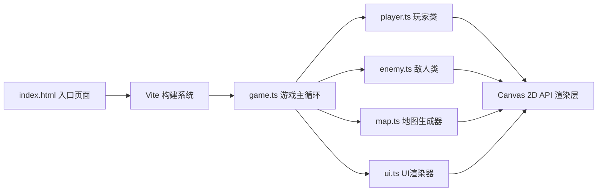

## 1. 架构设计



## 2. 技术说明
- **前端框架**：原生 TypeScript + HTML5 Canvas API（无游戏引擎依赖）
- **构建工具**：Vite（支持热更新、路径别名）
- **开发环境**：Node.js + TypeScript 严格模式
- **渲染层**：Canvas 2D Context，纯原生API
- **无后端、无数据库**：纯前端单机游戏

## 3. 项目结构

```
auto83/
├── package.json          # 项目依赖与脚本
├── vite.config.js        # Vite构建配置（@别名→src）
├── tsconfig.json         # TS配置（严格模式，target ES2020）
├── index.html            # 入口页面（全屏Canvas）
└── src/
    ├── game.ts           # 游戏主循环（场景渲染/更新/碰撞）
    ├── player.ts         # 玩家类（鼠标输入/移动/视野锥）
    ├── enemy.ts          # 敌人类（巡逻路径/视野检测/追逐）
    ├── map.ts            # 地图生成器（障碍物/文件布局）
    └── ui.ts             # UI渲染（文件计数/警报等级）
```

## 4. 核心数据模型

### 4.1 类型定义

```typescript
interface Vector2 {
  x: number;
  y: number;
}

type AlertLevel = 'safe' | 'warning' | 'danger';

interface Obstacle {
  x: number;
  y: number;
  width: number;
  height: number;
  type: 'crate' | 'barrel';  // 木箱/铁桶
}

interface DocumentFile {
  x: number;
  y: number;
  collected: boolean;
  collectAnim: number;  // 0-1 收集动画进度
}

interface EnemyState {
  position: Vector2;
  direction: number;    // 弧度
  patrolPath: Vector2[];
  currentPathIndex: number;
  pathDirection: 1 | -1;  // 正向/反向巡逻
  chasing: boolean;
  alertAnim: number;    // 感叹号动画 0-1
  lostTimer: number;    // 丢失目标计时
}
```

### 4.2 性能约束
- 帧率目标：稳定60fps
- 每帧角色移动+敌人AI计算 ≤ 5ms
- 采用 requestAnimationFrame 主循环
- 数学计算使用轻量向量运算，避免GC压力

## 5. 关键算法

### 5.1 视野锥碰撞检测（带遮挡）
1. 对视野锥内的点进行角度+距离检测
2. 使用光线投射（Ray Casting）检测障碍物遮挡
3. 沿视野锥方向每N度发射一条射线，记录最近碰撞点

### 5.2 巡逻路径随机生成
1. 在地图可通行区域随机选取2-3个路径点
2. 确保路径点之间距离适中（避免穿墙）
3. 敌人在路径点间往返移动

### 5.3 躲藏判定
1. 玩家→敌人方向发射射线
2. 若射线先与障碍物相交，则判定为躲藏状态
3. 或玩家位置与障碍物距离<阈值且位于障碍物后方

