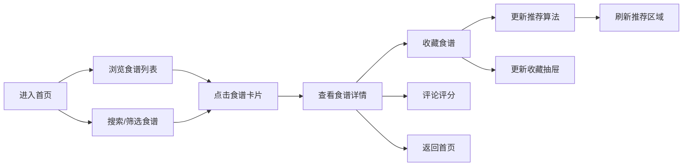

## 1. 产品概述

在线食谱分享与个性化推荐应用，让用户浏览、搜索、收藏食谱，并根据饮食偏好获得智能推荐。解决用户寻找合适食谱的痛点，提供个性化美食发现体验。

## 2. 核心功能

### 2.1 用户角色
| 角色 | 注册方式 | 核心权限 |
|------|----------|----------|
| 普通用户 | 无需注册，匿名使用 | 浏览食谱、搜索筛选、收藏管理、个性化推荐、评论评分 |

### 2.2 功能模块
1. **首页**：食谱列表网格、搜索栏、标签筛选、个性化推荐区域、收藏抽屉
2. **食谱详情页**：大图展示、食材清单、步骤说明、评论区、评分系统、收藏功能
3. **收藏系统**：心形图标角标、下拉抽屉展示、同步状态
4. **推荐系统**：基于收藏标签匹配、自动刷新、渐入动画
5. **评论评分**：星级评分、文字评论、用户列表、时间倒序

### 2.3 页面详情
| 页面名称 | 模块名称 | 功能描述 |
|---------|---------|---------|
| 首页 | 搜索栏 | 关键词搜索，0.2秒防抖，占位符"搜索食谱..." |
| 首页 | 标签筛选 | 多选标签，绿色高亮胶囊样式 |
| 首页 | 食谱列表 | 3列网格布局（响应式2列/1列），卡片展示，收藏按钮 |
| 首页 | 推荐区域 | 4个个性化推荐食谱，橙色"推荐"标签，30秒自动刷新 |
| 首页 | 收藏抽屉 | 顶部下滑抽屉，收藏缩略图列表，数量角标 |
| 食谱详情页 | 大图区域 | 全宽300px高度，背景覆盖 |
| 食谱详情页 | 信息区域 | 名称、烹饪时长、饮食标签 |
| 食谱详情页 | 食材清单 | 带数量的食材列表 |
| 食谱详情页 | 步骤说明 | 编号分步骤烹饪指南 |
| 食谱详情页 | 评论区 | 1-5星评分，100字文字评论，用户随机名称 |
| 食谱详情页 | 操作栏 | 返回按钮（左滑动画）、收藏按钮 |

## 3. 核心流程

用户进入首页 → 浏览食谱列表/使用搜索筛选 → 点击食谱卡片（右滑进入详情）→ 查看详情/收藏/评论评分 → 返回首页 → 查看收藏/获取推荐

## 4. 用户界面设计

### 4.1 设计风格
- 主色调：暖橙色 #E67E22
- 辅色调：绿色 #2ECC71
- 背景色：米白色 #FFF8F0
- 卡片圆角：12px，阴影柔和
- 字体：系统无衬线字体 -apple-system, BlinkMacSystemFont
- 交互反馈：200ms-400ms过渡动画
- 卡片hover效果：阴影加深，上移2px

### 4.2 页面设计概述
| 页面名称 | 模块名称 | UI元素 |
|---------|---------|--------|
| 首页 | 食谱卡片 | 300x200px圆角图片，名称，烹饪时长，标签，收藏心形图标 |
| 首页 | 搜索筛选栏 | sticky定位，圆角输入框，绿色胶囊标签 |
| 首页 | 推荐卡片 | 左上角橙色"推荐"标签，旋转-5度 |
| 首页 | 收藏抽屉 | 顶部下滑0.3秒，60px缩略图 |
| 食谱详情页 | 页面过渡 | 右滑进入0.4秒ease-out |
| 食谱详情页 | 星级评分 | 悬停预选黄色填充，点击提交 |
| 食谱详情页 | 新评论 | 底部0.2秒淡入动画 |

### 4.3 响应式设计
- 桌面端（≥1024px）：3列网格布局
- 平板端（≥768px）：2列网格布局
- 手机端（<768px）：1列布局，优化触摸交互
- 搜索筛选栏保持sticky定位
- 图片和文字自适应缩放

### 4.4 动效设计
- 卡片点击：0.3秒缩放动画
- 收藏图标：空心→实心红色，缩放动画
- 页面切换：从右向左滑动0.4秒ease-out
- 推荐刷新：0.5秒渐入动画
- 抽屉展开：顶部下滑0.3秒
- 新评论：底部0.2秒淡入
