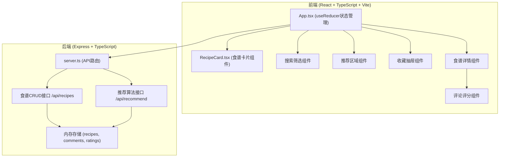
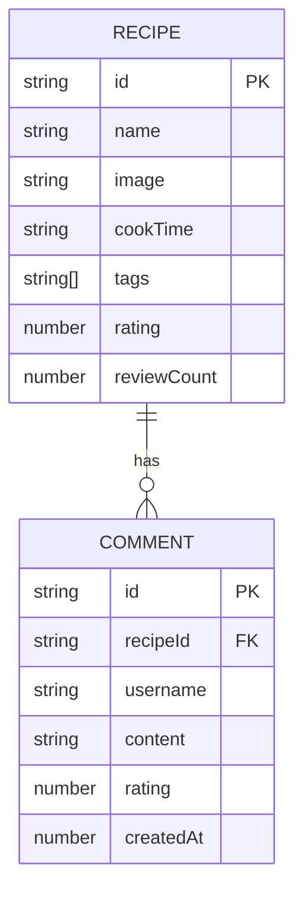

## 1. 架构设计



## 2. 技术描述

- **前端框架**：React 18 + TypeScript + Vite
- **状态管理**：useReducer 集中管理应用状态
- **样式方案**：CSS Modules / 原生CSS + CSS变量
- **构建工具**：Vite 5.x，路径别名 @ 指向 src
- **后端框架**：Express 4.x + TypeScript
- **数据存储**：内存存储（使用 uuid 生成唯一ID）
- **跨域处理**：cors 中间件
- **HTTP客户端**：原生 fetch API

## 3. 项目结构

```
d:\Pro\tasks\auto85\
├── package.json
├── vite.config.js
├── tsconfig.json
├── index.html
└── src/
    ├── server.ts          # Express后端服务
    ├── App.tsx            # 主组件，状态管理
    ├── components/
    │   └── RecipeCard.tsx # 食谱卡片组件
    ├── types.ts           # TypeScript类型定义
    └── styles/
        └── App.css        # 全局样式
```

## 4. 数据模型

### 4.1 TypeScript 类型定义

```typescript
interface Recipe {
  id: string;
  name: string;
  image: string;
  cookTime: string;
  tags: string[];
  ingredients: { name: string; quantity: string }[];
  steps: string[];
  rating: number;
  reviewCount: number;
}

interface Comment {
  id: string;
  recipeId: string;
  username: string;
  content: string;
  rating: number;
  createdAt: number;
}

interface AppState {
  recipes: Recipe[];
  recommendedRecipes: Recipe[];
  favorites: string[];
  searchQuery: string;
  selectedTags: string[];
  currentView: 'list' | 'detail';
  selectedRecipe: Recipe | null;
  showFavoritesDrawer: boolean;
  comments: Record<string, Comment[]>;
}
```

### 4.2 ER 图



## 5. API 定义

### 5.1 食谱接口

| 方法 | 路径 | 描述 | 响应 |
|------|------|------|------|
| GET | /api/recipes | 获取食谱列表（支持查询参数 limit, search, tags） | `{ recipes: Recipe[], total: number }` |
| GET | /api/recipes/:id | 获取单个食谱详情 | `Recipe` |
| POST | /api/recipes/:id/comments | 添加评论 | `{ success: boolean, comment: Comment }` |
| GET | /api/recipes/:id/comments | 获取评论列表 | `{ comments: Comment[] }` |

### 5.2 推荐接口

| 方法 | 路径 | 描述 | 请求参数 | 响应 |
|------|------|------|---------|------|
| GET | /api/recommend | 获取个性化推荐 | `favorites: string[]` (query) | `{ recommendations: Recipe[] }` |

## 6. 推荐算法

基于用户收藏的标签匹配：
1. 收集用户所有收藏食谱的标签
2. 统计标签出现频率
3. 按标签匹配度排序非收藏食谱
4. 返回匹配度最高的4个食谱

## 7. 性能优化

- **列表分页**：初始返回20条数据
- **搜索防抖**：0.2秒延时避免频繁重渲染
- **图片优化**：固定尺寸，懒加载
- **状态管理**：useReducer 避免不必要的重渲染
- **动画性能**：CSS transform 和 opacity 属性实现硬件加速
