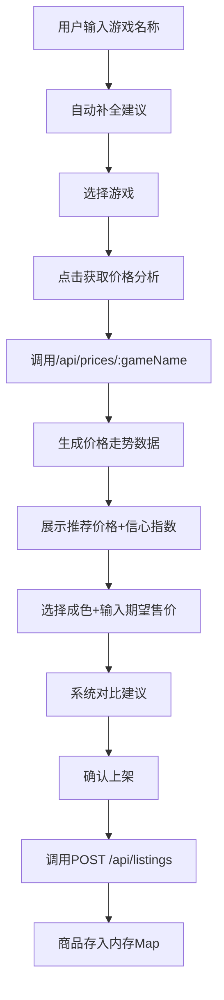

## 1. 产品概述

二手游戏价格分析辅助上架应用，解决独立游戏交易社区用户定价难、成交率低的痛点。通过抓取平台历史成交数据生成价格走势图表，基于市场供需推荐最优上架价格，帮助用户科学定价、提升交易效率。

- 核心目标：提供直观的价格对比工具，减少定价偏差，提升商品成交率
- 目标用户：二手游戏交易社区的卖家和买家
- 市场价值：通过数据驱动的定价建议，构建更健康的二手交易生态

## 2. 核心功能

### 2.1 用户角色

| 角色 | 注册方式 | 核心权限 |
|------|---------|---------|
| 普通用户 | 无需注册（演示版本） | 浏览商品、上架商品、查看价格分析 |

### 2.2 功能模块

1. **商品上架页面**：游戏名称输入（自动补全）、价格分析、推荐价格展示、成色选择、期望售价对比
2. **历史价格走势页面**：30天价格波动折线图、交互式图例、数据悬停提示
3. **商品列表页面**：卡片网格布局、悬停动画、详情展开、缩略图展示

### 2.3 页面详情

| 页面名称 | 模块名称 | 功能描述 |
|---------|---------|---------|
| 商品上架页 | 游戏名称输入 | 支持自动补全，下拉展示前5个匹配项，选中自动填充 |
| 商品上架页 | 价格分析按钮 | 点击后弹性动画展示推荐价格标签（带信心指数）和历史趋势链接 |
| 商品上架页 | 成色与售价 | 成色选择（九成新/八成新/有瑕疵）、期望售价输入、与推荐价格对比 |
| 历史走势页 | 价格折线图 | 30天价格波动曲线，X轴日期Y轴价格，品牌蓝色线条，悬停显示详情 |
| 历史走势页 | 交互式图例 | 均价/最高价/最低价，点击切换显示隐藏，渐隐动画 |
| 商品列表页 | 卡片网格 | 4/2/1列响应式布局，悬停上浮阴影加深，点击展开详情 |
| 商品列表页 | 详情展开 | 包含价格走势小图、卖家留言、完整商品信息 |

## 3. 核心流程

### 用户上架商品流程

用户输入游戏名称 → 系统自动补全建议 → 用户选择游戏 → 点击获取价格分析 → 系统调用后端API获取历史数据 → 展示推荐价格和信心指数 → 用户选择成色、输入期望售价 → 系统对比给出建议 → 用户确认上架 → 数据存入后端

### 用户浏览商品流程

用户进入商品列表 → 卡片网格展示所有商品 → 悬停查看交互效果 → 点击卡片展开详情 → 查看价格走势小图和卖家信息 → 可跳转查看完整历史趋势

## 4. 用户界面设计

### 4.1 设计风格

- **主色调**：#1A1A2E（深蓝黑背景）、#16213E（深蓝）、#0F3460（中蓝）、#E94560（珊瑚红强调色）
- **图表色**：#4A90D9（品牌蓝）
- **按钮风格**：圆角12px，点击按压效果（scale: 0.95，0.1秒）
- **字体**：系统无衬线字体，深色主题优化
- **布局风格**：卡片式布局，固定顶部导航栏，响应式网格
- **动效风格**：页面切换fade-in（0.2秒），弹性滑动（0.3秒缓出），卡片悬停上浮

### 4.2 页面设计概述

| 页面名称 | 模块名称 | UI元素 |
|---------|---------|---------|
| 全局 | 导航栏 | Logo（红色）、导航链接（上架商品/浏览商品/我的商品）、圆形用户头像、移动端汉堡菜单 |
| 商品上架页 | 输入区域 | 游戏名称输入框（带自动补全下拉）、获取价格分析按钮、推荐价格标签（渐变色+圆形信心指数） |
| 商品上架页 | 表单区域 | 成色单选按钮组、期望售价输入框、价格对比建议区间、确认上架按钮 |
| 历史走势页 | 图表区域 | Canvas折线图（90个数据点，<200ms渲染）、交互式图例（可点击切换） |
| 商品列表页 | 卡片网格 | 封面缩略图、游戏名称、售价、成色标签、查看详情按钮、展开后的价格小图和留言 |

### 4.3 响应式设计

- **桌面端（>1024px）**：4列卡片网格，完整导航栏
- **平板端（768-1024px）**：2列卡片网格，导航栏紧凑布局
- **移动端（<768px）**：单列卡片网格，汉堡菜单收起侧边栏，触控优化
- **首屏加载**：<1.5秒可见，非首屏组件懒加载

### 4.4 性能指标

- 价格图表渲染：<200ms（Canvas渲染，约90个数据点）
- 首屏内容可见：<1.5秒
- 页面切换动画：0.2秒fade-in
- 卡片悬停过渡：0.2秒缓出
- 推荐价格展示：0.3秒弹性滑动缓出
