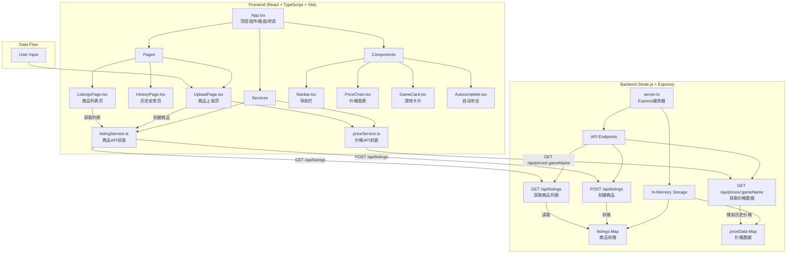
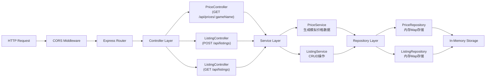
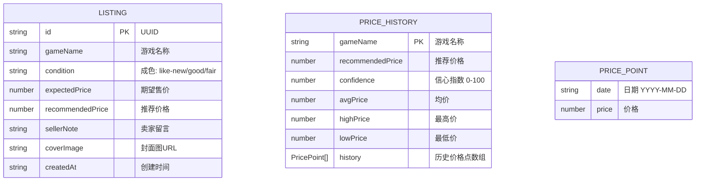

## 1. 架构设计



## 2. 技术描述

- **前端框架**：React 18 + TypeScript 5 + Vite 5
- **构建工具**：Vite 5，配置路径别名 `@` 指向 `src`
- **状态管理**：React useState/useEffect（轻量级场景）
- **路由**：React Router DOM 6
- **图表库**：Chart.js + react-chartjs-2（Canvas渲染，高性能）
- **HTTP客户端**：原生 Fetch API
- **UI样式**：CSS Modules + CSS Variables（深色主题）
- **图标库**：lucide-react
- **后端框架**：Express 4 + TypeScript
- **数据存储**：内存 Map（无持久化，演示用途）
- **跨域处理**：cors 中间件
- **唯一ID**：uuid v4
- **初始化工具**：vite-init

## 3. 路由定义

| 路由路径 | 页面组件 | 用途 |
|---------|---------|------|
| `/` | `UploadPage` | 商品上架页面（首页） |
| `/history/:gameName` | `HistoryPage` | 历史价格走势页面 |
| `/listings` | `ListingsPage` | 商品列表浏览页面 |

## 4. API 定义

### 类型定义

```typescript
// 价格数据点
interface PricePoint {
  date: string;      // ISO 日期格式 YYYY-MM-DD
  price: number;     // 价格（美元）
}

// 价格历史响应
interface PriceHistoryResponse {
  gameName: string;
  recommendedPrice: number;
  confidence: number;           // 0-100 信心指数
  avgPrice: number;
  highPrice: number;
  lowPrice: number;
  history: PricePoint[];        // 过去30天，每天3个数据点 → 90个点
}

// 商品成色类型
type Condition = 'like-new' | 'good' | 'fair';

// 创建商品请求
interface CreateListingRequest {
  gameName: string;
  condition: Condition;
  expectedPrice: number;
  recommendedPrice: number;
  sellerNote?: string;
  coverImage?: string;
}

// 商品响应
interface ListingResponse {
  id: string;
  gameName: string;
  condition: Condition;
  expectedPrice: number;
  recommendedPrice: number;
  sellerNote?: string;
  coverImage?: string;
  createdAt: string;
}
```

### API 端点

1. **GET /api/prices/:gameName**
   - 描述：获取指定游戏的历史价格数据和推荐价格
   - 请求参数：`gameName`（路径参数）
   - 响应：`PriceHistoryResponse`
   - 状态码：200 成功

2. **POST /api/listings**
   - 描述：创建新的商品上架记录
   - 请求体：`CreateListingRequest`
   - 响应：`ListingResponse`（包含生成的ID）
   - 状态码：201 创建成功

3. **GET /api/listings**
   - 描述：获取所有已上架商品列表
   - 响应：`ListingResponse[]`
   - 状态码：200 成功

## 5. 服务器架构图



## 6. 项目结构

```
auto86/
├── .trae/documents/
│   ├── PRD.md                    # 产品需求文档
│   └── TechnicalArchitecture.md  # 技术架构文档
├── src/                          # 前端源代码
│   ├── App.tsx                   # 顶层组件，路由配置，全局状态
│   ├── main.tsx                  # React 入口文件
│   ├── index.css                 # 全局样式，CSS变量
│   ├── pages/
│   │   ├── UploadPage.tsx        # 商品上架页面
│   │   ├── HistoryPage.tsx       # 历史价格走势页面
│   │   └── ListingsPage.tsx      # 商品列表页面
│   ├── services/
│   │   ├── priceService.ts       # 价格API封装
│   │   └── listingService.ts     # 商品API封装
│   ├── components/
│   │   ├── Navbar.tsx            # 导航栏组件
│   │   ├── PriceChart.tsx        # 价格图表组件
│   │   ├── GameCard.tsx          # 游戏卡片组件
│   │   └── Autocomplete.tsx      # 自动补全组件
│   ├── types/
│   │   └── index.ts              # 共享类型定义
│   └── utils/
│       └── mockGames.ts          # 模拟游戏数据库
├── server/                       # 后端源代码
│   ├── server.ts                 # Express 服务器入口
│   ├── types.ts                  # 后端类型定义
│   └── data/
│       └── mockGames.ts          # 模拟游戏数据
├── package.json                  # 项目依赖和脚本
├── vite.config.js                # Vite 构建配置
├── tsconfig.json                 # TypeScript 配置（严格模式）
└── index.html                    # 入口 HTML
```

## 7. 数据模型

### 7.1 数据模型定义



### 7.2 内存数据结构

```typescript
// 商品存储 - Map<listingId, Listing>
const listingsStore = new Map<string, ListingResponse>();

// 价格数据缓存 - Map<gameName, PriceHistoryResponse>
const priceCache = new Map<string, PriceHistoryResponse>();

// 支持自动补全的游戏库
const gameLibrary = [
  'The Legend of Zelda: Tears of the Kingdom',
  'Elden Ring',
  'God of War Ragnarok',
  'Cyberpunk 2077',
  'Red Dead Redemption 2',
  'Horizon Forbidden West',
  'Final Fantasy XVI',
  'Baldurs Gate 3',
  'Starfield',
  'Marvels Spider-Man 2'
];
```

## 8. 调用关系与数据流

### 8.1 文件调用关系

```
src/App.tsx
  ├─ imports → src/components/Navbar.tsx
  ├─ imports → src/pages/UploadPage.tsx
  ├─ imports → src/pages/HistoryPage.tsx
  └─ imports → src/pages/ListingsPage.tsx

src/pages/UploadPage.tsx
  ├─ imports → src/services/priceService.ts (getPriceHistory)
  ├─ imports → src/services/listingService.ts (createListing)
  ├─ imports → src/components/Autocomplete.tsx
  └─ imports → src/components/PriceChart.tsx (缩略图)

src/pages/HistoryPage.tsx
  ├─ imports → src/services/priceService.ts (getPriceHistory)
  └─ imports → src/components/PriceChart.tsx

src/pages/ListingsPage.tsx
  ├─ imports → src/services/listingService.ts (getListings)
  └─ imports → src/components/GameCard.tsx

src/components/GameCard.tsx
  └─ imports → src/components/PriceChart.tsx (小图)

src/services/priceService.ts
  └─ fetch → GET /api/prices/:gameName → server/server.ts

src/services/listingService.ts
  ├─ fetch → POST /api/listings → server/server.ts
  └─ fetch → GET /api/listings → server/server.ts

server/server.ts
  ├─ uses → server/data/mockGames.ts (游戏库)
  └─ stores → Map in-memory
```

### 8.2 核心数据流

1. **价格分析流程**：
   - 用户输入 → `UploadPage.tsx` 状态更新 → 点击按钮 → `priceService.getPriceHistory()` → `GET /api/prices/:gameName` → `server.ts` 生成模拟数据 → 返回 `PriceHistoryResponse` → 渲染推荐价格标签和图表

2. **商品上架流程**：
   - 表单填写 → `UploadPage.tsx` 收集数据 → 点击上架 → `listingService.createListing()` → `POST /api/listings` → `server.ts` 存入 `listingsStore` Map → 返回 `ListingResponse` → 路由跳转至列表页

3. **商品浏览流程**：
   - 进入列表页 → `ListingsPage.tsx` `useEffect` → `listingService.getListings()` → `GET /api/listings` → `server.ts` 读取 `listingsStore` → 返回数组 → 渲染 `GameCard` 网格

## 9. 性能优化策略

1. **图表性能**：
   - 使用 Chart.js Canvas 渲染，避免 SVG 性能瓶颈
   - 90个数据点分批处理，渲染时间 <200ms
   - 图表数据缓存，避免重复请求

2. **首屏加载**：
   - 非首屏页面组件使用 `React.lazy` 懒加载
   - 图片使用占位符 + 懒加载
   - 路由级代码分割

3. **动画性能**：
   - 使用 CSS transform 和 opacity 动画（GPU加速）
   - 避免 layout thrashing，使用 `will-change` 提示

4. **内存优化**：
   - 价格数据缓存设置过期时间
   - 组件卸载时清理事件监听器和定时器
