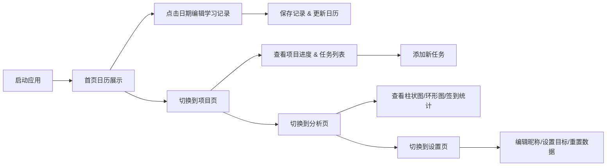

## 1. 产品概述

智能学习计划管理应用，帮助用户管理个人学习目标、追踪每日学习进度并生成可视化统计报告。解决学习者在长期目标执行过程中缺乏实时反馈和动力维持的问题。

- 目标用户：有长期学习计划的自我提升者、学生、职场人士
- 核心价值：通过可视化进度追踪和数据反馈，维持学习动力，提升学习效率

## 2. 核心功能

### 2.1 用户角色
| 角色 | 注册方式 | 核心权限 |
|------|----------|----------|
| 普通用户 | 本地存储自动初始化 | 管理学习项目、记录学习时长、查看统计分析 |

### 2.2 功能模块
1. **首页日历**：动态日历组件展示当月学习记录，学习时长颜色编码，点击编辑每日学习内容
2. **项目管理**：多学习项目创建、任务CRUD、进度条展示、周/月/总时长统计
3. **数据分析**：7天学习时长柱状图、项目耗时占比环形图、连续签到日历
4. **个人设置**：昵称编辑、每日学习目标滑块、数据重置功能

### 2.3 页面详情
| 页面名称 | 模块名称 | 功能描述 |
|----------|----------|----------|
| 首页 | 动态日历 | 展示当月每日学习记录，圆点颜色表示学习时长（浅蓝0-30min、中蓝30-60min、深蓝60min+），点击弹出毛玻璃编辑弹窗 |
| 首页 | 编辑弹窗 | 半透明毛玻璃效果，背景模糊淡入0.3秒，编辑学习内容（最多200字）和时长，保存后圆点颜色实时更新并伴随缩放动画 |
| 项目页 | 项目列表 | 展示所有学习项目卡片，含渐变进度条和时长统计 |
| 项目页 | 任务管理 | 底部滑出表单添加任务（名称、预估时长、截止日期），任务列表按截止日期升序，0.2秒淡入动画 |
| 项目页 | 进度条 | 圆角长条，深灰背景，蓝紫渐变填充，顶部显示周/月/总时长统计 |
| 分析页 | 柱状图 | 最近7天学习时长，柱体按主题渐变色，悬停显示精确时长和主题名 |
| 分析页 | 环形图 | 各项目耗时占比，圆心显示总学习天数，点击切片跳转项目详情 |
| 分析页 | 连续签到 | 连续签到天数数字展示，伴火焰图标动画 |
| 设置页 | 昵称编辑 | 输入框编辑用户昵称 |
| 设置页 | 目标滑块 | 拖拽滑块设置每日学习目标（15-240分钟，步长15分钟），数值提示动画 |
| 设置页 | 数据重置 | 二次确认对话框，红/灰按钮配色，确认后弹窗缩小消失并清空数据 |

## 3. 核心流程

用户打开应用 → 首页展示当月学习日历 → 点击某天编辑学习记录 → 切换到项目页查看/管理学习项目 → 添加任务到具体项目 → 切换到分析页查看学习数据统计 → 切换到设置页调整个人偏好

## 4. 用户界面设计

### 4.1 设计风格
- 主背景色：#1a1a2e（深空蓝黑）
- 辅背景色：#16213e（深靛蓝）
- 字体颜色：#e0e0e0（浅灰色）
- 强调色：蓝紫渐变（#667eea 到 #764ba2）
- 卡片圆角：12px
- 卡片背景：暗色毛玻璃效果（backdrop-filter: blur(8px)）
- 卡片间距：16px，卡片内元素间距：12px
- 交互动画：悬停亮度提升0.3秒，过渡动画0.2-0.3秒

### 4.2 页面设计概览
| 页面名称 | 模块名称 | UI元素 |
|----------|----------|--------|
| 首页 | 日历组件 | 动态月历、颜色编码圆点、毛玻璃弹窗、缩放动画 |
| 项目页 | 项目卡片 | 渐变进度条、时长统计标签、任务列表、底部滑出表单 |
| 分析页 | 图表容器 | 柱状图（悬停提示）、环形图（点击交互）、火焰签到动画 |
| 设置页 | 设置表单 | 文本输入、滑块组件、确认对话框 |

### 4.3 响应式设计
- 桌面端优先，最大宽度1200px居中布局
- 三列分区：左侧导航栏240px固定，中间主内容区自适应
- 导航栏固定，含四个图标按钮（首页、项目、分析、设置）
- 选中项下方小横条指示器，0.2秒平滑过渡动画

### 4.4 性能要求
- 首屏加载时间（FCP）≤ 2秒
- 数据读写响应时间 ≤ 100ms
- 动画帧率稳定在60fps
