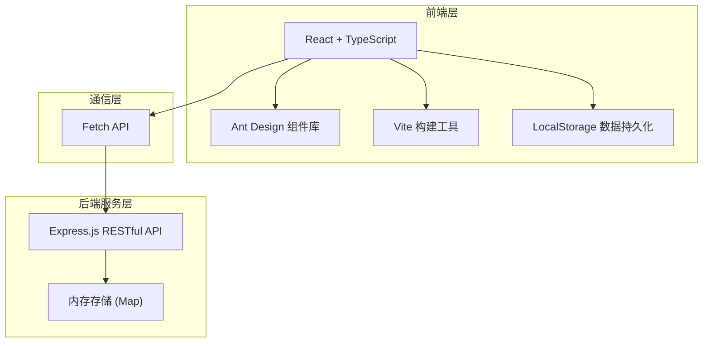
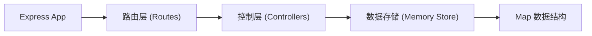
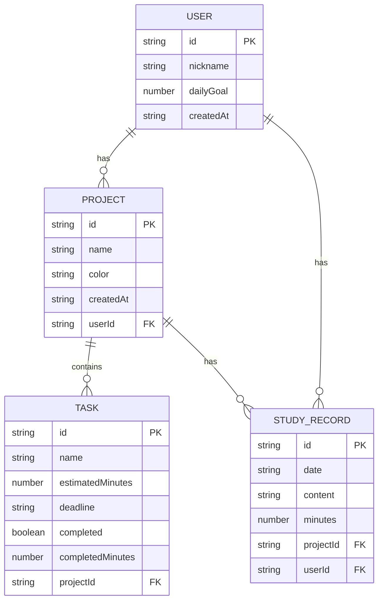

## 1. 架构设计



## 2. 技术说明

- 前端框架：React 18 + TypeScript
- 构建工具：Vite 5
- UI组件库：Ant Design 5（DatePicker、Progress、Slider、Modal）
- 样式方案：CSS Modules / 内联样式 + 自定义样式
- 状态管理：React useState/useEffect（简单场景）+ LocalStorage 持久化
- 后端框架：Express 4
- 数据存储：内存 Map（后端）+ LocalStorage（前端）
- 图标：Lucide React
- 路径别名：@ 指向 src 目录

## 3. 路由定义

| 路由 | 页面 | 说明 |
|------|------|------|
| / | 首页 | 日历学习记录展示与编辑 |
| /projects | 项目页 | 学习项目列表、任务管理、进度展示 |
| /analysis | 分析页 | 数据统计图表、连续签到展示 |
| /settings | 设置页 | 用户设置、数据重置 |

## 4. API 定义

### 4.1 用户相关

```typescript
// 用户数据类型
interface User {
  id: string;
  nickname: string;
  dailyGoal: number; // 每日学习目标（分钟）
  createdAt: string;
}

// GET /api/user - 获取用户信息
// Response: { data: User }

// PUT /api/user - 更新用户信息
// Request: { nickname?: string; dailyGoal?: number }
// Response: { data: User }
```

### 4.2 项目相关

```typescript
// 任务类型
interface Task {
  id: string;
  name: string;
  estimatedMinutes: number;
  deadline: string; // ISO date
  completed: boolean;
  completedMinutes: number; // 已完成时长
  projectId: string;
}

// 项目类型
interface Project {
  id: string;
  name: string;
  color: string;
  createdAt: string;
  tasks: Task[];
}

// 学习记录类型
interface StudyRecord {
  id: string;
  date: string; // YYYY-MM-DD
  content: string;
  minutes: number;
  projectId?: string;
}

// GET /api/projects - 获取所有项目
// Response: { data: Project[] }

// POST /api/projects - 创建项目
// Request: { name: string; color: string }
// Response: { data: Project }

// PUT /api/projects/:id - 更新项目
// Request: { name?: string; color?: string }
// Response: { data: Project }

// DELETE /api/projects/:id - 删除项目
// Response: { success: boolean }
```

### 4.3 任务相关

```typescript
// POST /api/projects/:projectId/tasks - 添加任务
// Request: { name: string; estimatedMinutes: number; deadline: string }
// Response: { data: Task }

// PUT /api/tasks/:id - 更新任务
// Request: { name?: string; estimatedMinutes?: number; deadline?: string; completed?: boolean; completedMinutes?: number }
// Response: { data: Task }

// DELETE /api/tasks/:id - 删除任务
// Response: { success: boolean }
```

### 4.4 学习记录相关

```typescript
// GET /api/records - 获取学习记录
// Query: { startDate?: string; endDate?: string }
// Response: { data: StudyRecord[] }

// POST /api/records - 添加/更新学习记录
// Request: { date: string; content: string; minutes: number; projectId?: string }
// Response: { data: StudyRecord }

// DELETE /api/records/:id - 删除学习记录
// Response: { success: boolean }
```

## 5. 服务端架构图



## 6. 数据模型

### 6.1 数据模型定义



### 6.2 内存存储结构

后端使用 Map 进行内存存储：
- `users: Map<string, User>` - 用户数据
- `projects: Map<string, Project>` - 项目数据
- `tasks: Map<string, Task>` - 任务数据
- `records: Map<string, StudyRecord>` - 学习记录数据

前端 LocalStorage 存储键：
- `study_plan_user` - 用户信息
- `study_plan_projects` - 项目列表
- `study_plan_records` - 学习记录

## 7. 项目文件结构

```
project/
├── package.json
├── vite.config.js
├── tsconfig.json
├── index.html
├── src/
│   ├── main.tsx              # 应用入口
│   ├── App.tsx               # 根组件（路由、布局）
│   ├── index.css             # 全局样式
│   ├── pages/
│   │   ├── HomePage.tsx      # 首页日历
│   │   ├── ProjectsPage.tsx  # 项目管理页
│   │   ├── AnalysisPage.tsx  # 数据分析页
│   │   └── SettingsPage.tsx  # 设置页
│   ├── components/
│   │   ├── Sidebar.tsx       # 侧边导航栏
│   │   ├── Calendar.tsx      # 日历组件
│   │   ├── StudyModal.tsx    # 学习记录编辑弹窗
│   │   ├── ProgressBar.tsx   # 渐变进度条
│   │   ├── TaskForm.tsx      # 任务表单
│   │   ├── BarChart.tsx      # 柱状图
│   │   └── DonutChart.tsx    # 环形图
│   ├── services/
│   │   ├── api.ts            # API 调用封装
│   │   └── storage.ts        # LocalStorage 封装
│   ├── types/
│   │   └── index.ts          # TypeScript 类型定义
│   └── utils/
│       └── date.ts           # 日期工具函数
└── server/
    └── user-service.ts       # Express 后端服务
```
