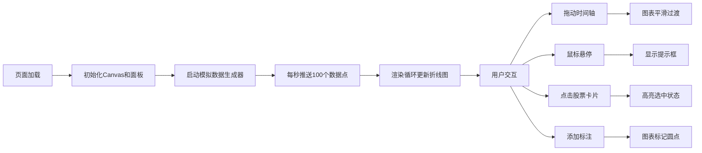

## 1. 产品概述
股票模拟盯盘系统是一个实时行情可视化工具，让用户在单一页面上同时监控多只自选股的模拟行情走势，支持历史数据回溯和自定义状态标注。
- 核心价值：为交易者提供沉浸式的多股票盯盘体验，结合动态图表与状态管理，提升决策效率
- 目标用户：股票交易者、投资者、金融学习者

## 2. 核心功能

### 2.1 用户角色
| 角色 | 注册方式 | 核心权限 |
|------|----------|----------|
| 普通用户 | 无需注册，直接使用 | 查看行情、拖动时间轴、添加标注、搜索股票 |

### 2.2 功能模块
1. **主盯盘页面**：动态折线图、时间轴滑块、状态标注面板
2. **行情图表模块**：多股票折线叠加、实时数据动画、鼠标悬停提示
3. **时间轴模块**：历史回溯、平滑过渡、数据同步刷新
4. **状态面板模块**：股票卡片列表、实时统计数据、搜索过滤
5. **标注系统**：自定义文本标注、颜色选择、图表标记点

### 2.3 页面详情
| 页面名称 | 模块名称 | 功能描述 |
|----------|----------|----------|
| 盯盘主页 | 折线图区域 | 多股票实时行情折线，深色渐变背景，网格线，渐变色折线 |
| 盯盘主页 | 时间轴滑块 | 底部深蓝色滑块，拖动时图表平滑移动，数据同步更新 |
| 盯盘主页 | 悬停提示 | 鼠标悬停显示精确数值，毛玻璃效果，淡入缩放动画 |
| 盯盘主页 | 状态面板 | 右侧固定宽度，股票卡片列表，显示价格、涨跌幅、波动率、交易量 |
| 盯盘主页 | 搜索功能 | 顶部搜索框，按股票代码/名称过滤 |
| 盯盘主页 | 标注功能 | 卡片展开文本框和颜色选择器，标注在折线图上以彩色圆点显示 |

## 3. 核心流程
用户打开页面后，系统自动启动模拟数据推送，实时更新8只股票的行情数据。用户可以拖动时间轴查看历史走势，悬停查看具体数值，点击股票卡片选中查看详情，添加自定义标注。

## 4. 用户界面设计

### 4.1 设计风格
- **主色调**：深灰(#1a1a2e)到黑色(#0f0f1a)径向渐变背景，青色(#00d4ff)到紫色(#9d4edd)渐变色折线
- **面板色**：深蓝(#16213e)到紫色(#533483)渐变
- **涨跌色**：红色(#ff4757)上涨，绿色(#2ed573)下跌
- **按钮样式**：圆角8px，带有微妙的发光效果
- **字体**：使用JetBrains Mono等宽字体配合Inter无衬线字体，数字使用等宽字体确保对齐
- **布局风格**：左侧78%区域为图表，右侧22%固定宽度面板，图表占页面高度70%
- **图标风格**：使用简约的SVG图标，箭头带有弹动动画

### 4.2 页面设计概述
| 页面名称 | 模块名称 | UI元素 |
|----------|----------|----------|
| 盯盘主页 | 折线图区域 | 径向渐变背景、50px间隔半透明白色网格线、0.3px线宽、青色到紫色渐变折线、0.5秒滑入动画 |
| 盯盘主页 | 时间轴滑块 | 深蓝色(#1e3a8a)背景、可拖动滑块、0.3秒缓出动画 |
| 盯盘主页 | 悬停提示 | 半透明毛玻璃效果、微弱阴影、精确到两位小数、0.2秒淡入缩放动画 |
| 盯盘主页 | 状态面板 | 深蓝到紫色渐变背景、最多8张股票卡片、3px发光选中边框 |
| 盯盘主页 | 股票卡片 | 股票名称、价格(红涨绿跌)、0.3秒数值滚动动画、涨跌幅带上下弹动箭头 |
| 盯盘主页 | 标注功能 | 文本输入框、颜色选择器、彩色圆点标记 |

### 4.3 响应式
- 桌面端优先设计，最小支持1280px宽度
- 时间轴和面板支持触控拖动
- 字体大小随容器宽度自适应调整

### 4.4 性能要求
- 每秒100个数据点推送时帧率≥55fps
- 折线图动画流畅无卡顿
- 时间轴拖动画平滑过渡
