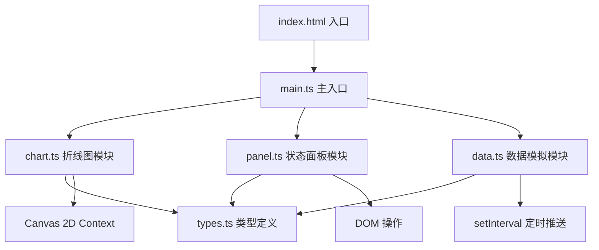

## 1. 架构设计



## 2. 技术描述
- **前端技术栈**：TypeScript 5.x + Vite 5.x + 原生 Canvas 2D API
- **构建工具**：Vite 5.x，配置路径别名 @ 指向 src 目录
- **无后端**：所有数据由前端模拟生成，无需服务器
- **性能优化**：使用 requestAnimationFrame 渲染循环，离屏缓存，对象池技术

## 3. 项目文件结构

| 文件路径 | 职责描述 |
|----------|----------|
| `package.json` | 项目依赖配置，typescript、vite，启动脚本 npm run dev |
| `vite.config.js` | Vite 构建配置，路径别名 @ 指向 src |
| `tsconfig.json` | TypeScript 严格模式配置 |
| `index.html` | 入口页面，固定视口，禁止滚动 |
| `src/main.ts` | 应用入口，初始化 Canvas，启动数据推送和渲染循环 |
| `src/chart.ts` | 折线图绘制、数据管理、时间轴滑块交互、鼠标悬停提示 |
| `src/panel.ts` | 状态面板布局、股票卡片渲染、搜索和标注功能 |
| `src/types.ts` | 数据结构定义：股票数据点、标注信息、面板状态 |
| `src/data.ts` | 模拟数据生成器，定时推送更新，每秒100个数据点 |

## 4. 核心数据模型

### 4.1 TypeScript 类型定义

```typescript
// 股票数据点
interface StockDataPoint {
  timestamp: number;
  price: number;
  volume: number;
}

// 股票信息
interface Stock {
  id: string;
  code: string;
  name: string;
  basePrice: number;
  data: StockDataPoint[];
  color: string;
  annotations: Annotation[];
}

// 标注信息
interface Annotation {
  id: string;
  stockId: string;
  timestamp: number;
  text: string;
  color: string;
}

// 面板状态
interface PanelState {
  selectedStockId: string | null;
  searchQuery: string;
  expandedAnnotationId: string | null;
}

// 图表状态
interface ChartState {
  timeRange: { start: number; end: number };
  viewOffset: number;
  hoveredPoint: { stockId: string; index: number } | null;
  isDragging: boolean;
}

// 悬停提示状态
interface TooltipState {
  visible: boolean;
  x: number;
  y: number;
  value: number;
  opacity: number;
  scale: number;
}
```

## 5. 核心模块设计

### 5.1 Chart 类 (src/chart.ts)
- **属性**：canvas 元素、ctx 上下文、股票数据、图表状态、时间轴位置
- **方法**：
  - `render()`: 主渲染循环，调用各绘制方法
  - `drawBackground()`: 绘制径向渐变背景
  - `drawGrid()`: 绘制50px间隔的半透明白色网格线
  - `drawLine(stock: Stock)`: 使用渐变色绘制单条折线，带滑入动画
  - `drawTimeAxis()`: 绘制底部时间轴滑块
  - `drawTooltip()`: 绘制悬停提示框（毛玻璃效果）
  - `drawAnnotations()`: 绘制标注圆点
  - `handleMouseMove(e: MouseEvent)`: 处理鼠标移动，检测最近数据点
  - `handleMouseDown(e: MouseEvent)`: 处理时间轴拖动开始
  - `handleMouseMoveDrag(e: MouseEvent)`: 处理时间轴拖动中
  - `handleMouseUp(e: MouseEvent)`: 处理时间轴拖动结束
  - `smoothTransition(targetOffset: number)`: 0.3秒缓出动画平滑移动

### 5.2 Panel 类 (src/panel.ts)
- **属性**：容器元素、股票列表、面板状态、事件监听器
- **方法**：
  - `render()`: 渲染整个面板
  - `renderSearchBox()`: 渲染搜索框，占位文字淡出动画
  - `renderStockCards()`: 渲染股票卡片列表（最多8只）
  - `renderStockCard(stock: Stock)`: 渲染单张股票卡片
  - `animatePrice(element: HTMLElement, newValue: number)`: 0.3秒数值滚动动画
  - `toggleAnnotation(stockId: string)`: 展开/收起标注输入区域
  - `addAnnotation(stockId: string, text: string, color: string)`: 添加标注
  - `filterStocks(query: string)`: 根据搜索过滤股票

### 5.3 DataGenerator 类 (src/data.ts)
- **属性**：股票列表、推送间隔、回调函数
- **方法**：
  - `generateInitialData()`: 生成初始历史数据
  - `generateNextPoint(stock: Stock)`: 使用几何布朗运动生成下一个数据点
  - `startPushing(callback: (stocks: Stock[]) => void)`: 开始定时推送，每秒100个点
  - `stopPushing()`: 停止数据推送

## 6. 性能优化策略

### 6.1 渲染性能
- 使用 `requestAnimationFrame` 进行渲染循环，与浏览器刷新率同步
- 离屏 Canvas 缓存静态背景和网格线
- 折线绘制使用 `Path2D` 缓存路径对象
- 只重绘可视区域内的数据点

### 6.2 内存管理
- 数据点使用环形缓冲区，限制最大存储数量
- 对象池复用临时计算对象
- 及时移除事件监听器，防止内存泄漏

### 6.3 动画优化
- CSS `transform` 和 `opacity` 实现硬件加速动画
- 使用 `will-change` 提示浏览器优化
- 避免在动画中触发重排（reflow）

## 7. 性能指标要求
- 数据推送频率：100点/秒
- 渲染帧率：≥ 55fps
- 单次渲染耗时：≤ 16ms
- 时间轴过渡动画：0.3秒 ease-out
- 折线滑入动画：0.5秒从左到右
- 悬停提示动画：0.2秒淡入缩放
