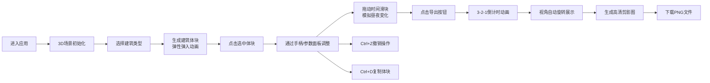

## 1. 产品概述
交互式3D城市天际线剪影编辑器，让用户通过拖拽和参数调整在三维空间中自由组合建筑体块，实时生成并导出城市天际线全景图。
- 面向建筑设计爱好者、城市规划师和创意工作者，提供直观的3D城市建模体验
- 降低3D建模门槛，快速生成具有艺术感的城市天际线剪影作品

## 2. 核心功能

### 2.1 功能模块
1. **主场景页面**：3D场景渲染、建筑体块操作、时间控制、导出功能

### 2.2 页面详情
| 页面名称 | 模块名称 | 功能描述 |
|-----------|-------------|---------------------|
| 主场景 | 3D渲染场景 | Three.js场景、网格地面、渐变天空盒、建筑体块渲染与阴影 |
| 主场景 | 建筑类型库面板 | 6种预设建筑类型（住宅楼、写字楼、酒店、电视塔、教堂、纪念碑），带图标预览，点击生成体块 |
| 主场景 | 属性编辑面板 | 选中体块后显示位置/尺寸/旋转参数，滑块与数值输入联动 |
| 主场景 | 时间控制条 | 06:00-20:00时间滑块，控制天空盒颜色与光照变化 |
| 主场景 | 导出功能 | 倒计时动画、自动旋转视角、2560x1440高清剪影截图导出（PNG） |
| 主场景 | 变换控制 | 选中体块显示平移/旋转/缩放控制手柄 |
| 主场景 | 撤销/复制 | Ctrl+Z撤销（20步）、Ctrl+D复制体块 |

## 3. 核心流程
用户进入应用后，左侧建筑类型库选择建筑类型，场景中随机生成弹性弹入的建筑体块。点击选中体块后可通过控制手柄或右侧参数面板进行精确调整。拖动顶部时间滑块可模拟一天中的光照变化。完成创作后点击导出按钮，经倒计时动画后自动生成高清天际线剪影图供下载。

## 4. 用户界面设计

### 4.1 设计风格
- **主色调**：深灰到黑色渐变背景（#1a1a2e到#16213e），选中高亮色亮蓝（#00b4ff）
- **建筑色彩**：莫兰迪色系12种柔和色板（米白、浅灰、淡蓝、暖橙、灰粉等低饱和度颜色）
- **面板风格**：毛玻璃效果（背景rgba(255,255,255,0.08)，blur:12px），霓虹蓝边框（1px rgba(100,200,255,0.3)）
- **按钮风格**：圆角矩形（border-radius:8px），悬停时背景变亮并横向扩展0.2秒动画
- **字体**：现代无衬线字体，标题加粗，正文常规字重

### 4.2 页面设计概述
| 页面名称 | 模块名称 | UI元素 |
|-----------|-------------|-------------|
| 主场景 | 3D画布 | 全屏Three.js渲染，淡蓝色网格地面，渐变天空盒，建筑体块带阴影 |
| 主场景 | 左侧类型面板 | 固定宽度280px，半透明毛玻璃，建筑类型卡片网格（2列），带小图标预览 |
| 主场景 | 右侧属性面板 | 固定宽度320px，选中时显示，参数滑块+数值输入框，分组布局 |
| 主场景 | 顶部时间条 | 居中800px宽度，时间滑块+时间文字+太阳/月亮图标 |
| 主场景 | 导出按钮 | 右上角固定，圆角按钮带导出图标 |
| 主场景 | 导出动画 | 中心倒计时数字，成功后绿色对勾扩散动画 |

### 4.3 响应式设计
- 桌面端（≥1200px）：左右面板固定展开
- 小屏（<1200px）：面板折叠为汉堡菜单，点击展开
- 触控设备：优化触摸交互区域

### 4.4 3D场景指引
- **环境**：渐变天空盒从浅蓝到淡紫，缓慢旋转（0.0005 rad/帧）
- **光照**：DirectionalLight模拟太阳光，位置和颜色随时间变化，开启阴影投射（PCFSoftShadowMap）
- **相机**：PerspectiveCamera（fov:60），初始位置(80, 60, 80)，OrbitControls控制
- **地面**：PlaneGeometry + MeshStandardMaterial，淡蓝色，接收阴影
- **网格**：GridHelper（尺寸400x400，间隔20，透明度0.3）
- **后处理**：无额外后处理，直接渲染以保证性能
- **性能**：建筑体块上限50个，保持60FPS
