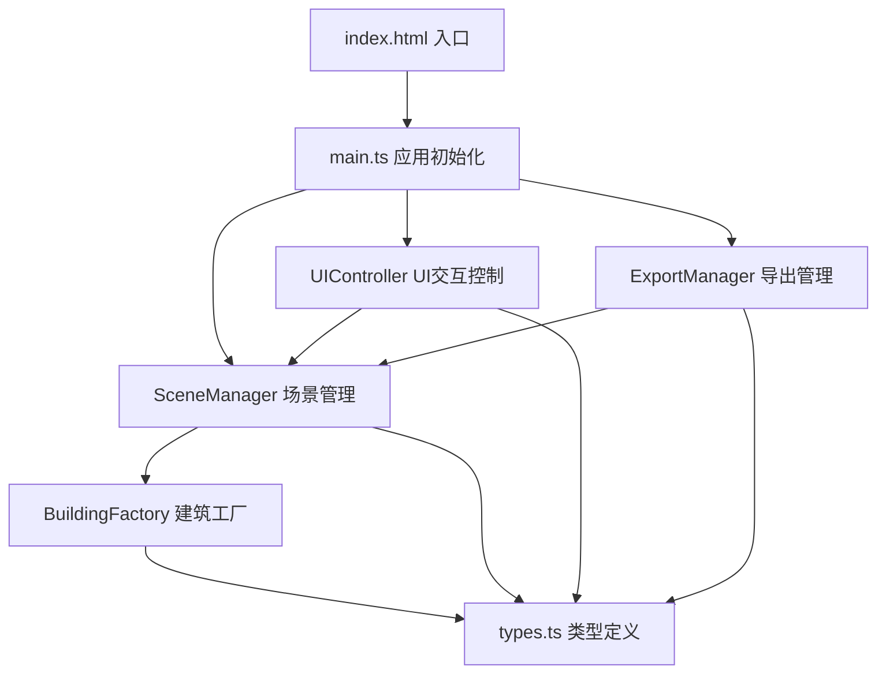

## 1. 架构设计



## 2. 技术描述
- **前端框架**：原生 TypeScript 5.x + Three.js 0.160.x
- **构建工具**：Vite 5.x，配置路径别名@指向src
- **渲染引擎**：Three.js（3D场景渲染）+ 原生 Canvas API（截图导出）
- **状态管理**：SceneManager 内部维护场景状态与历史记录栈
- **动画系统**：requestAnimationFrame 驱动，自定义缓动函数实现弹性动画

## 3. 文件结构
| 路径 | 职责 |
|-------|------|
| `package.json` | 依赖声明（three, typescript, vite, @types/three），启动脚本 `npm run dev` |
| `vite.config.js` | Vite 构建配置，路径别名 `@` → `src` |
| `tsconfig.json` | TypeScript 严格模式配置 |
| `index.html` | 入口页面，引入 main.ts，包含 UI 容器结构 |
| `src/main.ts` | 应用入口：初始化场景、UI、导出管理器，启动渲染循环 |
| `src/types.ts` | 类型定义：BuildingType 枚举、BuildingParams 接口、SceneState 接口 |
| `src/editor/sceneManager.ts` | 3D场景管理：建筑增删改查、变换控制、网格地面、天空盒、光照、历史记录 |
| `src/editor/uiController.ts` | UI交互：面板事件、滑块联动、建筑类型选择器、响应式菜单 |
| `src/editor/buildingFactory.ts` | 建筑体块生成：根据类型参数生成几何体、材质、颜色 |
| `src/export/exportManager.ts` | 导出管理：倒计时动画、视角切换、Canvas剪影渲染、PNG下载 |

## 4. 核心数据模型

### 4.1 类型定义
```typescript
// 建筑类型枚举
enum BuildingType {
  RESIDENTIAL = 'residential',    // 住宅楼
  OFFICE = 'office',               // 写字楼
  HOTEL = 'hotel',                 // 酒店
  TV_TOWER = 'tv_tower',           // 电视塔
  CHURCH = 'church',               // 教堂
  MONUMENT = 'monument'            // 纪念碑
}

// 建筑参数接口
interface BuildingParams {
  id: string;
  type: BuildingType;
  position: { x: number; y: number; z: number };
  size: { w: number; h: number; d: number };
  rotationY: number;
  color: string;
}

// 场景状态接口
interface SceneState {
  buildings: BuildingParams[];
  selectedId: string | null;
  timeOfDay: number; // 6-20 小时
}

// 历史记录
interface HistoryAction {
  type: 'add' | 'remove' | 'modify' | 'duplicate';
  before?: BuildingParams;
  after?: BuildingParams;
}
```

## 5. 核心模块设计

### 5.1 SceneManager
- 维护 Three.js Scene、Camera、Renderer、OrbitControls
- 建筑体块的 addBuilding / removeBuilding / updateBuilding / selectBuilding
- TransformControls（three/examples）实现可视化变换
- 20步历史记录栈实现 undo / redo
- animateBuildingIn / animateBuildingOut 弹性动画
- setTimeOfDay 更新天空盒颜色、太阳光位置与颜色

### 5.2 BuildingFactory
- createBuilding(type, params?) 根据类型生成 Mesh
- 6种建筑类型对应不同几何体组合（BoxGeometry、CylinderGeometry、ConeGeometry）
- 预设12色莫兰迪色板随机选取
- MeshStandardMaterial + 开启动投射/接收阴影

### 5.3 UIController
- 左侧建筑类型面板：卡片点击触发 addBuilding
- 右侧属性面板：滑块/输入框双向绑定选中体块参数（0.05s debounce）
- 顶部时间滑块：0.5小时步进，格式化显示 HH:MM，太阳/月亮图标切换
- 导出按钮：触发 ExportManager.startExport()
- 键盘事件：Ctrl+Z 撤销、Ctrl+D 复制
- 响应式：<1200px 面板折叠为汉堡菜单

### 5.4 ExportManager
- 3-2-1 倒计时 DOM 动画
- 相机自动 Tween 到俯视角 (0, 100, 100) → lookAt(0,0,0)，绕Y轴缓慢旋转一周
- 离屏 Canvas (2560x1440) 渲染 Three.js 场景
- 后处理：暗色背景、建筑剪影轮廓、底边阴影
- 生成 Blob → ObjectURL → 触发下载
- 成功动画：绿色对勾 CSS 扩散效果

## 6. 性能优化策略
- 建筑体块上限50个，超过时提示
- 使用 BufferGeometry 替代 Geometry
- 材质共享（同色建筑复用 Material 实例）
- 阴影贴图尺寸限制为 1024x1024
- 导出时临时关闭抗锯齿加速渲染
- 滑块参数更新使用 requestAnimationFrame 节流
