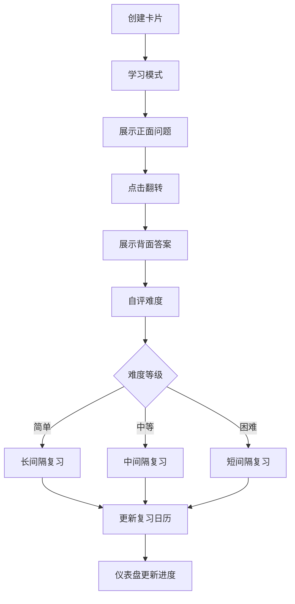

## 1. 产品概述

知识卡片闪卡记忆训练应用——帮助用户创建自己的知识卡片（正面问题、背面答案），通过间隔重复算法（Spaced Repetition）自动安排复习计划，实现高效记忆训练。面向学生、终身学习者和需要记忆大量知识的专业人士。

## 2. 核心功能

### 2.1 用户角色
| 角色 | 注册方式 | 核心权限 |
|------|----------|----------|
| 普通用户 | 无需注册 | 创建、编辑、删除卡片，学习与复习 |

### 2.2 功能模块
1. **仪表盘首页**：今日待复习卡片数量、连续学习天数、总体掌握进度环形图、今日复习入口
2. **卡片管理页**：创建/编辑/删除卡片、分类打标签、分类筛选、表单展开动画、卡片删除缩放消失动画
3. **学习模式页**：3D翻转动画展示卡片正反面、自评难度（简单/中等/困难）、间隔重复算法调度、日历视图展示复习计划

### 2.3 页面详情
| 页面名称 | 模块名称 | 功能描述 |
|----------|----------|----------|
| 仪表盘 | 今日待复习 | 显示今日需要复习的卡片数量，点击按钮直接进入学习模式 |
| 仪表盘 | 连续学习天数 | 显示用户连续学习天数，激励持续学习 |
| 仪表盘 | 进度环 | 环形进度条动画展示总体掌握进度百分比 |
| 卡片管理 | 卡片列表 | 展示所有卡片，支持按分类筛选，删除时缩放消失动画 |
| 卡片管理 | 创建/编辑表单 | 平滑展开动画的表单，包含正面问题、背面答案、分类标签 |
| 学习模式 | 翻转卡片 | 3D Y轴旋转翻转动画，正面大字体显示问题，背面灰色字体显示答案 |
| 学习模式 | 难度评级 | 简单/中等/困难三个按钮，弹簧回弹效果 |
| 学习模式 | 日历视图 | 展示复习计划日历，按月切换，标注每日复习卡片数量 |

## 3. 核心流程

用户创建知识卡片 → 系统根据间隔重复算法安排首次学习 → 用户进入学习模式 → 翻转卡片查看答案 → 自评难度 → 算法计算下次复习时间 → 更新日历视图 → 回到仪表盘查看进度

## 4. 用户界面设计

### 4.1 设计风格
- 主色调：柔和蓝紫色渐变（#6366f1 → #8b5cf6 → #a78bfa）
- 辅助色：半透明白色毛玻璃效果（rgba(255,255,255,0.15) + backdrop-blur）
- 按钮：圆角胶囊形，弹簧回弹效果点击动画
- 字体：正面问题使用大号圆角字体，背面答案使用稍小灰色字体
- 布局：卡片式布局，顶部导航切换页面
- 图标：lucide-react 图标库

### 4.2 页面设计概览
| 页面名称 | 模块名称 | UI 元素 |
|----------|----------|---------|
| 仪表盘 | 今日待复习 | 蓝紫渐变背景卡片，大号数字，复习按钮 |
| 仪表盘 | 进度环 | SVG环形进度条，动画填充，中心百分比数字 |
| 仪表盘 | 连续学习天数 | 火焰图标+数字，毛玻璃卡片 |
| 卡片管理 | 卡片列表 | 毛玻璃卡片网格，分类筛选标签栏，删除缩放动画 |
| 卡片管理 | 创建表单 | 展开动画表单，输入框+标签选择器，渐变提交按钮 |
| 学习模式 | 翻转卡片 | 3D Y轴旋转，正面大字问题，背面灰色答案，边缘光线流动 |
| 学习模式 | 难度按钮 | 三个胶囊按钮（绿/黄/红），弹簧回弹效果 |
| 学习模式 | 日历视图 | 月历网格，每日复习数量标注，左右切换月份 |

### 4.3 响应式设计
- 桌面端优先，移动端适配
- 卡片网格：桌面3列，平板2列，手机1列
- 学习模式卡片居中展示，固定最大宽度
- 触摸优化：按钮最小44px点击区域，滑动支持日历切换

### 4.4 动画性能要求
- 卡片翻转动画帧率不低于50fps（使用CSS transform + will-change）
- 日历视图切换月份时流畅无卡顿（CSS transition + requestAnimationFrame）
- 边缘光线效果使用CSS动画而非JavaScript计算
