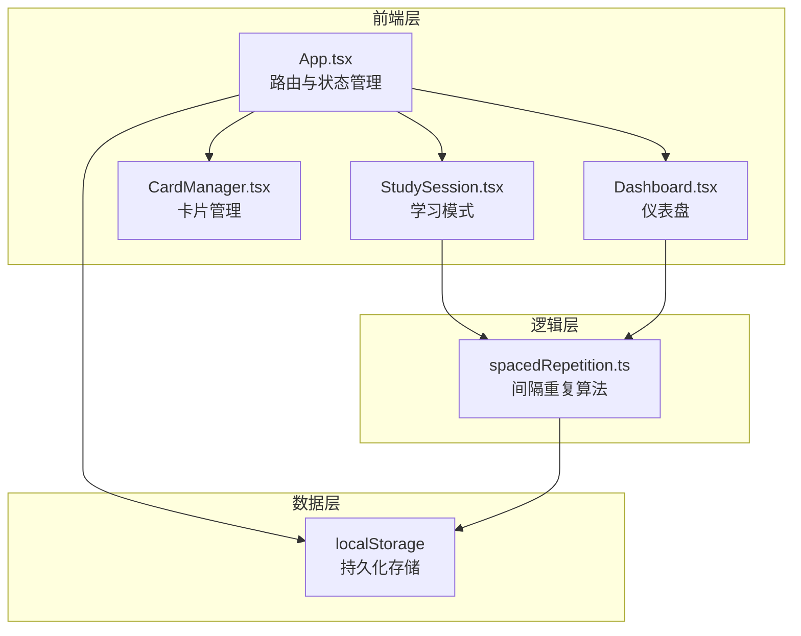
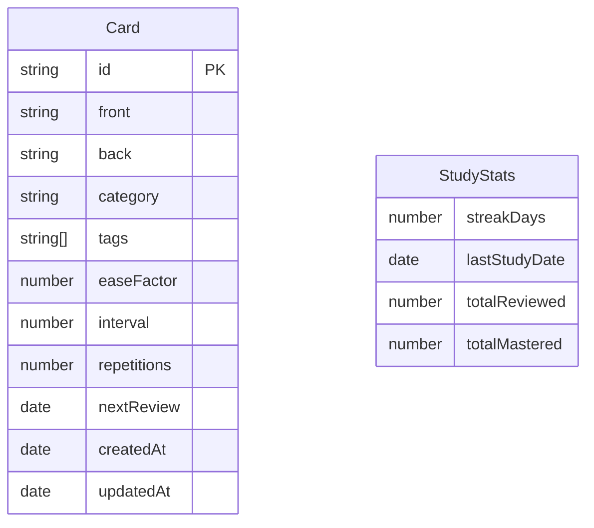

## 1. 架构设计

## 2. 技术说明
- 前端：React 18 + TypeScript + Vite
- 初始化工具：vite-init（react-ts 模板）
- 样式：Tailwind CSS + 自定义CSS动画
- 状态管理：Zustand
- 数据持久化：localStorage
- 依赖库：uuid（卡片ID生成）、date-fns（日期处理）、lucide-react（图标）
- 后端：无（纯前端应用）

## 3. 路由定义
| 路由 | 用途 |
|------|------|
| / | 仪表盘首页，展示今日待复习、学习进度、连续天数 |
| /cards | 卡片管理页，创建/编辑/删除/筛选卡片 |
| /study | 学习模式页，翻转卡片、自评难度、复习调度 |

## 4. 数据模型

### 4.1 数据模型定义

### 4.2 数据结构定义

**Card 接口**：
- `id`: string — 唯一标识（uuid）
- `front`: string — 正面问题
- `back`: string — 背面答案
- `category`: string — 分类
- `tags`: string[] — 标签列表
- `easeFactor`: number — 难度因子（默认2.5，最低1.3）
- `interval`: number — 复习间隔（天）
- `repetitions`: number — 已复习次数
- `nextReview`: string — 下次复习日期（ISO字符串）
- `createdAt`: string — 创建时间
- `updatedAt`: string — 更新时间

**StudyStats 接口**：
- `streakDays`: number — 连续学习天数
- `lastStudyDate`: string — 最后学习日期
- `totalReviewed`: number — 总复习次数
- `totalMastered`: number — 已掌握卡片数（interval >= 21天）

### 4.3 间隔重复算法（SM-2改良版）

根据用户自评等级调整：
- **简单**：easeFactor += 0.15，interval = interval * easeFactor * 1.3
- **中等**：easeFactor 不变，interval = interval * easeFactor
- **困难**：easeFactor -= 0.2（最低1.3），interval = interval * 0.5（最低1天）
- 首次复习：简单=4天，中等=2天，困难=1天
- 第二次复习：基于首次间隔 * easeFactor
