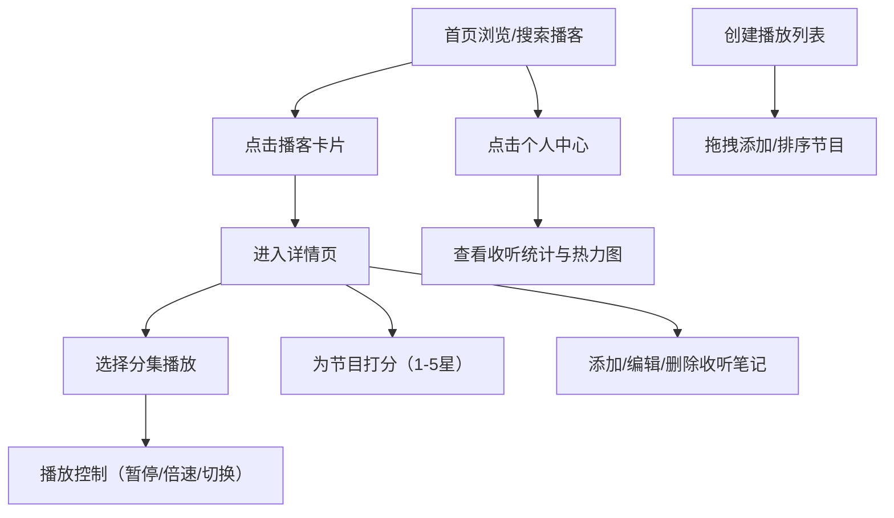

## 1. 产品概述

播客追踪与推荐应用，帮助播客爱好者系统化管理收听记录、生成个性化统计报告并创建自制播放列表。

- 主要目的：解决播客爱好者听完节目后无法系统回顾和发现新内容的痛点
- 目标用户：重度播客听众、内容爱好者、知识工作者
- 产品价值：提供一站式播客管理体验，从发现、收听到回顾的全流程服务

## 2. 核心功能

### 2.1 功能模块

1. **首页**：播客搜索、播客列表展示（两列网格）、个人中心入口
2. **播客详情页**：封面大图、节目简介、分集列表、打分系统、笔记管理
3. **播放控制面板**：播放/暂停、进度条、倍速选择、上下集切换
4. **播放列表管理**：创建自定义列表、拖拽排序、节目添加/移除
5. **个人中心侧边栏**：收听统计、热力图、完成集数、平均评分

### 2.2 页面详情

| 页面名称 | 模块名称 | 功能描述 |
|-----------|-------------|---------------------|
| 首页 | 搜索栏 | 支持按节目名称搜索播客 |
| 首页 | 播客卡片列表 | 两列网格展示播客卡片，含封面、标题、标签 |
| 首页 | 个人中心入口 | 右上角图标，点击展开侧边栏 |
| 详情页 | 封面展示区 | 圆角16px带阴影的封面大图 |
| 详情页 | 节目简介区 | 显示节目描述和分集数 |
| 详情页 | 分集列表 | 每集显示标题和时长，点击播放 |
| 详情页 | 打分系统 | 1-5星打分，弹性缩放动画 |
| 详情页 | 笔记管理 | 支持Markdown、编辑、删除，时间倒序 |
| 播放控制栏 | 播放控制 | 播放/暂停按钮带脉冲动画 |
| 播放控制栏 | 进度条 | 珊瑚橙填充，实时更新 |
| 播放控制栏 | 倍速选择 | 0.5x - 2x 倍速切换 |
| 播放控制栏 | 上下集切换 | 快速切换到上一集/下一集 |
| 播放列表页 | 列表创建 | 创建自定义播放列表 |
| 播放列表页 | 拖拽排序 | 支持拖拽调整节目顺序 |
| 播放列表页 | 节目管理 | 添加/移除节目到列表 |
| 个人侧边栏 | 收听统计 | 总时长、完成集数、平均评分 |
| 个人侧边栏 | 热力图 | 最近7天收听强度可视化 |

## 3. 核心流程

用户从首页浏览或搜索播客 → 点击进入详情页 → 选择分集播放 → 为节目打分和写笔记 → 创建播放列表并拖拽管理 → 查看个人收听统计

## 4. 用户界面设计

### 4.1 设计风格

- 主题模式：深色模式
- 背景色：#1a1a2e（主背景），#16213e（卡片背景）
- 品牌主色调：珊瑚橙 #ff6b6b
- 强调色：浅蓝 #4ecdc4
- 卡片圆角：12px，详情封面圆角：16px
- 字体系统：现代无衬线字体，支持中文显示
- 图标风格：Lucide 线性图标

### 4.2 交互设计

- 卡片悬停：上移4px + 珊瑚橙阴影
- 星星打分：弹性缩放动画，灰色变金色
- 侧边栏：从右侧滑入，0.3秒缓出动画
- 弹窗/侧边栏：0.3秒缓出动画
- 拖拽：元素半透明跟随鼠标，目标位置蓝色虚线占位符
- 播放按钮：点击时脉冲涟漪动画
- 笔记编辑：淡入动画展开编辑区
- 操作提示：从顶部滑入，2秒后消失

### 4.3 响应式设计

- 桌面端（>768px）：两列网格布局
- 移动端（≤768px）：单列布局
- 播放控制面板：固定底部，高度80px
- 个人侧边栏：宽度320px，毛玻璃半透明效果

### 4.4 性能要求

- 首屏加载：≤2秒（代码分割 + 懒加载）
- 播放状态切换：<100ms
- 列表滚动：保持60fps帧率
