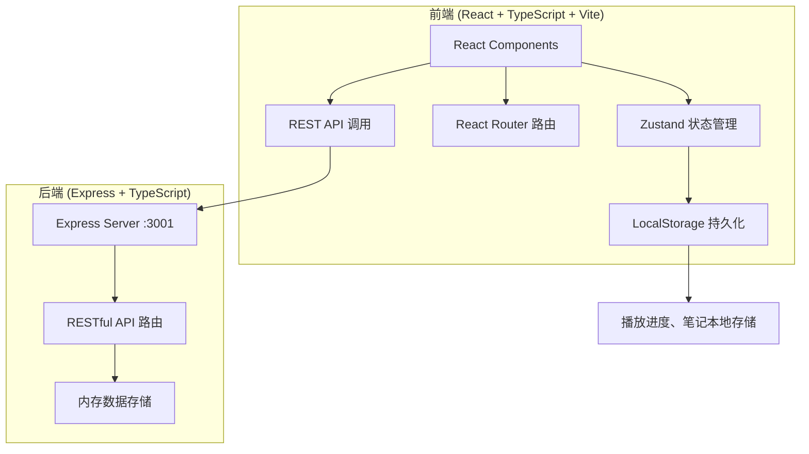
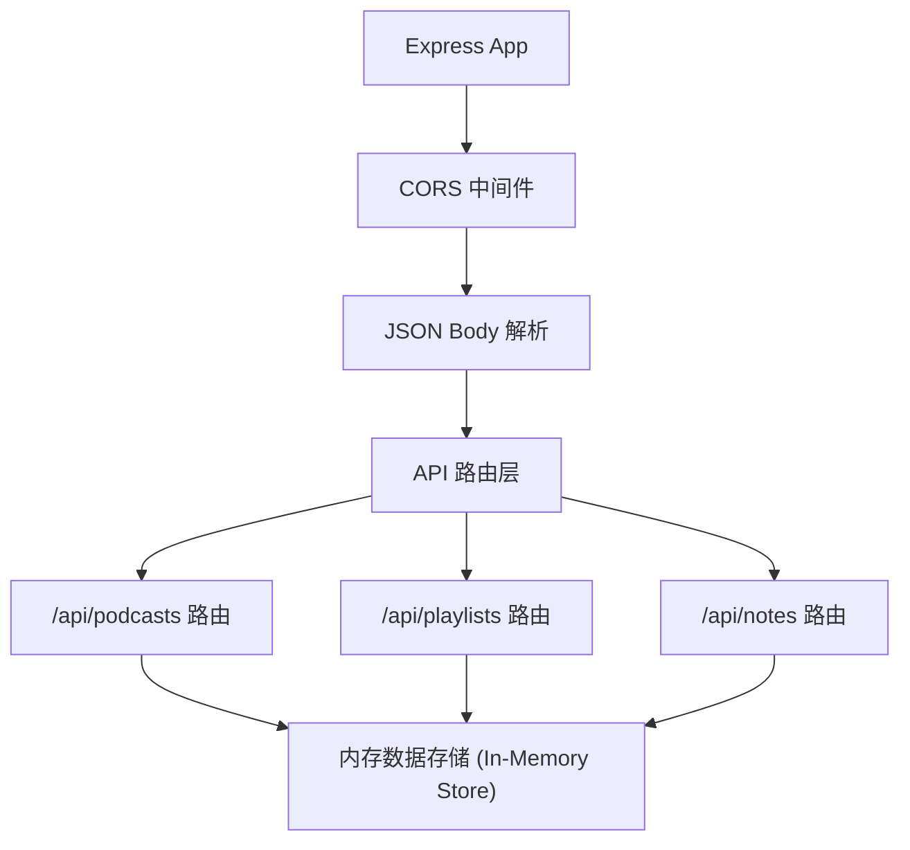
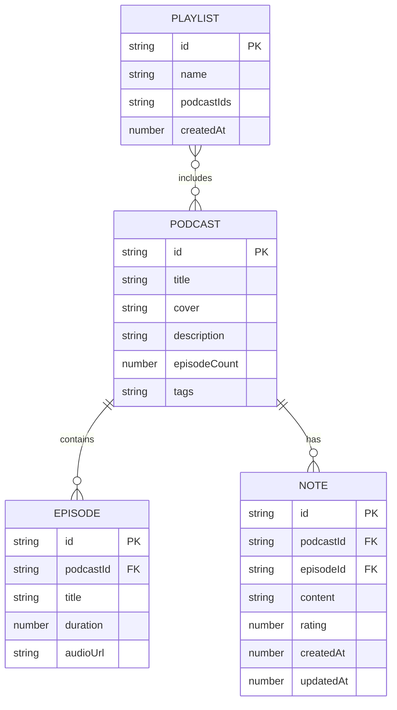

## 1. 架构设计



## 2. 技术栈说明

- **前端框架**：React@18 + TypeScript
- **构建工具**：Vite@5 + @vitejs/plugin-react
- **路由**：react-router-dom@6
- **状态管理**：zustand
- **拖拽库**：@dnd-kit/core + @dnd-kit/sortable（替代 react-beautiful-dnd，后者已停止维护）
- **图标**：lucide-react
- **样式**：原生 CSS（CSS Modules），配合 CSS 变量
- **后端框架**：Express@4
- **CORS 处理**：cors 中间件
- **数据存储**：内存存储（uuid 生成唯一 ID）
- **开发代理**：Vite dev server 代理 API 请求到 :3001

## 3. 路由定义

| 路由 | 页面/功能 |
|-------|---------|
| `/` | 首页 - 播客搜索与列表展示 |
| `/podcast/:id` | 播客详情页 - 节目信息、分集、评分、笔记 |
| `/playlists` | 播放列表管理页 |

## 4. API 定义

### 类型定义

```typescript
interface Podcast {
  id: string;
  title: string;
  cover: string;
  description: string;
  episodeCount: number;
  tags: string[];
  episodes: Episode[];
}

interface Episode {
  id: string;
  podcastId: string;
  title: string;
  duration: number; // 秒
  audioUrl: string;
}

interface Playlist {
  id: string;
  name: string;
  podcastIds: string[];
  createdAt: number;
}

interface Note {
  id: string;
  podcastId: string;
  episodeId?: string;
  content: string;
  rating: number; // 1-5
  createdAt: number;
  updatedAt: number;
}

interface ListeningStats {
  totalMinutes: number;
  completedEpisodes: number;
  averageRating: number;
  dailyMinutes: { date: string; minutes: number }[];
}
```

### API 端点

| 方法 | 路径 | 描述 | 请求体 | 响应 |
|------|------|------|--------|------|
| GET | `/api/podcasts` | 获取所有播客列表 | - | Podcast[] |
| GET | `/api/podcasts?search=xxx` | 搜索播客 | - | Podcast[] |
| GET | `/api/podcasts/:id` | 获取单个播客详情 | - | Podcast |
| GET | `/api/playlists` | 获取所有播放列表 | - | Playlist[] |
| POST | `/api/playlists` | 创建播放列表 | `{ name: string }` | Playlist |
| PUT | `/api/playlists/:id` | 更新播放列表（排序/增删） | `{ name?: string, podcastIds: string[] }` | Playlist |
| DELETE | `/api/playlists/:id` | 删除播放列表 | - | `{ success: true }` |
| GET | `/api/notes?podcastId=xxx` | 获取播客的笔记 | - | Note[] |
| POST | `/api/notes` | 创建笔记 | `{ podcastId, episodeId?, content, rating }` | Note |
| PUT | `/api/notes/:id` | 更新笔记 | `{ content?: string, rating?: number }` | Note |
| DELETE | `/api/notes/:id` | 删除笔记 | - | `{ success: true }` |

## 5. 服务端架构



## 6. 数据模型

### 6.1 数据实体关系



### 6.2 本地存储结构

```json
{
  "playbackProgress": {
    "<episodeId>": {
      "currentTime": 0,
      "duration": 0,
      "completed": false,
      "lastPlayedAt": 0
    }
  },
  "listeningHistory": [
    { "date": "2026-06-22", "minutes": 45 }
  ]
}
```

## 7. 项目结构

```
.
├── package.json
├── vite.config.ts
├── tsconfig.json
├── tsconfig.node.json
├── index.html
├── src/
│   ├── server/
│   │   └── index.ts              # Express 服务端入口
│   ├── client/
│   │   ├── main.tsx              # React 入口
│   │   ├── App.tsx               # 根组件与路由
│   │   ├── index.css             # 全局样式
│   │   ├── store/
│   │   │   ├── playerStore.ts    # 播放器状态
│   │   │   └── appStore.ts       # 应用全局状态
│   │   ├── pages/
│   │   │   ├── Home.tsx          # 首页
│   │   │   ├── PodcastDetail.tsx # 详情页
│   │   │   └── Playlists.tsx     # 播放列表页
│   │   ├── components/
│   │   │   ├── PodcastCard.tsx   # 播客卡片
│   │   │   ├── Player.tsx        # 底部播放控制
│   │   │   ├── Playlist.tsx      # 播放列表组件
│   │   │   ├── StarRating.tsx    # 星级评分
│   │   │   ├── NoteEditor.tsx    # 笔记编辑器
│   │   │   ├── Sidebar.tsx       # 个人中心侧边栏
│   │   │   └── Heatmap.tsx       # 收听热力图
│   │   ├── types/
│   │   │   └── index.ts          # 类型定义
│   │   ├── utils/
│   │   │   ├── api.ts            # API 请求封装
│   │   │   ├── storage.ts        # LocalStorage 工具
│   │   │   └── format.ts         # 格式化工具
│   │   └── hooks/
│   │       └── useAudio.ts       # Audio API Hook
```
