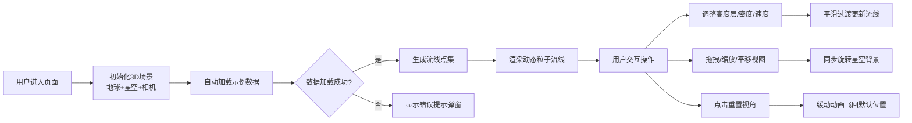

## 1. 产品概述

交互式3D风场流线可视化应用，为气象数据分析师提供直观的三维风场探索工具，解决传统2D等值线图无法体现三维空间结构变化的问题。通过动态流线粒子在3D地球上展示不同高度层的风场数据，支持高度层切换、流线密度和粒子速度调节。

- 目标用户：气象数据分析师、天气预报员、大气科学研究者
- 产品价值：将抽象的三维风场数据转化为直观的动态可视化，帮助预测天气系统演变路径

## 2. 核心特性

### 2.1 用户角色
| 角色 | 注册方式 | 核心权限 |
|------|----------|----------|
| 普通用户 | 无需注册 | 浏览3D风场、调整参数、切换高度层 |

### 2.2 功能模块
1. **3D地球场景**：半透明地球模型、经纬网格线、星空背景、相机轨道控制
2. **风场流线渲染**：动态粒子流线、拖尾效果、风速颜色映射
3. **参数控制面板**：高度层选择、流线密度滑块、粒子速度滑块、重置视角按钮
4. **数据加载模块**：自动加载示例JSON气象数据、错误提示处理
5. **响应式布局**：桌面侧边面板、移动端底部抽屉面板

### 2.3 页面详情
| 页面名称 | 模块名称 | 功能描述 |
|----------|----------|----------|
| 主页面 | 3D地球场景 | 半透明深空蓝地球，经纬网格线，默认俯视视角（0度上方400单位），星空背景缓慢旋转 |
| 主页面 | 风场流线 | 每条流线200个点，粒子沿路径匀速移动，颜色根据风速从蓝绿到红紫渐变，粒子带12个点的拖尾效果 |
| 主页面 | 控制面板 | 右侧毛玻璃面板（260px宽），高度层下拉（5个预设层）、密度滑块（1-20）、速度滑块（0.5-5.0）、重置按钮 |
| 主页面 | 错误提示 | 数据加载失败时中央红色半透明弹窗，带淡入动画和关闭按钮 |

## 3. 核心流程

## 4. 用户界面设计

### 4.1 设计风格
- **主色调**：深空蓝 #0a0e27
- **点缀色**：青色 #00d4ff，紫色 #8b5cf6
- **字体**：主标题使用 Orbitron（科技感），正文使用 Inter（可读性）
- **面板样式**：毛玻璃效果，背景 rgba(0,0,0,0.6)，圆角 16px，淡蓝光晕边缘，模糊 10px
- **滑块样式**：渐变轨道（左青右紫），圆形滑块
- **动画**：所有交互 0.2s 过渡，高度层切换 1s 渐隐渐现，视角重置 1.5s 缓出动画

### 4.2 页面设计概述
| 页面名称 | 模块名称 | UI 元素 |
|----------|----------|----------|
| 主页面 | 3D地球场景 | 半透明蓝色球体、白色半透明经纬线、黑色星空粒子、动态彩色流线粒子 |
| 主页面 | 控制面板 | 白色标签文字、深色下拉菜单（悬停青色）、渐变滑块、发光按钮（悬停放大） |
| 主页面 | 错误提示 | 红色半透明弹窗、白色错误文字、关闭按钮 |
| 主页面 | 移动端抽屉 | 底部折叠面板、右上角展开图标、抽屉滑入动画 |

### 4.3 响应式设计
- **桌面端（≥768px）**：右侧固定控制面板（260px宽，从右侧滑入）
- **移动端（<768px）**：底部抽屉式面板，点击右上角图标展开/收起
- **触摸优化**：滑块增大触摸区域，按钮最小 44x44px

### 4.4 3D场景设计
- **环境**：深空黑色背景，2000个星空粒子缓慢旋转
- **光照**：环境光（强度0.3）+ 方向光（强度0.8，从右上方照射）
- **相机**：PerspectiveCamera，fov 60，近裁剪面 1，远裁剪面 2000，默认位置 (0, 0, 400)
- **地球**：半径 100，半透明（opacity 0.6），深空蓝材质，经纬网格线（opacity 0.3）
- **流线粒子**：2px 圆形，带 12 个点的拖尾，透明度从 0.8 递减到 0
- **交互**：OrbitControls，缩放范围 100-800，左键旋转，右键平移，滚轮缩放
- **性能**：帧率 ≥55fps，流线条数 ≤100，粒子更新 ≤16ms
