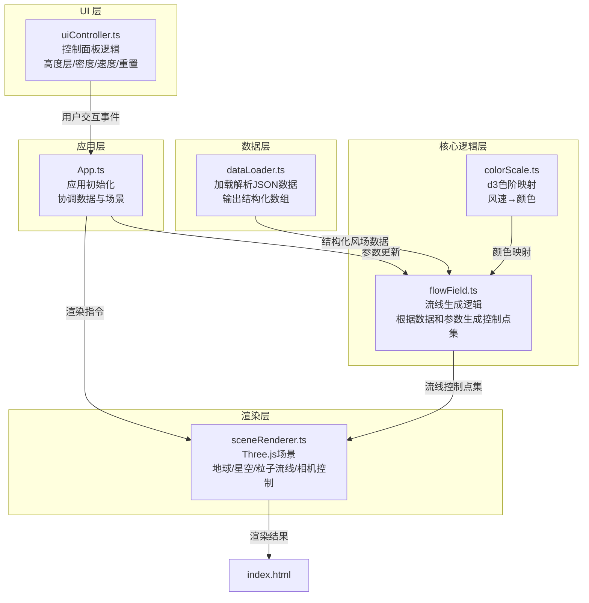

## 1. 架构设计



## 2. 技术栈描述

- **前端框架**：原生 TypeScript（无 React/Vue，按用户要求）
- **构建工具**：Vite@5.x
- **3D 渲染**：Three.js@0.160.x + @types/three
- **数据处理**：d3@7.x + @types/d3（数据插值、颜色映射）
- **语言**：TypeScript@5.x（严格模式）
- **样式**：原生 CSS（毛玻璃、渐变、动画）
- **包管理**：npm

## 3. 项目文件结构

```
auto92/
├── index.html                     # 入口页面
├── package.json                   # 项目依赖和脚本
├── vite.config.js                 # Vite 构建配置
├── tsconfig.json                  # TypeScript 配置
├── public/
│   └── sample-wind-data.json      # 示例气象数据集
└── src/
    ├── App.ts                     # 应用初始化与协调
    ├── main.ts                    # 入口文件
    ├── dataLoader.ts              # 数据加载与解析
    ├── flowField.ts               # 核心流线生成逻辑
    ├── sceneRenderer.ts           # Three.js 场景管理
    ├── uiController.ts            # UI 控制面板逻辑
    ├── colorScale.ts              # d3 颜色映射
    ├── types.ts                   # 类型定义
    └── styles/
        └── main.css               # 全局样式
```

## 4. 模块调用关系与数据流向

### 4.1 模块职责

| 模块 | 输入 | 输出 | 核心职责 |
|------|------|------|----------|
| **App.ts** | UI 事件、加载完成通知 | 场景更新指令 | 协调各模块、事件绑定、生命周期管理 |
| **dataLoader.ts** | JSON 文件路径 | `WindDataGrid[]` | 加载、解析、验证气象数据 |
| **flowField.ts** | 风场数据、UI 参数（高度层、密度） | `StreamlinePoint[][]` | 生成流线控制点集，每个点含位置、风向、颜色 |
| **sceneRenderer.ts** | 流线点集、速度参数 | Three.js 渲染结果 | 创建3D场景、地球、星空、粒子动画、渲染循环 |
| **uiController.ts** | DOM 元素 | 事件回调（高度层/密度/速度/重置） | 处理用户交互、派发事件通知 |
| **colorScale.ts** | 风速值 | RGB 颜色字符串 | d3 色阶映射，低风速蓝绿，高风速红紫 |

### 4.2 数据流向
1. 启动：`main.ts` → `App.init()` → 创建 `SceneRenderer`、`DataLoader`、`UIController`
2. 数据加载：`DataLoader.load()` → 解析 JSON → `WindDataGrid` 数组
3. 流线生成：`FlowField.generate(streamlineCount, altitudeLevel)` → 调用 `ColorScale` → `StreamlinePoint[][]`
4. 渲染：`SceneRenderer.updateStreamlines(points)` → 创建粒子系统 → 渲染循环更新粒子位置
5. 用户交互：`UIController` 事件 → `App` 处理 → 调用 `FlowField` 或 `SceneRenderer` 更新

## 5. 数据模型定义

### 5.1 类型定义（types.ts）

```typescript
// 单个网格点的风场数据
export interface WindDataPoint {
  lon: number;           // 经度 [-180, 180]
  lat: number;           // 纬度 [-90, 90]
  u: number;             // 东西向风速分量 (m/s)
  v: number;             // 南北向风速分量 (m/s)
  altitude: number;      // 高度层 (hPa)
}

// 某一高度层的完整风场网格
export interface WindDataGrid {
  altitude: number;      // 高度层 (hPa)
  points: WindDataPoint[];
  gridSize: { lon: number; lat: number };
  bounds: { minLon: number; maxLon: number; minLat: number; maxLat: number };
}

// 流线控制点
export interface StreamlinePoint {
  position: { x: number; y: number; z: number };  // 3D 空间位置
  direction: { x: number; y: number; z: number }; // 风向向量
  speed: number;                                  // 风速大小
  color: string;                                   // 颜色（RGB 十六进制）
}

// UI 控制参数
export interface UIParameters {
  altitudeLevel: number;    // 当前高度层索引
  streamlineDensity: number; // 流线密度（1-20）
  particleSpeed: number;     // 粒子速度（0.5-5.0）
}

// 应用状态
export interface AppState {
  isDataLoaded: boolean;
  currentAltitude: number;
  streamlineCount: number;
  error: string | null;
}
```

### 5.2 示例数据格式（sample-wind-data.json）

```json
{
  "metadata": {
    "generatedAt": "2024-01-15T10:00:00Z",
    "gridSize": { "lon": 20, "lat": 20 },
    "altitudeLevels": [1000, 850, 700, 500, 300]
  },
  "data": [
    {
      "altitude": 1000,
      "points": [
        { "lon": -180, "lat": -90, "u": 5.2, "v": -3.1 },
        { "lon": -160, "lat": -90, "u": 4.8, "v": -2.9 }
      ]
    }
  ]
}
```

## 6. 关键实现说明

### 6.1 流线生成算法（flowField.ts）
- **种子点生成**：在地球表面均匀分布种子点，数量 = 密度系数 × 5
- **流线追踪**：使用四阶 Runge-Kutta 方法进行流线积分，步长 0.5°
- **数据插值**：使用 d3.bisect 在经纬度网格上进行双线性插值获取任意点的风向风速
- **终止条件**：流线长度达到 200 个点，或离开地球边界，或风速为 0

### 6.2 粒子动画系统（sceneRenderer.ts）
- **粒子管理**：每条流线对应一个粒子，粒子沿流线点数组循环移动
- **拖尾效果**：每个粒子维护一个 12 点的位置历史，透明度从 0.8 线性递减到 0
- **性能优化**：使用 BufferGeometry 批量更新粒子位置，而非单独更新每个 mesh
- **速度控制**：粒子沿流线前进的索引增量 = 粒子速度系数 × 时间增量

### 6.3 平滑过渡效果
- **高度层切换**：旧流线透明度 1→0（500ms），同时新流线透明度 0→1（500ms）
- **密度变化**：流线条数变化时，多余流线渐隐消失，新增流线从地球表面渐入
- **视角重置**：使用自定义缓动函数 `easeOutCubic`，1.5s 内相机平滑飞回 (0, 0, 400)

## 7. 性能优化策略

1. **对象池**：预分配最大 100 条流线的粒子对象，避免频繁创建销毁
2. **批量更新**：每帧一次性更新所有粒子的 position attribute，减少 draw call
3. **节流处理**：UI 滑块事件使用 16ms 节流，避免频繁重新生成流线
4. **离屏计算**：流线生成使用 requestIdleCallback，不阻塞主线程
5. **LOD 控制**：距离相机较远的粒子适当降低拖尾长度

## 8. 构建配置

### vite.config.js
```javascript
import { defineConfig } from 'vite';
import path from 'path';

export default defineConfig({
  resolve: {
    alias: {
      '@': path.resolve(__dirname, './src')
    }
  },
  server: {
    port: 5173,
    open: true
  },
  build: {
    target: 'es2020',
    sourcemap: true
  }
});
```

### tsconfig.json
```json
{
  "compilerOptions": {
    "target": "ES2020",
    "module": "ESNext",
    "strict": true,
    "moduleResolution": "bundler",
    "baseUrl": ".",
    "paths": {
      "@/*": ["src/*"]
    },
    "types": ["three", "d3"]
  },
  "include": ["src/**/*"]
}
```
