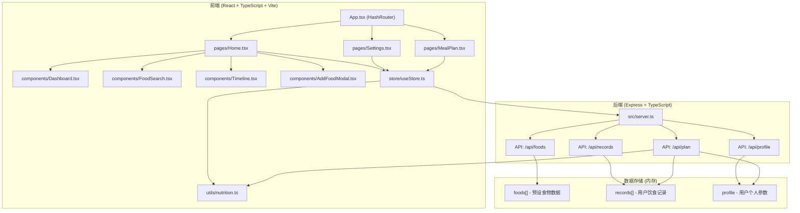
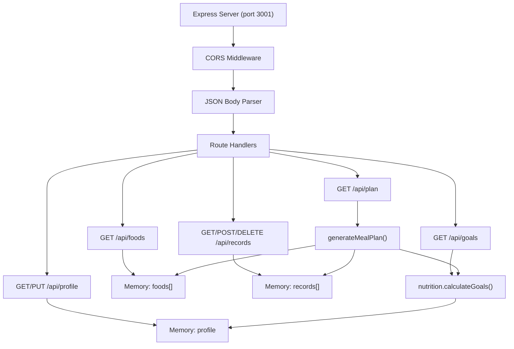
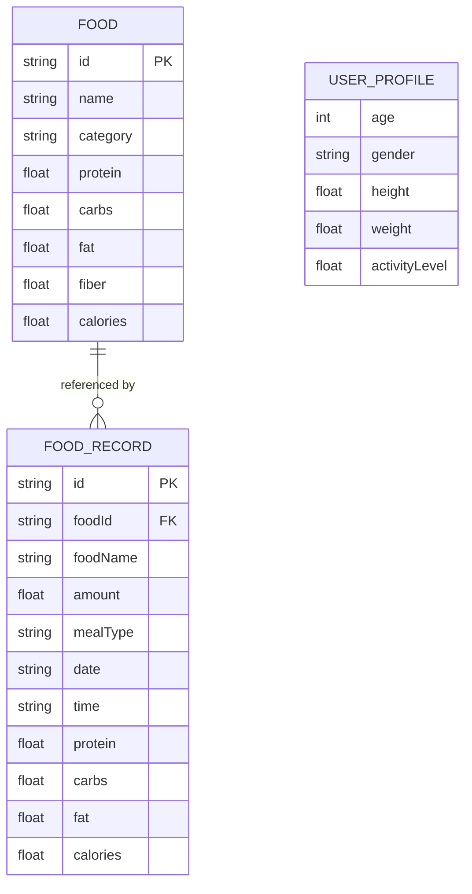

## 1. 架构设计



## 2. 技术描述
- 前端：React 18 + TypeScript + Vite + React Router DOM + Zustand
- UI样式：纯CSS（无Tailwind，使用CSS变量）
- 图标：lucide-react
- 后端：Express 4 + TypeScript + CORS
- 数据存储：内存数组（无需数据库）
- 构建工具：Vite 5 + @vitejs/plugin-react
- 唯一ID生成：uuid

## 3. 路由定义
| 路由 | 页面 | 功能 |
|------|------|------|
| / | 首页 | 食物搜索、时间线、仪表盘 |
| /settings | 设置页 | 个人参数设置、营养目标计算 |
| /plan | 食谱页 | 周食谱计划展示、一键添加 |

## 4. API 定义

### 类型定义
```typescript
interface Food {
  id: string;
  name: string;
  category: '主食' | '肉类' | '蔬菜' | '水果' | '乳制品' | '其他';
  protein: number;    // g per 100g
  carbs: number;      // g per 100g
  fat: number;        // g per 100g
  fiber: number;      // g per 100g
  calories: number;   // kcal per 100g
}

interface FoodRecord {
  id: string;
  foodId: string;
  foodName: string;
  amount: number;     // grams
  mealType: 'breakfast' | 'lunch' | 'dinner' | 'snack1' | 'snack2';
  date: string;       // YYYY-MM-DD
  time: string;       // HH:mm
  protein: number;
  carbs: number;
  fat: number;
  calories: number;
}

interface UserProfile {
  age: number;
  gender: 'male' | 'female';
  height: number;     // cm
  weight: number;     // kg
  activityLevel: 1.2 | 1.375 | 1.55 | 1.725 | 1.9;
}

interface NutritionGoals {
  calories: number;
  protein: number;
  carbs: number;
  fat: number;
}

interface MealPlanItem {
  foodId: string;
  foodName: string;
  amount: number;
  calories: number;
}

interface MealPlanDay {
  breakfast: MealPlanItem[];
  lunch: MealPlanItem[];
  dinner: MealPlanItem[];
  snack1: MealPlanItem[];
  snack2: MealPlanItem[];
}

type WeeklyMealPlan = MealPlanDay[]; // 7 days
```

### API 端点
| 方法 | 路径 | 描述 | 请求体 | 响应 |
|------|------|------|--------|------|
| GET | /api/foods | 获取所有食物，支持name查询 | - | Food[] |
| GET | /api/records | 获取饮食记录，支持date查询 | - | FoodRecord[] |
| POST | /api/records | 添加饮食记录 | FoodRecord (无id) | FoodRecord |
| DELETE | /api/records/:id | 删除饮食记录 | - | { success: boolean } |
| GET | /api/profile | 获取用户个人参数 | - | UserProfile |
| PUT | /api/profile | 更新用户个人参数 | UserProfile | UserProfile |
| GET | /api/goals | 获取营养目标 | - | NutritionGoals |
| GET | /api/plan | 生成周食谱计划 | - | WeeklyMealPlan |

## 5. 服务器架构



## 6. 数据模型

### 6.1 数据模型定义



### 6.2 初始化数据
- 预设50+种食物数据，涵盖主食、肉类、蔬菜、水果、乳制品等类别
- 默认用户参数：年龄30、性别男、身高175cm、体重70kg、活动水平1.55
- 空的饮食记录数组

## 7. 核心计算逻辑

### 7.1 Mifflin-St Jeor BMR 公式
- 男性: BMR = 10 × 体重(kg) + 6.25 × 身高(cm) - 5 × 年龄 + 5
- 女性: BMR = 10 × 体重(kg) + 6.25 × 身高(cm) - 5 × 年龄 - 161

### 7.2 每日总能量消耗 (TDEE)
- TDEE = BMR × 活动系数
  - 久坐: 1.2
  - 轻度活动: 1.375
  - 中度活动: 1.55
  - 高强度活动: 1.725
  - 极高强度活动: 1.9

### 7.3 宏量营养素分配
- 蛋白质: 总热量的 25% (1g = 4kcal)
- 碳水化合物: 总热量的 50% (1g = 4kcal)
- 脂肪: 总热量的 25% (1g = 9kcal)

### 7.4 食谱生成算法
- 分析过去7天营养摄入的平均缺额
- 基于营养目标和食物库生成均衡的周食谱
- 每日包含早餐、午餐、晚餐和两顿加餐
- 确保每餐的营养比例合理
