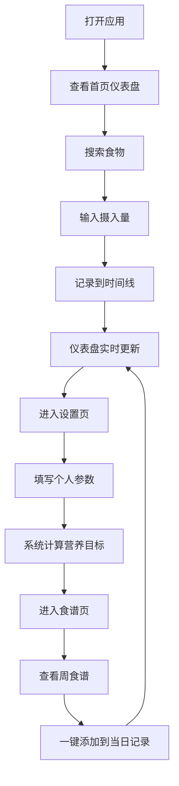

## 1. 产品概述
营养追踪与食谱规划应用，帮助用户记录每日饮食摄入、分析营养平衡，并基于个人参数生成个性化周食谱计划。解决日常饮食不均衡和不知道如何调整饮食结构的问题，为追求健康生活的用户提供科学的饮食管理工具。

## 2. 核心功能

### 2.1 用户角色
| 角色 | 注册方式 | 核心权限 |
|------|---------|---------|
| 普通用户 | 无需注册（本地存储） | 记录饮食、查看营养分析、设置个人参数、生成周食谱 |

### 2.2 功能模块
1. **首页**：食物搜索栏、每日时间线、营养仪表盘
2. **设置页**：个人参数表单、营养目标计算
3. **食谱页**：周食谱计划表格、一键添加功能

### 2.3 页面详情
| 页面名称 | 模块名称 | 功能描述 |
|---------|---------|---------|
| 首页 | 食物搜索栏 | 支持模糊匹配，1秒防抖，预设50+种食物 |
| 首页 | 添加食物窗口 | 显示详细营养成分表，输入摄入量克数 |
| 首页 | 每日时间线 | 卡片式展示餐记录，热量渐变背景，左滑删除动画 |
| 首页 | 营养仪表盘 | 三大宏量营养素环形进度条，剩余热量实时计算 |
| 设置页 | 个人参数表单 | 年龄、性别、身高、体重、活动水平输入 |
| 设置页 | BMR计算 | Mifflin-St Jeor公式计算基础代谢率 |
| 食谱页 | 周食谱表格 | 早中晚餐+两顿加餐，7天食谱计划 |
| 食谱页 | 一键添加 | 点击加号将食谱食物添加到当天对应餐段 |

## 3. 核心流程
用户打开应用 → 查看首页仪表盘（显示当日摄入情况）→ 搜索食物 → 输入摄入量 → 记录到时间线 → 仪表盘实时更新 → 进入设置页填写个人参数 → 系统自动计算营养目标 → 进入食谱页查看基于历史记录生成的周食谱 → 点击加号一键添加食谱食物到当日记录

## 4. 用户界面设计

### 4.1 设计风格
- 主色调：浅橙黄（#F5E6CA），营造温暖健康的氛围
- 辅助色：薄荷绿（#A8D5BA）代表健康、淡蓝灰（#B0C4DE）代表冷静专业
- 按钮风格：圆角12px，浅阴影，悬浮时阴影加深0.1秒过渡
- 字体：采用简洁现代的无衬线字体，标题加粗，正文适中
- 布局：三栏布局（左280px、中自适应、右320px），<900px时单栏堆叠
- 图标：使用lucide-react线性图标，保持简洁统一

### 4.2 页面设计概述
| 页面名称 | 模块名称 | UI元素 |
|---------|---------|--------|
| 首页 | 食物搜索栏 | 圆角输入框，搜索图标，模糊匹配下拉列表 |
| 首页 | 添加食物窗口 | 模态框，营养成分表格，克数输入，确认/取消按钮 |
| 首页 | 每日时间线 | 垂直时间线，卡片（渐变背景、删除按钮、左滑动画） |
| 首页 | 营养仪表盘 | 毛玻璃半透明背景，SVG环形进度条（蓝/黄/紫），数值显示 |
| 设置页 | 个人参数表单 | 标签+输入框（聚焦发光动画），下拉选择，保存按钮 |
| 食谱页 | 周食谱表格 | 7列x5行网格，单元格（食物名+热量+加号按钮） |

### 4.3 响应式
- 桌面端（≥900px）：三栏布局，左侧餐录、中间时间线、右侧仪表盘
- 移动端（<900px）：单栏堆叠，仪表盘置顶，时间线居中，食物搜索在顶部
- 触摸优化：按钮最小44x44px，卡片支持触摸滑动删除

### 4.4 动画与交互
- 环形进度条：0.5秒从0%填充到当前值
- 删除卡片：0.3秒向左滑出消失
- 输入框聚焦：浅色外发光动画
- 按钮悬浮：阴影加深0.1秒过渡
- 页面切换：平滑淡入淡出
