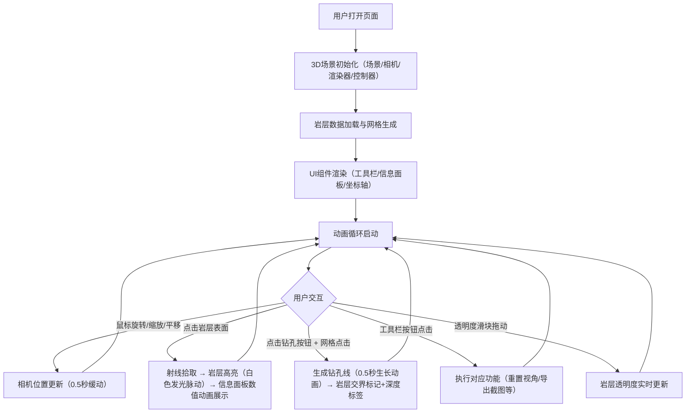

## 1. 产品概述

地质勘探岩层3D可视化工具是一款面向地质勘探专业人员的交互式分析应用，解决传统钻孔剖面图无法直观展示三维空间内岩层分布和断层关系的问题。通过Three.js实现的3D场景，用户可自由旋转、缩放、平移视角，查看多层波浪形岩层的空间分布，支持点击查看岩层详情、动态生成钻孔剖面等功能。

### 产品目标
- 提供直观的3D岩层空间展示，替代传统2D剖面图
- 支持交互式探索，提升地质分析效率
- 快速生成可视化钻孔数据，辅助勘探决策

## 2. 核心功能

### 2.1 功能模块

| 模块名称 | 功能描述 |
|----------|----------|
| 3D场景展示 | 20x20x10长方体地块，多层半透明波浪形岩层，辅助网格线 |
| 视角控制 | 鼠标旋转（Y轴，水平-180~180°，垂直-30~60°）、滚轮缩放（5~50单位）、中键平移，0.5秒缓动动画 |
| 岩层交互 | 点击岩层高亮显示（白色发光边缘，2秒周期脉动），右侧信息面板展示岩层参数 |
| 信息面板 | 毛玻璃效果，250px宽，显示名称、深度范围、厚度、密度，数值渐变动画（0.3秒），透明度滑块（0.5~10，步长0.1） |
| 钻孔功能 | 点击工具栏"生成钻孔"按钮后，在网格位置点击生成垂直蓝色细线（直径0.1），0.5秒从下到上生长动画，岩层交界处灰色圆环（直径0.3）+深度标签 |
| 工具栏 | 40px垂直工具栏（深色背景），包含旋转、缩放、钻孔、剖面切换、重置视角、导出截图图标，悬停淡蓝色过渡（0.2秒），点击圆形光晕动效（0.3秒） |
| 坐标轴指示器 | 右下角30x30px半透明小方块，显示当前视角朝向 |
| 响应式布局 | 视口<768px时工具栏变为底部横向栏，信息面板变为下方抽屉式 |

### 2.2 页面详情

| 页面名称 | 模块名称 | 功能描述 |
|----------|----------|----------|
| 主页面 | 3D场景区 | 占据90%宽度，展示岩层地块、网格线、钻孔、坐标轴指示器 |
| 主页面 | 左侧工具栏 | 40px宽垂直栏，6个功能图标按钮 |
| 主页面 | 右侧信息面板 | 250px宽毛玻璃面板，岩层详情展示与透明度调节 |

## 3. 核心流程

## 4. 用户界面设计

### 4.1 设计风格
- **整体风格**：深色科技风，专业地质勘探工具
- **背景**：#1a1a2e → #16213e 线性渐变
- **主色调**：深灰底色 #2d2d44，青色描边/文字 #00d2ff
- **岩层颜色**：暖黄（砂岩）、灰绿（页岩）、浅蓝（石灰岩）
- **按钮效果**：悬停淡蓝色过渡（0.2秒），点击圆形光晕扩散（0.3秒）

### 4.2 字体与图标
- 字体：科技感无衬线字体
- 图标：简约线性风格，悬停变为淡蓝色

### 4.3 动效设计
- 相机视角切换：0.5秒缓动（ease-out）
- 岩层高亮边缘：白色发光，2秒周期正弦脉动
- 信息面板数值：从0到实际值，0.3秒渐变动画
- 钻孔生成：从下到上生长动画，0.5秒
- 工具栏图标：悬停0.2秒颜色过渡，点击0.3秒白色光晕扩散

### 4.4 页面布局
- 主场景：页面90%宽度，居中展示
- 左侧工具栏：40px宽垂直固定栏
- 右侧信息面板：250px宽，毛玻璃（backdrop-filter: blur）
- 右下角坐标轴指示器：30x30px半透明方块

### 4.5 响应式设计
- 桌面端（≥768px）：左侧垂直工具栏 + 右侧信息面板
- 移动端（<768px）：底部横向工具栏 + 下方抽屉式信息面板

### 4.6 3D场景指导
- **光照**：环境光（强度0.6）+ 方向光（强度0.8，斜上方45°）+ 点光源辅助
- **相机**：PerspectiveCamera，初始距离约15单位，看向场景中心
- **控制器**：OrbitControls，限制旋转角度、缩放范围，启用阻尼
- **岩层网格**：PlaneGeometry细分后顶点Z值按正弦函数偏移（幅度0.3），拉伸为体积块
- **后期效果**：Bloom发光效果用于岩层高亮边缘

## 5. 性能要求
- 场景加载时间 ≤ 3秒
- 帧率稳定 ≥ 30 FPS
- 钻孔生成动画时长 ≤ 1秒
