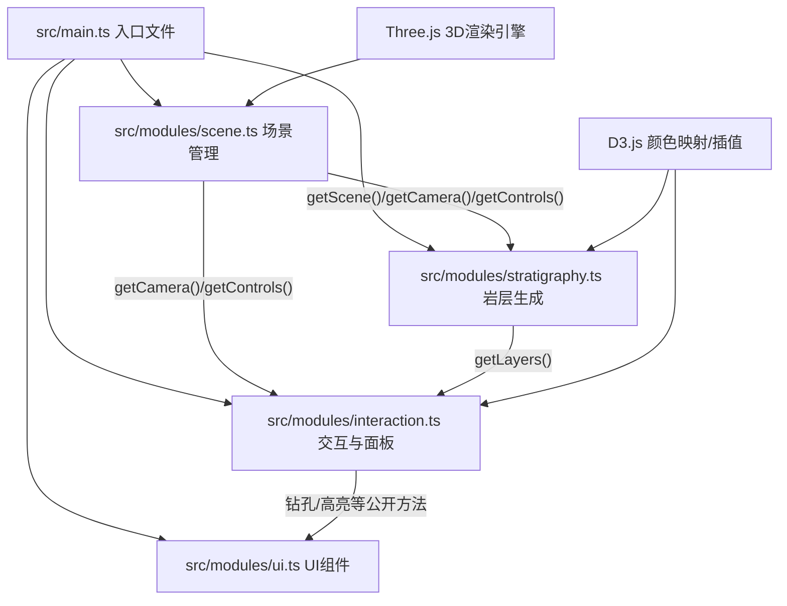

## 1. 架构设计



## 2. 技术栈说明

| 类别 | 技术选型 | 版本说明 | 用途 |
|------|----------|----------|------|
| 前端框架 | TypeScript | 最新稳定版 | 类型安全的开发语言 |
| 构建工具 | Vite | 最新稳定版 | 快速开发构建，支持路径别名 |
| 3D渲染 | Three.js + @types/three | 最新稳定版 | 3D场景、相机、渲染器、控制器、几何体、材质 |
| 数据可视化 | D3.js + @types/d3 | 最新稳定版 | 颜色映射、数值插值、缓动函数 |

### 初始化方式
- 使用 Vite 原生 TypeScript 模板初始化项目
- 路径别名：`@` → `src/`

## 3. 文件结构

```
auto96/
├── package.json
├── vite.config.js
├── tsconfig.json
├── index.html
└── src/
    ├── main.ts                    # 入口文件
    └── modules/
        ├── scene.ts               # 场景管理模块
        ├── stratigraphy.ts        # 岩层生成模块
        ├── interaction.ts         # 交互与信息面板模块
        └── ui.ts                  # UI模块
```

## 4. 模块设计

### 4.1 scene.ts — 场景管理模块

**职责**：负责Three.js核心对象的初始化与配置

**公开方法**：
- `initScene(container: HTMLElement): void` — 初始化场景、相机、渲染器、控制器、网格辅助线
- `getScene(): THREE.Scene` — 获取场景对象
- `getCamera(): THREE.PerspectiveCamera` — 获取相机对象
- `getControls(): OrbitControls` — 获取轨道控制器
- `render(): void` — 执行单次渲染
- `animate(callback: (delta: number) => void): void` — 启动动画循环

**内部实现要点**：
- PerspectiveCamera: fov=60, aspect=container比例, near=0.1, far=1000
- OrbitControls: enableDamping=true, dampingFactor=0.08, 限制minDistance=5, maxDistance=50, minPolarAngle=π/6 (30°), maxPolarAngle=2π/3 (120°即从顶向下60°范围)
- GridHelper: 20x20单位，每1单位一条线，颜色0x888888
- BoxHelper: 包裹地块显示边界
- 光照：AmbientLight(0xffffff, 0.6) + DirectionalLight(0xffffff, 0.8, position(10, 20, 10))

### 4.2 stratigraphy.ts — 岩层生成模块

**职责**：生成多层波浪形岩层网格并管理

**岩层预设数据**：
```typescript
interface LayerData {
  id: string;
  name: string;        // 名称：砂岩、页岩、石灰岩
  color: string;       // 颜色：暖黄、灰绿、浅蓝
  depthTop: number;    // 顶部深度
  depthBottom: number; // 底部深度
  thickness: number;   // 厚度
  density: number;     // 密度 g/cm³
  baseY: number;       // 基础Y位置
  opacity: number;     // 当前透明度
}
```

**公开方法**：
- `generateLayers(scene: THREE.Scene): LayerData[]` — 生成所有岩层网格并添加到场景
- `updateLayerOpacity(layerId: string, opacity: number): void` — 更新指定岩层透明度
- `getLayers(): Map<string, { data: LayerData, mesh: THREE.Mesh }>` — 获取岩层映射

**内部实现要点**：
- 使用PlaneGeometry(20, 20, 64, 64)，细分度高以产生平滑波浪
- 顶点Z值按正弦函数偏移：`z = sin(x * frequency) * cos(z * frequency) * amplitude`，amplitude=0.3
- 每个岩层通过上下两个波浪面+侧面围成封闭体积，或使用带厚度的拉伸方案
- 材质：MeshPhysicalMaterial，transparent=true，side=THREE.DoubleSide，color对应岩层颜色
- 颜色使用D3色阶辅助生成

### 4.3 interaction.ts — 交互与信息面板模块

**职责**：处理鼠标拾取、岩层高亮、信息面板展示、钻孔生成

**公开方法**：
- `initInteraction(camera: THREE.Camera, scene: THREE.Scene, controls: OrbitControls, layers: Map<...>): void` — 初始化交互
- `createBorehole(x: number, z: number): void` — 在指定位置创建钻孔
- `resetView(): void` — 重置相机视角
- `exportScreenshot(renderer: THREE.WebGLRenderer): void` — 导出场景截图
- `enableBoreholeMode(enabled: boolean): void` — 启用/禁用钻孔模式

**内部实现要点**：
- THREE.Raycaster 进行鼠标拾取
- 高亮：使用EdgesGeometry + LineBasicMaterial + 自定义Shader或Bloom效果实现发光边缘，强度随时间sin(t * π)脉动
- 信息面板：DOM元素，position:absolute，right:0，top:0，宽250px，backdrop-filter: blur(10px)，rgba(45,45,68,0.8)背景
- 数值动画：使用D3.interpolate + requestAnimationFrame实现0.3秒从0渐变到目标值
- 钻孔：CylinderGeometry(radius=0.05, height从0动画到10)，端点白色SphereGeometry(radius=0.15)，交界处TorusGeometry(radius=0.3, tube=0.03)，标签使用CSS2DRenderer

### 4.4 ui.ts — UI模块

**职责**：创建工具栏按钮和坐标轴指示器，绑定事件

**公开方法**：
- `initUI(interactionApi: {...}): void` — 初始化所有UI组件

**内部实现要点**：
- 工具栏：position:fixed, left:0, top:0, bottom:0, width:40px, background:#2d2d44
- 按钮图标：使用SVG内联或Unicode字符
- 悬停效果：transition: color 0.2s ease，color变为#00d2ff
- 点击效果：伪元素::after实现圆形光晕，transform: scale(0→1.5)，opacity: 1→0，transition: all 0.3s ease
- 坐标轴指示器：30x30px Canvas或小型Three.js场景，同步主相机朝向

### 4.5 main.ts — 入口文件

**职责**：串联所有模块，启动应用

**流程**：
1. DOM加载完成后获取容器元素
2. 调用scene.initScene()初始化3D场景
3. 调用stratigraphy.generateLayers()生成岩层
4. 调用interaction.initInteraction()初始化交互
5. 调用ui.initUI()初始化UI
6. 启动scene.animate()动画循环，在回调中更新控制器、高亮脉动、钻孔动画等

## 5. 性能优化策略

- 岩层几何体使用BufferGeometry，减少Draw Call
- 钻孔标签使用CSS2DRenderer，避免频繁创建Canvas纹理
- 射线拾取仅在鼠标点击时触发，不每帧执行
- 使用OrbitControls的enableDamping实现平滑视角变化
- 透明度变化仅修改material.opacity，不重建几何体
- 限制同时存在的钻孔数量（可按需清除）
