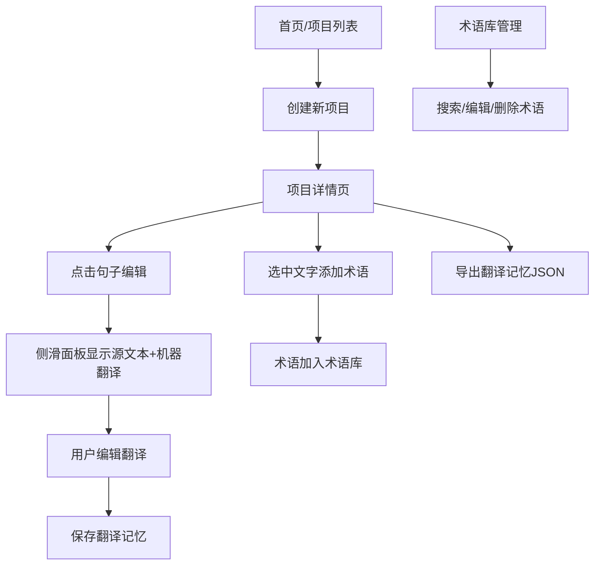

## 1. 产品概述
多语言翻译记忆与术语管理平台，帮助翻译工作者高效管理翻译项目、积累翻译记忆、维护术语库，提升翻译质量和一致性。
- 核心价值：通过机器翻译建议 + 人工编辑模式，结合翻译记忆复用和术语管理，大幅提升翻译效率
- 目标用户：翻译从业者、本地化工程师、多语言内容创作者

## 2. 核心功能

### 2.1 功能模块
1. **项目列表页**：创建/删除翻译项目，展示所有项目概览
2. **项目详情页**：句子列表、翻译编辑、术语提取、翻译记忆导出
3. **术语库管理页**：术语增删改查、搜索过滤

### 2.2 页面详情
| 页面名称 | 模块名称 | 功能描述 |
|-----------|-------------|---------------------|
| 项目列表页 | 项目创建表单 | 输入项目名称、选择源/目标语言（中/英/日/法/德），提交后跳转详情页 |
| 项目列表页 | 项目卡片列表 | 展示所有项目，支持删除操作 |
| 项目详情页 | 项目信息栏 | 显示项目名称、语言对、导出JSON按钮 |
| 项目详情页 | 句子卡片列表 | 10条示例句子，左侧源文本，右侧翻译状态按钮 |
| 项目详情页 | 侧滑翻译面板 | 毛玻璃效果，显示源文本、机器翻译建议、编辑框、保存按钮 |
| 项目详情页 | 术语提取浮窗 | 选中文本后出现，输入术语和释义，保存到术语库 |
| 术语库管理页 | 术语表格 | 展示术语、释义、语言、创建时间，支持编辑/删除 |
| 术语库管理页 | 搜索框 | 实时模糊匹配（防抖0.5s），匹配结果高亮 |

## 3. 核心流程
用户创建项目 → 进入项目详情 → 查看机器翻译建议 → 编辑并保存翻译 → 选中文本添加术语 → 在术语库管理术语 → 导出翻译记忆

## 4. 用户界面设计

### 4.1 设计风格
- **主题**：深色科技感
- **主色**：#1a1a2e（背景）、#16213e（卡片）
- **辅色**：#e94560（强调）、#0f3460（次级强调）
- **成功色**：#4CAF50（翻译建议文本）
- **高亮色**：黄色背景（术语高亮）
- **按钮/卡片**：圆角8px，hover时translateY(-2px) + 阴影
- **字体**：系统无衬线字体
- **动画**：0.2s-0.3s过渡，cubic-bezier缓动

### 4.2 页面设计概览
| 页面名称 | 模块名称 | UI元素 |
|-----------|-------------|-------------|
| 项目列表页 | 创建表单 | 深色输入框、下拉选择器、红色强调按钮 |
| 项目列表页 | 项目卡片 | 横向卡片、项目标题、语言标签、删除图标 |
| 项目详情页 | 句子列表 | 横向卡片布局、源文本、状态按钮 |
| 项目详情页 | 侧滑面板 | 毛玻璃blur(12px)、宽400px、从右滑入动画 |
| 项目详情页 | 翻译编辑区 | 源文本区、浅灰建议框、textarea编辑框、保存按钮 |
| 项目详情页 | 术语浮窗 | 跟随选中文本、输入表单 |
| 术语库管理页 | 搜索+表格 | 顶部搜索框、数据表格、hover变色行 |

### 4.3 响应式设计
- 桌面优先，断点768px
- 移动端：侧滑面板变全屏覆盖，卡片布局改为垂直排列
