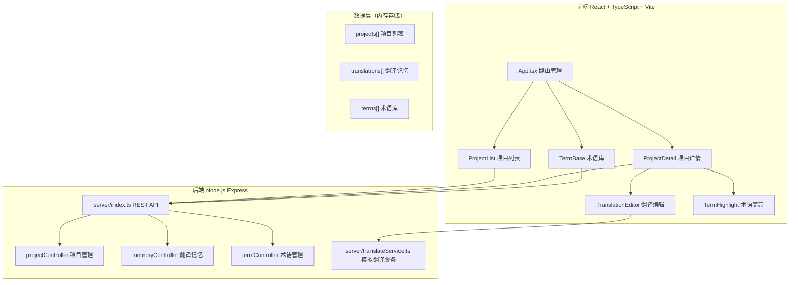

## 1. 架构设计



## 2. 技术描述
- **前端**：React 18 + TypeScript + Vite + React Router
- **后端**：Node.js Express 4 + TypeScript
- **数据存储**：内存存储（无需数据库）
- **图标库**：lucide-react
- **状态管理**：React useState/useEffect（轻量场景）
- **构建工具**：Vite（同时服务前端和通过插件启动Express）

## 3. 路由定义
| 路由 | 用途 |
|-------|---------|
| / | 项目列表页（首页） |
| /project/:id | 项目详情页 |
| /terms | 术语库管理页 |

## 4. API 定义

### 数据类型
```typescript
type Language = 'zh' | 'en' | 'ja' | 'fr' | 'de';

interface Project {
  id: string;
  name: string;
  sourceLang: Language;
  targetLang: Language;
  createdAt: number;
}

interface TranslationMemory {
  id: string;
  projectId: string;
  sourceText: string;
  translatedText: string;
  createdAt: number;
}

interface Term {
  id: string;
  term: string;
  definition: string;
  language: Language;
  createdAt: number;
}
```

### 接口列表
| Method | Path | 描述 |
|--------|------|------|
| GET | /api/projects | 获取所有项目 |
| POST | /api/projects | 创建新项目 |
| DELETE | /api/projects/:id | 删除项目 |
| GET | /api/projects/:id/translations | 获取项目翻译记忆 |
| POST | /api/projects/:id/translations | 保存翻译记忆 |
| GET | /api/terms | 获取所有术语 |
| POST | /api/terms | 新增术语 |
| PUT | /api/terms/:id | 更新术语 |
| DELETE | /api/terms/:id | 删除术语 |
| GET | /api/translate | 获取机器翻译建议（模拟） |

## 5. 目录结构
```
.
├── package.json
├── vite.config.js
├── tsconfig.json
├── index.html
├── server/
│   ├── index.ts          # Express服务入口
│   └── translateService.ts # 模拟翻译服务
└── src/
    ├── App.tsx           # 主组件+路由
    ├── pages/
    │   ├── ProjectList.tsx
    │   ├── ProjectDetail.tsx
    │   └── TermBase.tsx
    └── components/
        ├── TranslationEditor.tsx
        └── TermHighlight.tsx
```
