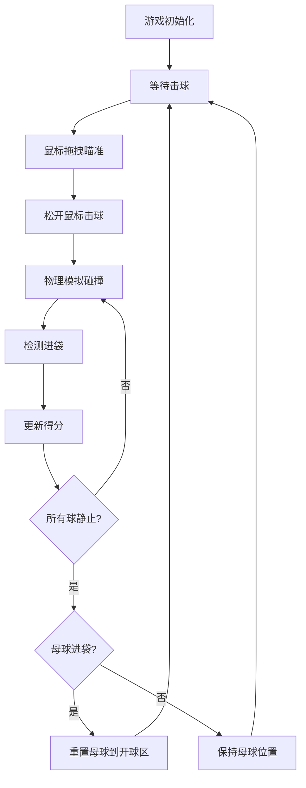

## 1. 产品概述

2D台球游戏是一款基于浏览器的物理碰撞模拟游戏，通过Canvas实现真实的台球物理碰撞、反弹和进袋效果，并搭配绚丽的粒子特效增强视觉体验。

- 核心目标：在浏览器中模拟真实台球桌的物理行为，提供沉浸式的击球体验
- 目标用户：休闲游戏爱好者、物理模拟爱好者
- 产品价值：无需安装即可体验真实物理碰撞的台球游戏，视觉效果精美

## 2. 核心功能

### 2.1 功能模块

1. **游戏主场景**：台球桌渲染、16个彩色球、木质边框
2. **击球系统**：鼠标拖拽母球瞄准、力量指示、击球发射
3. **物理引擎**：球与球碰撞、球与边界反弹、动量守恒、弹性碰撞
4. **粒子特效系统**：碰撞火花、边界光晕、进袋漩涡
5. **得分与计分**：得分面板、击球次数统计、进袋记录
6. **游戏状态管理**：开球排列、进袋检测、母球重置、下一杆

### 2.2 功能详情

| 模块名称 | 功能描述 |
|---------|----------|
| 桌面渲染 | 深绿色绒布纹理背景、棕色木质边框带高光线、6个球袋 |
| 球体渲染 | 16个彩色球（1白+15彩）、径向渐变高光、直径12像素 |
| 开球排列 | 正三角形排列、母球位于开球区 |
| 瞄准系统 | 虚线瞄准线、半透明白色、间距5像素 |
| 力量指示 | 黄到红渐变力量条、最大值200像素、随拖拽距离增大 |
| 球碰撞 | 弹性碰撞、动量守恒、碰撞粒子特效 |
| 边界碰撞 | 反弹、压扁形变、边界光晕 |
| 进袋检测 | 6个袋口检测、球缩小消失动画、漩涡粒子 |
| 得分面板 | 右侧半透明面板、实心球1分/条纹球2分/黑球5分 |
| 击球计数 | 左上角显示击球次数 |
| 状态切换 | 球停止后进入下一杆、母球进袋重置到中央 |

## 3. 核心流程

用户通过鼠标拖拽白色母球进行瞄准，松开后母球沿瞄准线方向以对应速度运动。球与球、球与边界发生碰撞并产生粒子特效。球进袋后记录得分并从桌面移除。所有球停止后自动进入下一杆状态，若母球进袋则重置到开球区。

## 4. 用户界面设计

### 4.1 设计风格

- **主色调**：深绿色（#0B5D1E）台球桌 + 深棕色（#3E2723）木质边框
- **强调色**：黄色→红色渐变力量条、彩色粒子特效
- **字体**：无衬线字体，清晰易读
- **布局**：左侧游戏区域（800x400）+ 右侧得分面板
- **视觉风格**：精致拟物化，球体带有高光立体感，木质边框有高光线

### 4.2 界面元素

| 元素 | 位置 | 样式 |
|------|------|------|
| 台球桌 | 左侧主体 | 深绿色绒布、棕色木质边框、6个袋口 |
| 得分面板 | 右侧 | 半透明深色背景、圆角8px、条目滑入动画 |
| 击球计数 | 左上角 | 白色文字、简洁清晰 |
| 瞄准线 | 母球到鼠标 | 半透明白色虚线、间距5px |
| 力量条 | 母球后方 | 黄到红渐变、长度随拖拽变化 |

### 4.3 动画效果

- 碰撞粒子：20-30个彩色粒子，随机扩散，0.5秒淡出
- 碰撞闪光：白色圆形闪光，半径15px，0.1秒消失
- 边界碰撞：球体压扁形变0.05秒，边界光晕0.2秒
- 进袋漩涡：60个彩色粒子旋转收缩，1秒消失
- 球进袋：缩放消失动画0.3秒
- 得分条目：从右侧滑入，持续0.2秒

### 4.4 性能要求

- 帧率：60FPS
- 同时模拟：16个球物理碰撞
- 粒子上限：500个（对象池管理）
