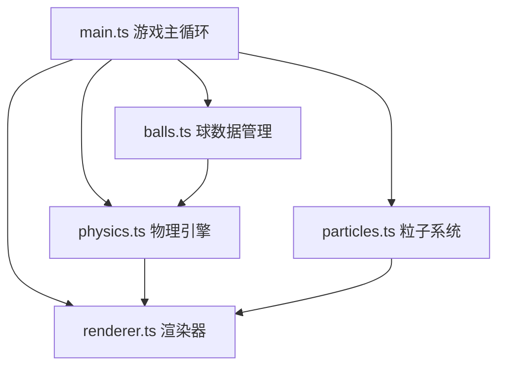

## 1. 架构设计



项目采用模块化架构，按职责划分为5个核心模块：
- **main.ts**：游戏入口，管理游戏状态和主循环
- **physics.ts**：物理引擎，处理碰撞检测与响应
- **particles.ts**：粒子系统，对象池管理
- **balls.ts**：球的数据与状态管理
- **renderer.ts**：Canvas渲染，绘制所有视觉元素

## 2. 技术描述

- **语言**：TypeScript（严格模式）
- **构建工具**：Vite
- **渲染方式**：原生Canvas 2D
- **物理引擎**：手动实现（弹性碰撞 + 动量守恒）
- **粒子系统**：对象池模式管理
- **无外部框架**：纯原生实现，轻量高效

## 3. 项目结构

```
auto99/
├── package.json          # 项目配置与依赖
├── vite.config.js        # Vite构建配置
├── tsconfig.json         # TypeScript配置（严格模式）
├── index.html            # 入口页面
└── src/
    ├── main.ts           # 游戏初始化与主循环
    ├── physics.ts        # 物理引擎（碰撞检测与响应）
    ├── particles.ts      # 粒子系统（对象池）
    ├── balls.ts          # 球数据管理
    └── renderer.ts       # Canvas渲染器
```

## 4. 核心数据结构

### 4.1 球 (Ball)
```typescript
interface Ball {
  id: number;
  x: number;
  y: number;
  vx: number;
  vy: number;
  radius: number;
  color: string;
  type: 'solid' | 'stripe' | 'black' | 'cue';
  pocketed: boolean;
  scale: number;
  squash: number;
}
```

### 4.2 粒子 (Particle)
```typescript
interface Particle {
  x: number;
  y: number;
  vx: number;
  vy: number;
  radius: number;
  color: string;
  alpha: number;
  life: number;
  maxLife: number;
  active: boolean;
}
```

### 4.3 游戏状态 (GameState)
```typescript
interface GameState {
  balls: Ball[];
  particles: ParticlePool;
  score: ScoreEntry[];
  shotCount: number;
  isAiming: boolean;
  aimStart: { x: number; y: number };
  aimEnd: { x: number; y: number };
  allStopped: boolean;
}
```

## 5. 物理引擎设计

### 5.1 碰撞检测
- 球与球：圆形碰撞检测（距离平方比较）
- 球与边界：矩形边界检测
- 球与袋口：圆形区域检测

### 5.2 碰撞响应
- 弹性碰撞公式：基于动量守恒和能量守恒
- 法向量与切向量分解速度
- 摩擦力：每帧速度衰减系数（模拟桌面摩擦）

### 5.3 边界反弹
- 法向速度反向
- 能量损失系数（弹性系数）
- 压扁形变动画

## 6. 粒子系统设计

### 6.1 对象池模式
- 预分配500个粒子对象
- emit时从池中获取可用粒子
- 生命周期结束后回收复用

### 6.2 粒子类型
- 碰撞粒子：20-30个，彩色，扩散运动
- 闪光粒子：1个，白色，快速放大淡出
- 边界光晕：线段型，白色，淡出
- 进袋漩涡：60个，旋转收缩运动

## 7. 性能优化

- **空间划分**：碰撞检测使用网格空间划分减少计算量
- **对象池**：粒子对象复用，避免频繁GC
- **requestAnimationFrame**：与显示器刷新同步
- **速度阈值**：速度小于阈值时视为静止，停止物理计算
