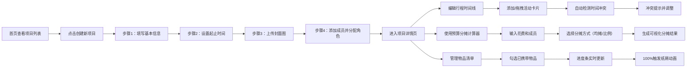

## 1. 产品概述

多人旅行计划管理应用，解决团队出行时行程安排混乱、预算分摊不清、物品携带遗漏的核心痛点。面向结伴出行的朋友、家庭、同事等群体，提供一站式旅行协作管理平台。

通过可视化的行程时间线、智能预算分摊工具、协作式物品清单，让团队旅行规划变得高效有序，提升出行体验。

## 2. 核心功能

### 2.1 用户角色

| 角色 | 注册方式 | 核心权限 |
|------|----------|----------|
| 领队 | 本地创建 | 创建项目、编辑行程、管理成员、分配角色 |
| 财务 | 本地创建 | 管理预算分摊、记录花费 |
| 普通成员 | 本地创建 | 查看行程、勾选物品、参与分摊 |

### 2.2 功能模块

1. **首页/项目列表**：卡片式网格展示所有旅行项目，支持创建新项目
2. **创建项目向导**：步骤引导动画，填写目的地、时间、封面，添加成员
3. **行程时间线**：按天添加活动，拖拽排序，时间冲突检测，预算汇总
4. **预算分摊计算器**：均摊/按比例分摊，饼图可视化展示
5. **物品清单**：分类物品列表，进度跟踪，自定义物品添加

### 2.3 页面详情

| 页面名称 | 模块名称 | 功能描述 |
|----------|----------|----------|
| 首页 | 项目卡片网格 | 展示所有旅行项目，hover浮起效果，点击进入详情 |
| 首页 | 创建项目按钮 | 悬浮按钮，点击进入创建向导 |
| 创建向导 | 步骤引导 | 卡片逐页翻转过渡动画，4步完成项目创建 |
| 创建向导 | 成员管理 | 添加成员姓名、头像、分配角色 |
| 行程时间线 | 瀑布流布局 | 按天展示活动，左侧时间线竖线+圆点标记 |
| 行程时间线 | 活动卡片 | 可拖拽排序，时间冲突时红色边框+抖动提示 |
| 行程时间线 | 预算汇总 | 每天自动计算小计，顶部显示总预算 |
| 预算分摊 | 分摊计算器 | 输入总花费，选择参与成员，自动计算分摊 |
| 预算分摊 | 可视化图表 | 渐变饼图，悬停放大，平滑重绘动画 |
| 预算分摊 | 分摊列表 | 明细展示每人应付金额 |
| 物品清单 | 分类列表 | 证件、衣物、药品等分类，可勾选已携带 |
| 物品清单 | 进度跟踪 | 进度条展示完成度，100%触发彩色纸屑动画 |
| 物品清单 | 自定义物品 | 添加个人物品，支持删除 |

## 3. 核心流程

## 4. 用户界面设计

### 4.1 设计风格

- **主色调**：柔和青蓝色渐变（#4ECDC4 → #45B7D1）搭配暖橙色点缀（#FF9F43）
- **背景**：淡青蓝到浅粉紫的径向渐变，营造旅行轻松氛围
- **按钮风格**：圆角胶囊形，青蓝渐变背景，点击回弹效果（scale 0.95 → 1）
- **字体**：标题使用圆润活泼的 "Quicksand"，正文使用清晰易读的 "Nunito"
- **布局风格**：卡片式设计，柔和阴影，留白充足
- **图标风格**：线性简约图标，搭配emoji增加趣味性

### 4.2 页面设计概述

| 页面名称 | 模块名称 | UI元素 |
|----------|----------|--------|
| 首页 | 项目卡片网格 | 3列网格布局，卡片圆角16px，阴影0 4px 20px rgba(78,205,196,0.15)，hover时translateY(-6px)阴影加深 |
| 首页 | 顶部导航 | 青蓝色背景，左侧logo，右侧用户信息，移动端收缩为汉堡菜单 |
| 创建向导 | 步骤卡片 | 卡片翻转过渡动画（rotateY 180deg），背面显示下一步内容 |
| 行程时间线 | 瀑布流区块 | 每天一个圆角卡片，左侧3px竖线，圆点标记时间点，卡片间距24px |
| 预算分摊 | 饼图区域 | Canvas绘制渐变扇区，hover时扇区向外偏移，显示数值tooltip |
| 预算分摊 | 分摊列表 | 每行包含成员头像、姓名、应付金额，背景斑马条纹 |
| 物品清单 | 分类区块 | 折叠面板，点击展开物品列表，进度条位于分类标题右侧 |
| 物品清单 | 物品项 | 左侧复选框（圆形，勾选时青蓝色填充），右侧物品名称 |
| 表单输入 | 输入框 | 底部边框动画，焦点时渐变从左到右流动（#4ECDC4 → #FF9F43） |

### 4.3 响应式设计

- **桌面端**（≥1200px）：3列项目卡片网格，时间线双列瀑布流
- **平板端**（768px-1199px）：2列项目卡片网格，时间线单列布局
- **移动端**（<768px）：1列布局，顶部导航收缩为汉堡菜单，点击从左侧滑入（transform: translateX(-100%) → 0，过渡300ms ease），按钮和输入框尺寸增大适配触控

### 4.4 动效规范

- **页面加载**：元素从下往上渐入，stagger延迟50ms
- **卡片hover**：translateY(-6px)，box-shadow加深，过渡200ms cubic-bezier(0.4, 0, 0.2, 1)
- **按钮点击**：scale(0.95) → scale(1)，过渡150ms ease
- **冲突提示**：border变红，shake抖动动画（translateX ±5px，3次循环）
- **纸屑动画**：100个彩色纸屑从顶部飘落，旋转下落，持续3秒
- **图表重绘**：饼图扇区angle从0过渡到目标值，持续400ms ease-out
