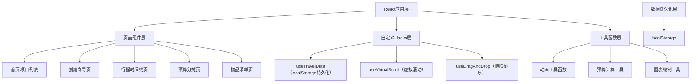
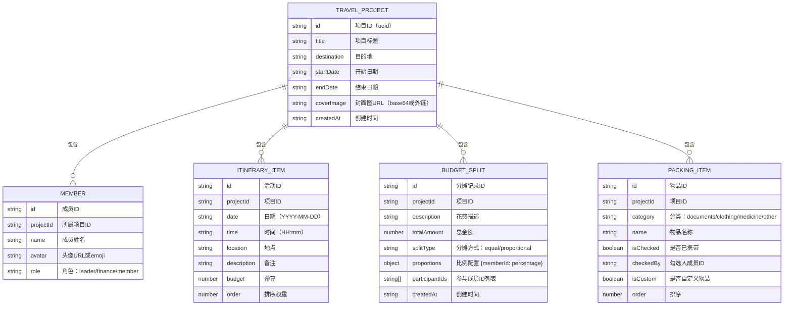

## 1. 架构设计



## 2. 技术描述

- **前端框架**：React 18 + TypeScript 5
- **构建工具**：Vite 5
- **状态管理**：React Context + useReducer（轻量级）
- **样式方案**：CSS Modules + CSS Variables（主题色管理）
- **图表方案**：原生Canvas 2D API（饼图绘制，无第三方库）
- **动画方案**：CSS Animations + Transitions + requestAnimationFrame
- **数据存储**：浏览器localStorage（无后端）
- **唯一ID生成**：uuid v4
- **路由方案**：React Router v6（或条件渲染，根据复杂度选择）

## 3. 路由定义

| 路由 | 页面 | 用途 |
|------|------|------|
| / | 首页 | 展示所有旅行项目卡片，入口页面 |
| /create | 创建向导 | 4步骤创建新旅行项目 |
| /trip/:id/itinerary | 行程时间线 | 编辑和查看行程安排 |
| /trip/:id/budget | 预算分摊 | 计算和展示预算分摊 |
| /trip/:id/packing | 物品清单 | 管理出行物品清单 |
| /trip/:id | 项目详情 | 项目总览和导航入口 |

## 4. 数据模型

### 4.1 数据模型定义



### 4.2 数据结构定义（TypeScript）

```typescript
type MemberRole = 'leader' | 'finance' | 'member';
type SplitType = 'equal' | 'proportional';
type PackingCategory = 'documents' | 'clothing' | 'medicine' | 'electronics' | 'toiletries' | 'other';

interface TravelProject {
  id: string;
  title: string;
  destination: string;
  startDate: string;
  endDate: string;
  coverImage: string;
  createdAt: string;
}

interface Member {
  id: string;
  projectId: string;
  name: string;
  avatar: string;
  role: MemberRole;
}

interface ItineraryItem {
  id: string;
  projectId: string;
  date: string;
  time: string;
  location: string;
  description: string;
  budget: number;
  order: number;
}

interface BudgetSplit {
  id: string;
  projectId: string;
  description: string;
  totalAmount: number;
  splitType: SplitType;
  proportions: Record<string, number>;
  participantIds: string[];
  createdAt: string;
}

interface PackingItem {
  id: string;
  projectId: string;
  category: PackingCategory;
  name: string;
  isChecked: boolean;
  checkedBy?: string;
  isCustom: boolean;
  order: number;
}

interface TravelData {
  projects: TravelProject[];
  members: Member[];
  itineraryItems: ItineraryItem[];
  budgetSplits: BudgetSplit[];
  packingItems: PackingItem[];
}
```

## 5. 文件结构

```
├── package.json
├── vite.config.js
├── tsconfig.json
├── index.html
└── src/
    ├── main.tsx
    ├── App.tsx
    ├── types/
    │   └── index.ts          # 类型定义
    ├── hooks/
    │   ├── useTravelData.ts  # localStorage数据管理
    │   └── useVirtualScroll.ts # 虚拟滚动
    ├── components/
    │   ├── TravelCard.tsx    # 项目卡片
    │   ├── ItineraryCard.tsx # 行程活动卡片
    │   ├── BudgetPieChart.tsx # 预算饼图
    │   ├── PackingList.tsx   # 物品清单
    │   ├── StepWizard.tsx    # 创建向导
    │   ├── Timeline.tsx      # 时间线组件
    │   └── Navbar.tsx        # 导航栏
    ├── pages/
    │   ├── HomePage.tsx
    │   ├── CreatePage.tsx
    │   ├── ItineraryPage.tsx
    │   ├── BudgetPage.tsx
    │   └── PackingPage.tsx
    ├── utils/
    │   ├── budget.ts         # 预算计算
    │   ├── canvas.ts         # 图表绘制
    │   └── animations.css    # 动画关键帧
    └── styles/
        ├── variables.css     # CSS变量主题
        └── global.css        # 全局样式
```

## 6. 性能优化策略

1. **首屏性能**
   - 路由懒加载（React.lazy + Suspense）
   - 代码分割按页面粒度拆分
   - 图片懒加载（IntersectionObserver）
   - 关键CSS内联

2. **虚拟滚动**
   - 行程活动列表超过50项时启用虚拟滚动
   - 只渲染可视区域内的DOM节点
   - 使用IntersectionObserver检测可见性

3. **动画性能**
   - 使用transform和opacity属性实现动画（GPU加速）
   - 避免在动画中触发layout/paint
   - 使用will-change提示浏览器优化

4. **数据持久化**
   - 防抖保存localStorage（延迟300ms）
   - 增量更新，避免全量序列化
   - 恢复数据时使用requestIdleCallback

## 7. 第三方依赖

| 包名 | 版本 | 用途 |
|------|------|------|
| react | ^18.2.0 | UI框架 |
| react-dom | ^18.2.0 | DOM渲染 |
| react-router-dom | ^6.22.0 | 路由管理 |
| typescript | ^5.4.0 | 类型系统 |
| vite | ^5.2.0 | 构建工具 |
| @vitejs/plugin-react | ^4.2.0 | React插件 |
| uuid | ^9.0.0 | 唯一ID生成 |
| @types/uuid | ^9.0.0 | uuid类型定义 |
