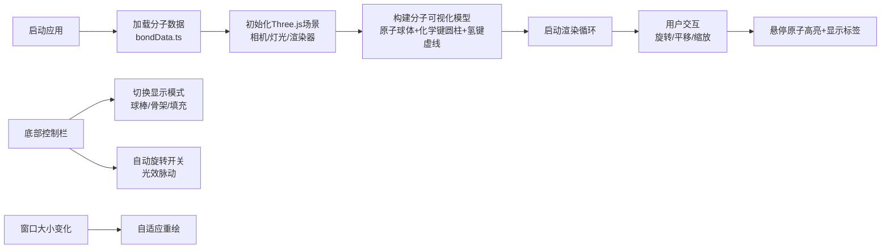

## 1. 产品概述
沉浸式3D分子结构观察工具，为生物实验室研究员提供直观的蛋白质折叠和分子间氢键动态连接探索体验，辅助药物设计讨论与分子结构研究。

- 核心用途：分子结构可视化、蛋白质折叠分析、氢键网络观察、药物分子对接模拟
- 目标用户：生物研究员、药物化学家、分子生物学学生
- 产品价值：将抽象的分子结构转化为可交互的3D可视化模型，降低理解门槛，提升研究效率

## 2. 核心功能

### 2.1 用户角色
| 角色 | 注册方式 | 核心权限 |
|------|----------|----------|
| 研究员 | 无需注册，本地应用 | 完整的3D交互控制、显示模式切换、数据导入导出 |

### 2.2 功能模块
1. **3D场景渲染模块**：分子球棒模型渲染、PBR材质系统、深空背景
2. **交互控制模块**：轨道控制（旋转/平移/缩放）、原子悬停高亮、平滑相机过渡
3. **显示模式模块**：球棒模式、骨架模式、填充模式（范德华半径）
4. **动态效果模块**：自动旋转、环境光脉动、氢键流动光点
5. **信息展示模块**：原子浮动标签、底部控制栏、响应式适配

### 2.3 页面详情
| 页面名称 | 模块名称 | 功能描述 |
|----------|----------|----------|
| 主视图 | 3D场景渲染 | 全屏Canvas渲染分子球棒模型，原子按元素类型着色，直径按原子量缩放，化学键用半透明圆柱连接，氢键用蓝色虚线表示 |
| 主视图 | 交互控制 | 鼠标拖拽旋转、滚轮缩放、右键平移，相机运动带0.6s缓动效果 |
| 主视图 | 悬停交互 | 鼠标悬停原子时高亮（外发光1.2倍，颜色强化），显示浮动标签（元素符号、残基编号、三维坐标） |
| 主视图 | 显示模式切换 | 底部控制栏一键切换：球棒模式/骨架模式/填充模式，0.4s淡入淡出过渡 |
| 主视图 | 自动旋转 | 开启后模型绕Y轴0.5°/帧匀速旋转，环境光0.4-0.6强度3s周期脉动 |
| 主视图 | 响应式适配 | 窗口大小变化时自动重绘场景，保持正确的渲染比例 |

## 3. 核心流程
用户打开应用 → 分子数据自动加载 → 3D场景初始化渲染 → 用户通过鼠标交互探索模型 → 可切换显示模式或开启自动旋转 → 悬停原子查看详细信息

## 4. 用户界面设计

### 4.1 设计风格
- **主色调**：深空蓝黑渐变背景 `#0b0f1a` → `#1a233a`
- **原子配色**：碳(C)灰色 `#a0a0a0`、氧(O)红色 `#ff4444`、氮(N)蓝色 `#4488ff`、氢(H)白色 `#ffffff`
- **氢键**：蓝色虚线 `#66b3ff`
- **控制栏**：毛玻璃效果（背景模糊15px，半透明白色 `rgba(255,255,255,0.12)`）
- **按钮**：圆角胶囊形，悬停时scale 1.05 + 微弱阴影抬升
- **字体**：现代科技感无衬线字体，标签文字清晰易读
- **材质**：原子PBR材质（粗糙度0.3，金属度0.1），半透明磨砂标签背景

### 4.2 页面设计概述
| 页面名称 | 模块名称 | UI元素 |
|----------|----------|--------|
| 主视图 | 3D场景 | 全屏Canvas，深空渐变背景，分子球棒模型居中，PBR材质光泽 |
| 主视图 | 浮动标签 | 跟随原子位置，半透明磨砂背景，显示元素符号、残基编号、坐标，边缘自动内偏 |
| 主视图 | 底部控制栏 | 毛玻璃效果固定底部，胶囊按钮组，平滑悬停动画 |
| 主视图 | 氢键效果 | 蓝色虚线，沿路径流动光点增强可视性 |

### 4.3 响应式
- Desktop-first设计，全屏Canvas自适应
- 窗口resize事件触发相机和渲染器尺寸更新
- 控制栏按钮在小屏幕下自动调整间距
- 标签位置检测屏幕边缘，自动偏移防止溢出

### 4.4 3D场景指导
- **环境**：深空蓝黑渐变背景，无HDRI，营造实验室沉浸感
- **灯光**：环境光（强度0.5，可脉动）+ 两盏方向光（主光+补光）+ 半球光模拟环境反射
- **相机**：PerspectiveCamera，fov 60，近裁剪面0.1，远裁剪面1000，初始位置(0, 0, 15)
- **相机运动**：OrbitControls，enableDamping=true，dampingFactor=0.05，0.6s缓动过渡
- **后期处理**：轻微抗锯齿（FXAA），原子外发光效果（自定义shader实现高亮）
- **性能**：30原子以内≥55fps，单帧渲染耗时≤18ms
