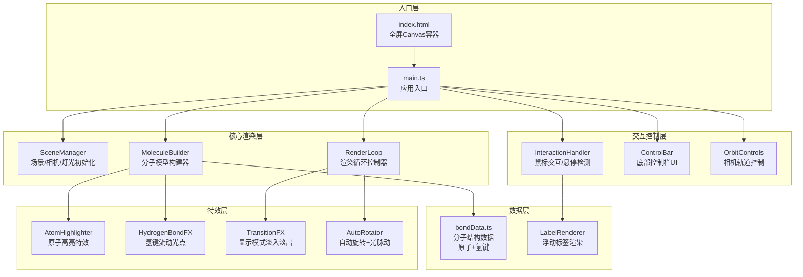

## 1. 架构设计



## 2. 技术描述

* **前端框架**：TypeScript + Three.js + OrbitControls

* **构建工具**：Vite 5.x（启用ES模块，HMR热更新）

* **编程语言**：TypeScript 5.x（严格模式）

* **3D引擎**：Three.js r160+

* **控制库**：three/addons/controls/OrbitControls.js

* **无后端**：纯前端应用，数据内置在bondData.ts中

* **样式**：原生CSS + CSS变量，毛玻璃效果使用backdrop-filter

## 3. 文件结构与调用关系

```
auto11/
├── package.json              # 项目依赖与脚本
├── vite.config.js            # Vite构建配置
├── tsconfig.json             # TypeScript配置
├── index.html                # 入口HTML
└── src/
    ├── main.ts               # 主入口 → 初始化所有模块，启动渲染循环
    ├── data/
    │   └── bondData.ts       # 分子数据 → 导出原子数组和氢键列表
    ├── types/
    │   └── index.ts          # TypeScript类型定义
    ├── core/
    │   ├── SceneManager.ts   # 场景管理 → 创建scene/camera/renderer/lights
    │   ├── MoleculeBuilder.ts # 分子构建 → 创建原子/化学键/氢键网格
    │   └── RenderLoop.ts     # 渲染循环 → requestAnimationFrame，每帧更新
    ├── controls/
    │   ├── InteractionHandler.ts # 交互处理 → 射线检测/悬停高亮/标签
    │   └── ControlBar.ts     # 控制栏UI → 模式切换按钮/自动旋转开关
    ├── effects/
    │   ├── AtomHighlighter.ts # 原子高亮 → 放大发光材质shader
    │   ├── HydrogenBondFX.ts # 氢键特效 → 虚线+流动光点
    │   └── TransitionFX.ts   # 过渡动画 → 显示模式切换淡入淡出
    └── utils/
        └── helpers.ts        # 辅助函数 → 颜色映射/尺寸计算/坐标转换
```

**数据流向：**

1. `bondData.ts` → `MoleculeBuilder.ts`：原子和氢键数据用于构建3D网格
2. `MoleculeBuilder.ts` → `SceneManager.ts`：构建好的模型添加到场景
3. `InteractionHandler.ts` → `LabelRenderer`：射线检测结果触发标签更新
4. `ControlBar.ts` → `MoleculeBuilder.ts`：显示模式切换触发模型重建
5. `RenderLoop.ts` → 所有模块：每帧调用update()方法更新动画状态

## 4. 核心数据模型

### 4.1 数据结构定义

```typescript
// src/types/index.ts
interface Atom {
  id: number;
  element: 'C' | 'O' | 'N' | 'H';
  position: [number, number, number]; // x, y, z
  residueId: number;
  residueName: string;
}

interface HydrogenBond {
  id: number;
  donorAtomId: number;
  acceptorAtomId: number;
  strength: number; // 0-1
}

interface MoleculeData {
  atoms: Atom[];
  hydrogenBonds: HydrogenBond[];
}

type DisplayMode = 'ball-stick' | 'skeleton' | 'filled';
```

### 4.2 常量配置

```typescript
// 元素颜色映射
const ELEMENT_COLORS = {
  C: 0xa0a0a0, // 碳 - 灰色
  O: 0xff4444, // 氧 - 红色
  N: 0x4488ff, // 氮 - 蓝色
  H: 0xffffff, // 氢 - 白色
};

// 原子半径（相对值，按原子量缩放）
const ATOMIC_RADII = {
  C: 0.7,
  O: 0.6,
  N: 0.65,
  H: 0.35,
};

// 范德华半径（填充模式）
const VAN_DER_WAALS_RADII = {
  C: 1.7,
  O: 1.52,
  N: 1.55,
  H: 1.2,
};
```

## 5. 关键技术实现

### 5.1 分子构建

* **原子**：SphereGeometry + MeshStandardMaterial（PBR，roughness: 0.3, metalness: 0.1）

* **化学键**：CylinderGeometry，两端对齐两个原子中心，半透明材质（opacity: 0.8）

* **氢键**：LineDashedGeometry + LineDashedMaterial，蓝色虚线，流动光点使用Points动态更新位置

### 5.2 交互系统

* **射线检测**：THREE.Raycaster，每帧检测鼠标与原子的相交

* **缓动动画**：自定义easeInOutCubic函数，0.6s相机过渡

* **标签系统**：HTML DIV元素，使用project()将3D坐标转换为屏幕坐标，边缘检测自动偏移

### 5.3 显示模式切换

* **球棒模式**：原子球体 + 化学键圆柱 + 氢键虚线

* **骨架模式**：仅显示化学键和氢键，原子隐藏

* **填充模式**：原子放大到范德华半径，透明度0.7，使用AdditiveBlending实现融接效果

* **过渡动画**：material.opacity从1→0→1，配合scale缩放，总时长0.4s

### 5.4 性能优化

* **几何体复用**：同种原子使用同一个SphereGeometry，通过instancedMesh或clone共享

* **材质复用**：相同元素原子共享材质实例

* **合并网格**：化学键使用merged geometry减少draw call

* **射线检测优化**：仅在鼠标移动时检测，而非每帧

* **帧率监控**：内置FPS计数器，30原子场景确保≥55fps

