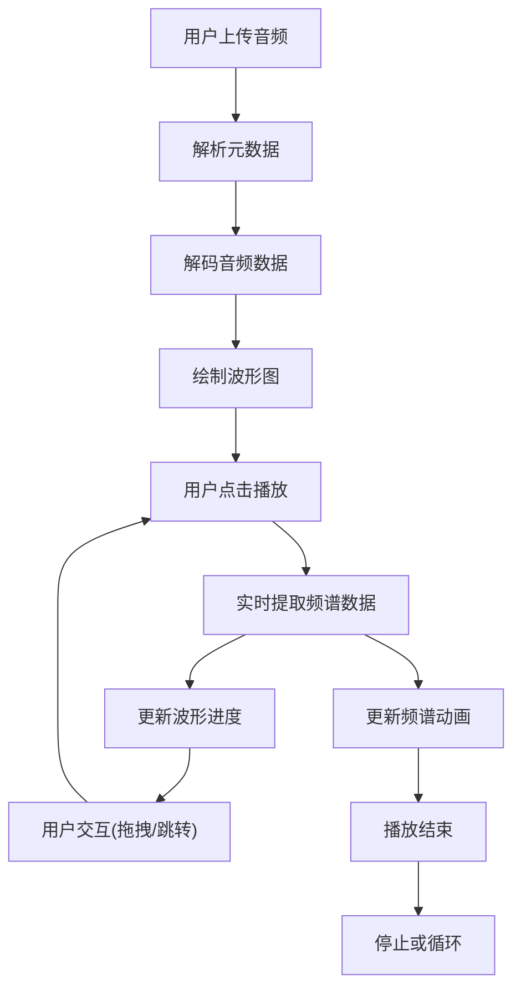

## 1. 产品概述
交互式音乐波形可视化与播放控制应用，让用户上传本地音频文件并实时显示频谱和波形动画。面向音乐爱好者、音频创作者和视觉设计爱好者，提供沉浸式的音乐可视化体验。

产品价值：将抽象的音频数据转化为直观的视觉表现，通过科技感十足的波形和频谱动画，增强用户聆听音乐时的感官体验。

## 2. 核心功能

### 2.1 功能模块
1. **主应用页面**：音频上传区、波形可视化、频谱可视化、播放控制面板、音频信息显示

### 2.2 页面详情
| 页面名称 | 模块名称 | 功能描述 |
|-----------|-------------|---------------------|
| 主页面 | 音频上传 | 支持拖拽上传或点击选择本地音频文件（mp3、wav、ogg），自动解析元数据 |
| 主页面 | 波形可视化 | Canvas绘制完整音频波形，支持拖拽选择播放区域，渐变描边和发光效果 |
| 主页面 | 频谱可视化 | 128条频谱条，条带高度随频率能量变化，蓝青到橙红渐变，弹性回落动画 |
| 主页面 | 播放控制 | 播放/暂停、停止、循环、进度条拖拽、时间tooltip |
| 主页面 | 音频信息 | 当前时间/总时长、采样率、文件大小，数字滚动效果 |

## 3. 核心流程
用户上传音频文件 → 系统解析音频元数据并解码 → 绘制完整波形图 → 用户点击播放 → 实时提取频谱数据 → 同步更新波形进度和频谱动画 → 用户可拖拽选择区域或调整进度 → 播放结束自动停止或循环

## 4. 用户界面设计
### 4.1 设计风格
- 主色调：深色背景#1a1a2e，霓虹蓝紫渐变
- 按钮风格：圆角毛玻璃效果，半透明背景，发光边框
- 字体：使用现代无衬线字体，数字采用等宽字体
- 布局：全屏Canvas容器，底部控制栏浮动，角落信息显示
- 图标：使用线性图标，发光效果

### 4.2 页面设计概述
| 页面名称 | 模块名称 | UI元素 |
|-----------|-------------|-------------|
| 主页面 | 整体布局 | 深色渐变背景、微弱光晕效果、毛玻璃控制面板 |
| 主页面 | 波形图 | 蓝紫渐变描边、发光效果、半透明选区遮罩、时间进度条 |
| 主页面 | 频谱图 | 128条渐变竖条、弹性动画、底部淡出融合 |
| 主页面 | 控制栏 | 播放/暂停图标切换动画、循环高亮、进度条tooltip |
| 主页面 | 信息显示 | 数字滚动动画、等宽数字字体 |

### 4.3 响应性
桌面端优先设计，移动端自适应：
- 移动端控件垂直堆叠
- Canvas宽度自适应屏幕
- 触摸优化拖拽和点击区域
- 控制按钮尺寸增大便于触摸

### 4.4 动效设计
- 所有交互元素悬停时0.3秒亮度提升和平滑缩放
- 频谱条带弹性回落动画（模拟惯性）
- 播放/暂停图标切换动画
- 数字滚动效果
- 页面加载渐入动画
