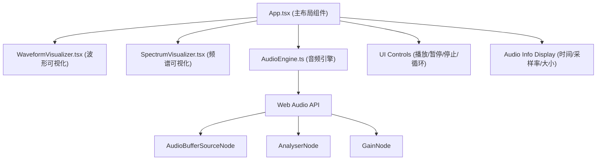

## 1. 架构设计


## 2. 技术描述
- 前端：React@18 + TypeScript@5 + Vite@5
- 构建工具：Vite + @vitejs/plugin-react
- 音频处理：原生Web Audio API（无第三方库）
- 图形渲染：HTML5 Canvas 2D API
- 状态管理：React useState/useRef/useEffect（轻量级场景无需状态管理库）
- 样式：纯CSS + CSS变量（无Tailwind等CSS框架）

## 3. 文件结构
```
├── package.json
├── vite.config.js
├── tsconfig.json
├── index.html
└── src/
    ├── main.ts (应用入口)
    ├── App.tsx (主布局组件)
    ├── AudioEngine.ts (Web Audio API封装)
    ├── WaveformVisualizer.tsx (波形可视化组件)
    └── SpectrumVisualizer.tsx (频谱可视化组件)
```

## 4. 核心模块说明

### 4.1 AudioEngine.ts
- 负责音频文件加载和解码
- 封装播放、暂停、停止、循环控制
- 实时提取频谱数据（ByteFrequencyData）和时域数据（ByteTimeDomainData）
- 通过回调函数将分析数据传递给UI层
- 支持选区播放（设置start/end时间）

### 4.2 WaveformVisualizer.tsx
- Canvas绘制完整音频波形（采样点压缩为垂直柱状）
- 支持鼠标拖拽选择播放区域
- 显示播放进度指示线
- 渐变描边（蓝色→紫色）和发光效果
- 选区高亮显示和起止时间显示

### 4.3 SpectrumVisualizer.tsx
- 128条频谱条，使用requestAnimationFrame动画循环
- 条带颜色渐变（低频蓝青色→高频橙红色）
- 弹性回落动画（使用速度和衰减模拟物理惯性）
- 暂停时保持当前频谱状态

### 4.4 App.tsx
- 管理音频加载状态和播放状态
- 组合所有子组件
- 处理文件上传（拖拽和点击）
- 渲染播放控制按钮和音频信息
- 响应式布局处理

## 5. 性能优化策略
- Canvas绘制使用requestAnimationFrame维持60fps
- 波形数据预处理：离线计算一次，存储压缩后的采样点
- 频谱数据使用TypedArray减少内存开销
- 避免在动画循环中创建新对象
- 使用离屏Canvas预渲染渐变和静态元素
- 拖拽选区时只重绘必要区域

## 6. 类型定义
```typescript
// AudioEngine 类型
interface AudioMetadata {
  duration: number;
  sampleRate: number;
  fileSize: number;
  fileName: string;
}

interface AudioAnalysisData {
  frequencyData: Uint8Array;
  timeDomainData: Uint8Array;
  currentTime: number;
}

interface Selection {
  start: number;
  end: number;
}

// 组件Props类型
interface WaveformVisualizerProps {
  audioBuffer: AudioBuffer | null;
  currentTime: number;
  duration: number;
  selection: Selection | null;
  onSelectionChange: (selection: Selection | null) => void;
  onSeek: (time: number) => void;
}

interface SpectrumVisualizerProps {
  frequencyData: Uint8Array | null;
  isPlaying: boolean;
}
```
