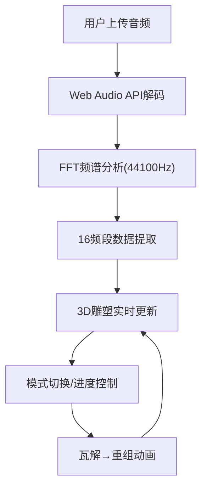

## 1. 产品概述

交互式3D声波雕塑生成器是一款音乐可视化Web应用，用户上传音频文件后，系统实时分析声音频谱特征，在三维空间中生成由彩色几何体构成的动态雕塑，随音乐节奏同步变化。

- 主要用途：音乐可视化、艺术创作展示、沉浸式音频体验
- 目标用户：音乐爱好者、视觉艺术家、设计师
- 产品价值：将抽象的音频特征转化为具象的3D视觉艺术，提供沉浸式音画同步体验

## 2. 核心功能

### 2.1 功能模块

1. **主界面**：3D雕塑展示区、星空粒子背景、顶部进度条、底部控制面板
2. **音频分析引擎**：Web Audio API驱动的FFT频谱分析，16频段实时数据提取
3. **3D雕塑系统**：三种可视化模式（频谱柱、波形流、粒子云），动态几何体生成与动画
4. **交互控制系统**：音频上传、播放/暂停、模式切换、进度拖拽

### 2.2 页面详情

| 页面名称 | 模块名称 | 功能描述 |
|-----------|-------------|---------------------|
| 主界面 | 3D雕塑展示 | 16×8×8立体网格雕塑，随音频实时变化，霓虹发光边缘效果，Y轴缓慢旋转 |
| 主界面 | 星空背景 | 深色太空背景，半透明星空粒子动态漂浮 |
| 主界面 | 进度条 | 顶部播放进度条，支持拖拽跳转，雕塑瞬间重构 |
| 主界面 | 控制面板 | 半毛玻璃效果悬浮面板，上传按钮、播放/暂停、三种模式切换按钮 |

## 3. 核心流程

用户上传音频文件 → 系统使用Web Audio API解码并进行FFT分析 → 实时获取16频段频谱数据 → 根据数据驱动3D几何体的高度、颜色和动画 → 用户可切换可视化模式（立方体瓦解飘散→重组聚合）→ 拖拽进度条跳转到任意时间点，雕塑同步重构。

## 4. 用户界面设计

### 4.1 设计风格

- **主色调**：深紫色(#1a0a2e)、青蓝色(#00d4ff)
- **点缀色**：荧光绿(#00ff88)、橙红色(#ff6b35)
- **背景**：深色太空渐变，半透明星空粒子
- **按钮样式**：圆角矩形，半毛玻璃效果（backdrop-filter: blur(10px)），悬停时光晕扩散
- **字体**：现代无衬线字体，采用 Orbitron 作为显示字体，Inter 作为正文字体
- **布局**：全屏3D画布，顶部进度条，底部悬浮控制面板
- **动效**：弹性缓动动画、瓦解飘散动画、凝聚聚合动画、按压下凹动效

### 4.2 页面设计概述

| 页面名称 | 模块名称 | UI元素 |
|-----------|-------------|-------------|
| 主界面 | 3D雕塑区 | 16×8×8立方体网格，霓虹发光边缘，实时频谱驱动高度/颜色，Y轴30秒/圈旋转 |
| 主界面 | 星空背景 | 深色渐变，动态半透明星空粒子漂浮 |
| 主界面 | 进度条 | 顶部细条，渐变色填充，拖拽手柄 |
| 主界面 | 控制面板 | 半毛玻璃背景，上传按钮、播放/暂停按钮、三个模式切换按钮 |
| 主界面 | 模式切换动画 | 激活态按钮下凹，立方体瓦解飘散(1秒)，碎块凝聚聚合 |

### 4.3 响应式设计

- **大屏(≥1200px)**：完整展示雕塑和控制面板，轨道控制器完整功能
- **中屏(768px-1199px)**：适当缩小雕塑尺寸，控制面板保持底部悬浮
- **小屏(<768px)**：大幅缩小雕塑，控制面板折叠为侧边栏可展开按钮，优化触摸交互

### 4.4 3D场景指引

- **环境**：深色太空背景，星空粒子系统，无HDRI，自发光材质为主
- **光照**：环境光+点光源组合，强调几何体边缘发光效果
- **相机**：PerspectiveCamera，距离雕塑中心适当位置，支持OrbitControls交互
- **构图**：雕塑位于场景中心，占据屏幕60%可视区域
- **动画**：立方体高度弹性缓动(spring easing)，整体Y轴匀速旋转，模式切换时的粒子物理动画
- **后期处理**：Bloom泛光效果增强霓虹发光感
- **性能**：帧率≥50FPS，几何体复用，减少draw call

## 5. 技术约束

- FFT采样率：44100Hz
- 缓冲池大小：≤4096
- 目标帧率：≥50FPS (Chrome 90+)
- 技术栈：TypeScript + Three.js + Web Audio API + Vite
