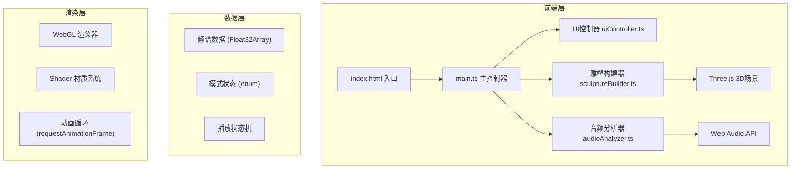

## 1. 架构设计



## 2. 技术描述

- **前端框架**: 原生 TypeScript (无React/Vue)，轻量级高性能
- **构建工具**: Vite 5.x，启用ES模块和TypeScript支持
- **3D引擎**: Three.js r160+，@types/three类型定义
- **音频处理**: Web Audio API (AnalyserNode, AudioContext)
- **FFT配置**: 采样率44100Hz，fftSize=2048，smoothingTimeConstant=0.8
- **缓冲池**: 最大4096，16频段数据提取

## 3. 文件结构

| 文件路径 | 职责说明 |
|----------|----------|
| `/package.json` | 项目依赖与脚本配置 |
| `/vite.config.js` | Vite构建配置 |
| `/tsconfig.json` | TypeScript严格模式配置 |
| `/index.html` | 入口HTML，全屏画布与UI容器 |
| `/src/main.ts` | 场景初始化、渲染循环、模块协调 |
| `/src/audioAnalyzer.ts` | 音频加载解码、FFT分析、频谱数据接口 |
| `/src/sculptureBuilder.ts` | 立方体网格创建、模式切换动画、数据更新 |
| `/src/uiController.ts` | 按钮事件绑定、进度条控制、UI状态反馈 |

## 4. 核心类与接口定义

### 4.1 AudioAnalyzer 类
```typescript
class AudioAnalyzer {
  private audioContext: AudioContext;
  private analyser: AnalyserNode;
  private source: AudioBufferSourceNode | null;
  private audioBuffer: AudioBuffer | null;
  private frequencyData: Float32Array;
  
  async loadAudio(file: File): Promise<void>;
  play(): void;
  pause(): void;
  seek(time: number): void;
  getFrequencyBands(bands: number): number[];
  getCurrentTime(): number;
  getDuration(): number;
  isPlaying(): boolean;
}
```

### 4.2 SculptureBuilder 类
```typescript
enum VisualizationMode {
  SPECTRUM = 'spectrum',
  WAVEFORM = 'waveform',
  PARTICLES = 'particles'
}

class SculptureBuilder {
  private scene: THREE.Scene;
  private cubes: THREE.Mesh[][][]; // 16x8x8
  private particleSystem: THREE.Points;
  private currentMode: VisualizationMode;
  private targetPositions: THREE.Vector3[][][];
  private animationState: 'idle' | 'collapsing' | 'reforming';
  
  init(scene: THREE.Scene): void;
  update(frequencyData: number[], delta: number): void;
  setMode(mode: VisualizationMode): Promise<void>;
  rotate(angle: number): void;
}
```

### 4.3 UIController 类
```typescript
class UIController {
  private audioAnalyzer: AudioAnalyzer;
  private sculptureBuilder: SculptureBuilder;
  
  init(analyzer: AudioAnalyzer, builder: SculptureBuilder): void;
  onUpload(callback: () => void): void;
  onPlayPause(callback: (playing: boolean) => void): void;
  onModeChange(callback: (mode: VisualizationMode) => void): void;
  onSeek(callback: (time: number) => void): void;
  updateProgress(current: number, duration: number): void;
}
```

## 5. 性能优化策略

1. **几何体复用**: 使用InstancedMesh替代大量独立Mesh，减少draw call
2. **材质共享**: 相同视觉属性的立方体共享Material实例
3. **数据缓存**: 频谱数据缓存，避免重复计算
4. **帧率控制**: requestAnimationFrame配合delta time计算
5. **懒更新**: 只有数据变化超过阈值才更新几何体
6. **对象池**: 瓦解/重组动画复用粒子对象

## 6. 动画系统设计

### 6.1 弹性缓动 (Spring Easing)
```typescript
function spring(current: number, target: number, velocity: number, 
                stiffness: number = 180, damping: number = 12): 
                { value: number; velocity: number } {
  const force = -stiffness * (current - target);
  const dampingForce = -damping * velocity;
  const acceleration = force + dampingForce;
  const newVelocity = velocity + acceleration * delta;
  const newValue = current + newVelocity * delta;
  return { value: newValue, velocity: newVelocity };
}
```

### 6.2 瓦解动画
- 持续时间：1000ms
- 每个立方体获得随机初速度和旋转角速度
- 应用重力和空气阻力
- 透明度线性衰减至0

### 6.3 重组动画
- 持续时间：800ms
- 碎块从飘散位置向目标位置加速飞行
- 缓动函数：easeOutCubic
- 透明度从0渐变为1

## 7. 色彩系统

| 频段 | 颜色 | 十六进制 |
|------|------|----------|
| 低频 (0-5) | 红色系 | #ff3b3b → #ff6b35 |
| 中频 (6-11) | 绿色系 | #00ff88 → #00ffcc |
| 高频 (12-15) | 蓝色系 | #00d4ff → #6b6bff |

颜色根据能量值在区间内插值，emissive强度与能量成正比。
