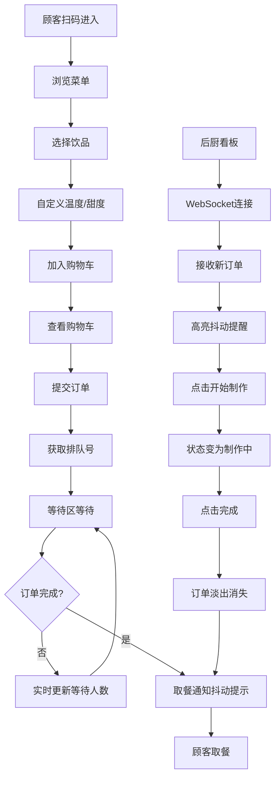

## 1. 产品概述

本产品为独立咖啡馆打造的轻量级在线点单与排队管理系统，通过扫码实现顾客自助浏览菜单、下单并获取排队号，后厨实时接收订单并管理制作状态，旨在减少人工抄单和沟通成本，提升运营效率。

- **目标用户**：咖啡馆顾客（扫码点单）、后厨工作人员（订单管理）、店铺管理员（数据查看）
- **核心价值**：实现无接触点单全流程数字化，降低人工成本，提升顾客体验和后厨效率

---

## 2. 核心功能

### 2.1 用户角色

| 角色 | 注册方式 | 核心权限 |
|------|----------|----------|
| 顾客 | 无需注册，扫码访问 | 浏览菜单、自定义饮品、提交订单、查看排队状态 |
| 后厨 | 系统内置权限 | 查看订单队列、标记订单状态（制作中/完成）、接收实时推送 |
| 管理员 | 系统内置权限 | 查看完整订单历史记录、订单详情查询 |

### 2.2 功能模块

1. **菜单浏览页**：分类展示饮品（冷饮/热饮/特调）、卡片式布局、自定义选项面板
2. **购物车与订单提交**：商品列表管理、数量调整、订单提交、排队号获取
3. **排队等待页**：大号排队号展示、前方等待人数实时更新、取餐通知
4. **后厨看板**：待处理订单列表、状态标记、新订单高亮提醒
5. **管理员时间线**：订单历史滚动展示、状态色标区分、详情弹窗

### 2.3 页面详情

| 页面名称 | 模块名称 | 功能描述 |
|----------|----------|----------|
| 菜单页 | 分类导航 | 冷饮/热饮/特调分类切换，平滑过渡动画 |
| 菜单页 | 饮品卡片 | 展示名称、价格、描述，悬停上浮效果，点击展开自定义选项 |
| 菜单页 | 自定义选项 | 温度选择（热/冰/常温）、甜度选择（全糖/半糖/无糖），平滑展开 |
| 菜单页 | 购物车徽标 | 底部固定图标，显示商品数量，数字跳动动画 |
| 订单页 | 购物车列表 | 显示已选商品，支持数量加减和删除操作 |
| 订单页 | 订单提交 | 调用API提交订单，返回排队号，大号数字弹出动画 |
| 排队页 | 等待展示 | 排队号居中大字号显示，前方等待人数每秒更新，呼吸灯背景 |
| 排队页 | 取餐通知 | 订单完成时显示提示，抖动动画反馈 |
| 后厨看板 | 订单队列 | 垂直列表展示，新订单淡入抖动高亮3秒 |
| 后厨看板 | 状态操作 | "开始制作"、"完成"按钮，状态实时同步 |
| 管理员页 | 时间线 | 滚动历史订单列表，绿色/橙色状态条区分 |
| 管理员页 | 详情弹窗 | 点击订单行查看完整订单信息 |

---

## 3. 核心流程

### 顾客点单流程
顾客扫码进入系统 → 浏览分类菜单 → 选择饮品并自定义温度甜度 → 加入购物车（弹性按钮动画）→ 查看购物车调整数量 → 提交订单 → 获取排队号 → 等待区查看状态 → 收到取餐通知 → 完成取餐

### 后厨操作流程
后厨打开看板页面 → WebSocket连接建立 → 接收新订单推送（高亮抖动）→ 点击"开始制作" → 订单状态变为"制作中" → 制作完成点击"完成" → 订单淡出消失 → 顾客端收到取餐通知

---

## 4. 用户界面设计

### 4.1 设计风格

**色彩系统**：
- 主色调：#D4A373（焦糖色）- 温暖舒适，符合咖啡馆氛围
- 背景色：#FEFAE0（奶油白）- 干净柔和，突出内容
- 强调色1：#CCD5AE（茶绿）- 清新自然，用于状态标识
- 强调色2：#E9EDC9（淡草绿）- 辅助点缀
- 文字色：#2F3E46（深灰）- 高对比度，易读性强
- 按钮渐变：#D4A373 → #B5838D（暖色调渐变）

**字体**：
- 标题：选用圆润有温度的无衬线字体，字号层次分明
- 正文：清晰易读的字体，行高1.6
- 排队号：大号粗体，2rem以上，居中醒目

**交互设计**：
- 卡片圆角12px，柔和阴影0 2px 8px rgba(0,0,0,0.1)，悬停上移4px加深阴影
- 按钮圆角20px，渐变背景，点击时背景色反转
- 可点击元素悬停缩放1.05倍，光标变为pointer
- 加载动画：旋转咖啡杯emoji

### 4.2 页面设计概述

| 页面名称 | 模块名称 | UI元素 |
|----------|----------|--------|
| 菜单页 | 顶部导航 | 固定顶部，品牌logo + 三个标签切换，左右滑动过渡0.3s |
| 菜单页 | 饮品网格 | 平板以上两列，手机单列，卡片式布局 |
| 菜单页 | 选项面板 | 下拉菜单/滑动条，平滑展开动画 |
| 菜单页 | 加入购物车按钮 | 缩小再弹开的弹性动画 |
| 订单页 | 购物车列表 | 每行商品，数量加减按钮，删除按钮 |
| 订单页 | 排队号弹出 | 大号数字，从中心放大弹出 |
| 排队页 | 等待区 | 居中布局，排队号大字号，呼吸灯渐变背景（暖黄↔浅橙循环） |
| 后厨看板 | 订单卡片 | 垂直列表，状态标签（等待中/制作中），新订单滑入动画 |
| 后厨看板 | 完成动画 | 绿色对勾弹出，渐出消失 |
| 管理员页 | 时间线 | 滚动列表，绿色/橙色条标记状态 |

### 4.3 动画效果汇总

| 动画名称 | 触发时机 | 效果描述 |
|----------|----------|----------|
| 卡片上浮 | 悬停饮品卡片 | 上移4px，阴影加深 |
| 按钮弹性 | 点击加入购物车 | 缩小再弹开 |
| 数字跳动 | 购物车数量变化 | 数字放大跳动 |
| 排队号弹出 | 订单提交成功 | 从中心放大弹出 |
| 新订单滑入 | 后厨接收新订单 | 从顶部滑入+淡入+抖动高亮3秒 |
| 完成渐出 | 订单标记完成 | 绿色对勾弹出→渐出消失 |
| 取餐抖动 | 顾客端订单完成 | CSS关键帧模拟震动 |
| 页面切换 | 标签切换 | 左右滑动0.3s ease-out |
| 选项展开 | 点击自定义 | 选项面板平滑展开 |
| 呼吸灯背景 | 等待区 | 暖黄到浅橙循环渐变 |

### 4.4 响应式设计

- **设计原则**：桌面端优先，移动端自适应
- **断点设置**：768px（平板）、480px（手机）
- **菜单布局**：≥768px两列网格，<768px单列
- **触控优化**：移动端按钮最小44px，点击区域足够大
- **字体响应**：使用相对单位rem，根据屏幕尺寸调整基准字号
