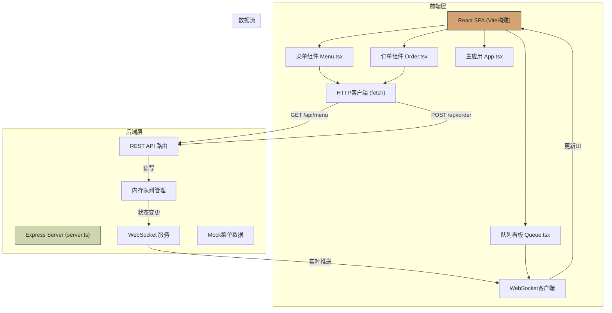
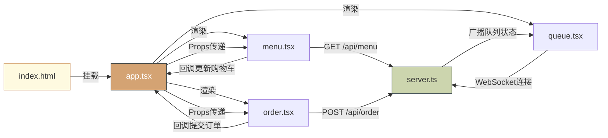
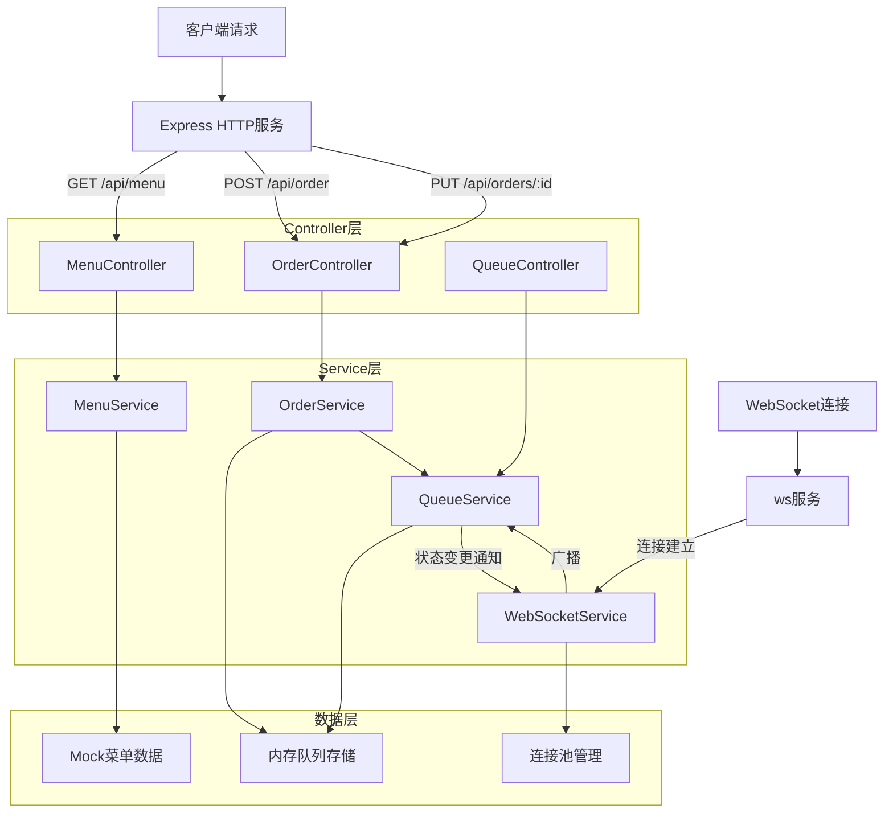

## 1. 架构设计

本系统采用前后端分离的全栈架构，前端使用React + TypeScript构建单页面应用，后端使用Express提供REST API和WebSocket实时通信。数据存储采用内存队列（可扩展为持久化数据库）。



***

## 2. 技术描述

| 层级        | 技术栈         | 版本/说明                            |
| --------- | ----------- | -------------------------------- |
| **前端框架**  | React       | 18.x，函数组件 + Hooks                |
| **语言**    | TypeScript  | 严格模式，ES模块解析                      |
| **构建工具**  | Vite        | 4.x，使用@vitejs/plugin-react       |
| **状态管理**  | React Hooks | useState, useEffect, useCallback |
| **实时通信**  | WebSocket   | ws库，客户端原生WebSocket API           |
| **后端框架**  | Express     | 4.x                              |
| **跨域处理**  | cors        | 中间件                              |
| **ID生成**  | uuid        | v4版本生成唯一标识                       |
| **CSS方案** | 原生CSS       | CSS变量 + 关键帧动画                    |

### 初始化方式

* 使用 `npm create vite@latest` 初始化React + TypeScript项目

* 手动安装后端依赖（express, cors, uuid, ws, @types/node, @types/express, @types/cors, @types/uuid, @types/ws, ts-node, typescript）

* 配置统一启动脚本 `npm run dev` 同时启动前后端（使用concurrently）

***

## 3. 文件结构与调用关系

```
auto14/
├── package.json              # 项目依赖配置
├── vite.config.js            # Vite构建配置，API代理到3001端口
├── tsconfig.json             # TypeScript编译配置（严格模式）
├── index.html                # 入口HTML
├── server.ts                 # Express后端 + WebSocket服务
├── src/
│   ├── app.tsx              # 主应用组件，路由/状态管理
│   ├── menu.tsx             # 菜单组件
│   ├── order.tsx            # 订单/购物车组件
│   ├── queue.tsx            # 队列看板组件
│   └── types.ts             # 类型定义（新增）
└── .trae/documents/
    ├── PRD-咖啡馆无接触点单系统.md
    └── 技术架构-咖啡馆无接触点单系统.md
```

### 调用关系图



***

## 4. 路由定义

### 前端路由（内存路由，基于状态切换）

| 路由标识      | 对应页面   | 说明                                |
| --------- | ------ | --------------------------------- |
| 'menu'    | 菜单浏览页  | 默认页面，展示饮品分类列表                     |
| 'order'   | 订单确认页  | 显示购物车，提交订单                        |
| 'queue'   | 排队看板页  | 展示当前队列状态和用户订单                     |
| 'kitchen' | 后厨看板页  | 后厨管理订单状态（可通过URL参数?view=kitchen访问） |
| 'admin'   | 管理员时间线 | 历史订单记录（可通过URL参数?view=admin访问）     |

### 后端API路由

| 方法        | 路径                     | 用途                                       |
| --------- | ---------------------- | ---------------------------------------- |
| GET       | /api/menu              | 获取菜单列表（按分类分组）                            |
| POST      | /api/order             | 提交新订单，返回排队号                              |
| GET       | /api/orders            | 获取所有订单列表（管理员用）                           |
| PUT       | /api/orders/:id/status | 更新订单状态（pending → processing → completed） |
| GET       | /api/queue             | 获取当前队列状态                                 |
| WebSocket | /ws                    | 实时队列状态推送                                 |

***

## 5. API 类型定义

```typescript
// src/types.ts

// 饮品分类
export type Category = 'cold' | 'hot' | 'special';

// 温度选项
export type Temperature = 'hot' | 'ice' | 'normal';

// 甜度选项
export type Sweetness = 'full' | 'half' | 'none';

// 饮品自定义选项
export interface CustomizationOptions {
  temperature?: Temperature;
  sweetness?: Sweetness;
}

// 菜单项
export interface MenuItem {
  id: string;
  name: string;
  price: number;
  category: Category;
  description: string;
  hasCustomization: boolean;
  image?: string;
}

// 购物车项
export interface CartItem {
  id: string;
  menuItem: MenuItem;
  quantity: number;
  options: CustomizationOptions;
}

// 订单状态
export type OrderStatus = 'pending' | 'processing' | 'completed';

// 订单项
export interface OrderItem {
  menuItemId: string;
  name: string;
  price: number;
  quantity: number;
  options: CustomizationOptions;
}

// 订单
export interface Order {
  id: string;
  queueNumber: string; // 格式: A001
  items: OrderItem[];
  totalAmount: number;
  status: OrderStatus;
  createdAt: number;
  startedAt?: number;
  completedAt?: number;
}

// 队列状态
export interface QueueStatus {
  pendingOrders: Order[];
  processingOrders: Order[];
  completedCount: number;
}

// API请求/响应类型
export interface SubmitOrderRequest {
  items: Omit<OrderItem, 'name' | 'price'>[];
}

export interface SubmitOrderResponse {
  success: boolean;
  queueNumber: string;
  orderId: string;
  waitCount: number;
}

export interface UpdateStatusRequest {
  status: OrderStatus;
}

// WebSocket消息类型
export type WsMessageType = 'queue_update' | 'order_completed' | 'new_order';

export interface WsMessage {
  type: WsMessageType;
  data: QueueStatus | { orderId: string; queueNumber: string };
}
```

***

## 6. 数据流向说明

### 6.1 顾客点单数据流

```
用户点击饮品卡片 → menu.tsx 显示自定义选项 → 用户选择后点击"加入购物车"
→ 回调更新 app.tsx 中 cart 状态 → 购物车徽标数字跳动动画
→ 用户进入订单页 → order.tsx 展示购物车列表
→ 用户点击"提交订单" → 调用 POST /api/order
→ server.ts 接收请求 → 生成唯一orderId和queueNumber（A001格式）
→ 写入内存队列 → 返回排队号和等待人数
→ order.tsx 显示排队号弹出动画 → 清空购物车 → 切换到排队页
→ queue.tsx 显示排队号和前方等待人数 → WebSocket监听状态更新
```

### 6.2 后厨操作数据流

```
后厨打开看板页面 → queue.tsx（kitchen模式）建立WebSocket连接
→ server.ts 保存连接 → 发送初始队列状态
→ 新订单提交 → server.ts 写入队列 → 广播 queue_update 消息
→ 后厨看板收到消息 → 新订单卡片滑入+抖动高亮
→ 后厨点击"开始制作" → 调用 PUT /api/orders/:id/status {status: 'processing'}
→ server.ts 更新订单状态 → 广播 queue_update
→ 后厨点击"完成" → 调用 PUT /api/orders/:id/status {status: 'completed'}
→ server.ts 更新状态 + 记录完成时间 → 广播 queue_update + order_completed
→ 顾客端收到order_completed → 显示取餐通知 + 抖动动画
→ 订单从后厨看板淡出消失
```

### 6.3 内存队列管理（server.ts）

```
数据结构：
- pendingOrders: Order[]   // 等待制作
- processingOrders: Order[] // 制作中
- completedOrders: Order[]  // 已完成（用于历史记录）
- orderCounter: number      // 排队号计数器

核心操作：
1. addOrder(order) → 加入pending队列末尾，生成queueNumber
2. startProcessing(orderId) → 从pending移到processing，记录startedAt
3. completeOrder(orderId) → 从processing移到completed，记录completedAt
4. getQueueStatus() → 返回当前队列快照
5. broadcast(message) → 向所有WebSocket连接发送消息
```

***

## 7. 性能优化策略

### 7.1 列表渲染优化

* 使用 React.memo 包装订单卡片组件，避免不必要的重渲染

* 队列更新时使用稳定的key（order.id），React能高效diff

* 仅重新渲染状态变化的订单元素，而非全列表重绘

### 7.2 WebSocket优化

* 消息采用增量更新策略，仅发送变化的数据而非全量队列

* 后端使用节流（throttle）控制广播频率，避免频繁推送

* 连接断开自动重连机制，确保实时性

### 7.3 动画性能

* 使用 CSS transform 和 opacity 实现动画，触发GPU加速

* 避免在动画中触发 layout/paint

* 使用 will-change 提示浏览器优化

### 7.4 加载性能

* 菜单数据本地mock，确保<500ms加载

* 路由级代码分割（按需加载）

* 图片懒加载（如使用饮品图片）

***

## 8. 服务端架构



### 核心模块职责

| 模块               | 职责           | 关键函数                                                |
| ---------------- | ------------ | --------------------------------------------------- |
| MenuController   | 处理菜单相关HTTP请求 | getMenu()                                           |
| OrderController  | 处理订单CRUD请求   | submitOrder(), updateStatus()                       |
| QueueController  | 处理队列查询请求     | getQueueStatus()                                    |
| MenuService      | 菜单业务逻辑       | getMenuByCategory()                                 |
| OrderService     | 订单业务逻辑       | createOrder(), updateOrderStatus()                  |
| QueueService     | 队列管理         | addToQueue(), moveToProcessing(), moveToCompleted() |
| WebSocketService | WebSocket管理  | handleConnection(), broadcast()                     |

***

## 9. Mock 数据示例

### 菜单数据（server.ts）

```typescript
const mockMenu: MenuItem[] = [
  {
    id: 'm1',
    name: '经典美式',
    price: 22,
    category: 'hot',
    description: '深烘咖啡豆，醇厚浓郁',
    hasCustomization: true
  },
  {
    id: 'm2',
    name: '冰拿铁',
    price: 28,
    category: 'cold',
    description: '意式浓缩配冰牛奶，丝滑顺口',
    hasCustomization: true
  },
  {
    id: 'm3',
    name: '焦糖玛奇朵',
    price: 32,
    category: 'special',
    description: '香草风味+焦糖淋酱，甜蜜享受',
    hasCustomization: true
  },
  // ... 更多饮品
];
```

### 排队号生成规则

* 前缀字母A-Z循环使用

* 数字部分3位，从001开始递增

* 格式示例：A001, A002, ..., A999, B001

