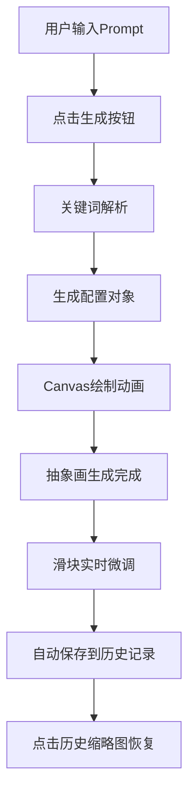

## 1. 产品概述
抽象艺术生成器是一款面向设计师的创意辅助工具，通过文字提示实时生成抽象艺术图案，解决设计师在寻找灵感时缺乏随机视觉刺激的问题。用户输入描述性文字后，系统自动解析关键词并生成独特的抽象画，支持实时微调参数、历史记录回溯和随机惊喜生成。

## 2. 核心功能

### 2.1 用户角色
| 角色 | 注册方式 | 核心权限 |
|------|----------|----------|
| 设计师用户 | 无需注册 | 使用全部生成、微调、历史记录功能 |

### 2.2 功能模块
1. **主画布区**：Canvas 抽象画渲染、生成动画、过渡效果
2. **控制面板**：Prompt 输入框、生成按钮、随机惊喜按钮、微调滑块
3. **历史记录**：横向滚动缩略图列表、点击恢复、自动保存
4. **参数微调**：色调偏移、形状复杂度、笔触粗细实时调整

### 2.3 页面详情
| 页面名称 | 模块名称 | 功能描述 |
|----------|----------|----------|
| 主页面 | 控制面板 | 左侧毛玻璃面板，包含 Prompt 输入、生成按钮、随机惊喜按钮、三个微调滑块 |
| 主页面 | 画布区域 | 中央全屏 Canvas，渲染抽象艺术图案，支持生成动画和过渡效果 |
| 主页面 | 历史记录 | 底部横向滚动缩略图列表，展示最近 10 次生成结果 |

## 3. 核心流程

### 3.1 主要用户流程
用户在输入框输入描述文字 → 点击生成按钮 → 系统解析关键词提取颜色/形状/纹理特征 → Canvas 按顺序铺色动画（2秒）→ 生成完成 → 拖动滑块实时微调 → 结果自动保存到历史记录 → 可点击历史缩略图恢复继续编辑

## 4. 用户界面设计

### 4.1 设计风格
- **主色调**：深色背景 `#1a1a2e`，毛玻璃面板 `rgba(255,255,255,0.08)`
- **强调色**：与当前画布主色调联动的发光效果，悬停时边框发光动画
- **按钮风格**：圆角 8px，半透明背景，悬停时发光描边
- **字体**：Space Grotesk（标题）+ JetBrains Mono（控件数值）
- **布局**：桌面端左侧固定 280px 控制面板，中央画布区，底部历史记录栏
- **视觉细节**：渐变背景、微妙噪点纹理、发光阴影、毛玻璃模糊效果

### 4.2 页面设计概述
| 页面名称 | 模块名称 | UI 元素 |
|----------|----------|----------|
| 主页面 | 控制面板 | 毛玻璃背景、输入框、主按钮、滑块控件、发光悬停效果 |
| 主页面 | 画布区域 | 全屏 Canvas、淡入淡出过渡、粒子消散动画 |
| 主页面 | 历史记录 | 横向滚动容器、缩略图卡片、Prompt 文字标签 |

### 4.3 响应式设计
- **桌面端（>1024px）**：左侧面板固定 280px，画布占满剩余空间
- **平板端（768px-1024px）**：面板折叠为底部浮动栏，画布全屏
- **手机端（<768px）**：全屏画布，控件通过浮层按钮呼出，手势操作支持

### 4.4 动效设计
- **生成动画**：颜色从中心向外依次铺开，持续 2 秒
- **滑块交互**：60fps 实时重绘，防抖处理
- **历史切换**：0.3 秒淡入动画
- **随机惊喜**：粒子消散过渡效果
- **控件悬停**：发光描边动画，颜色与画布主色调联动
